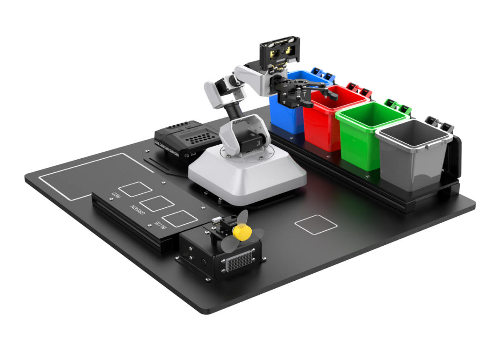
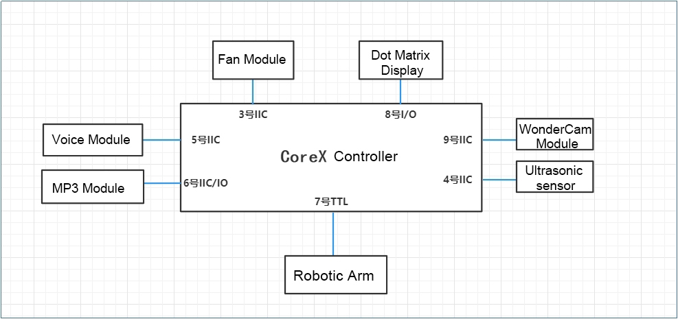
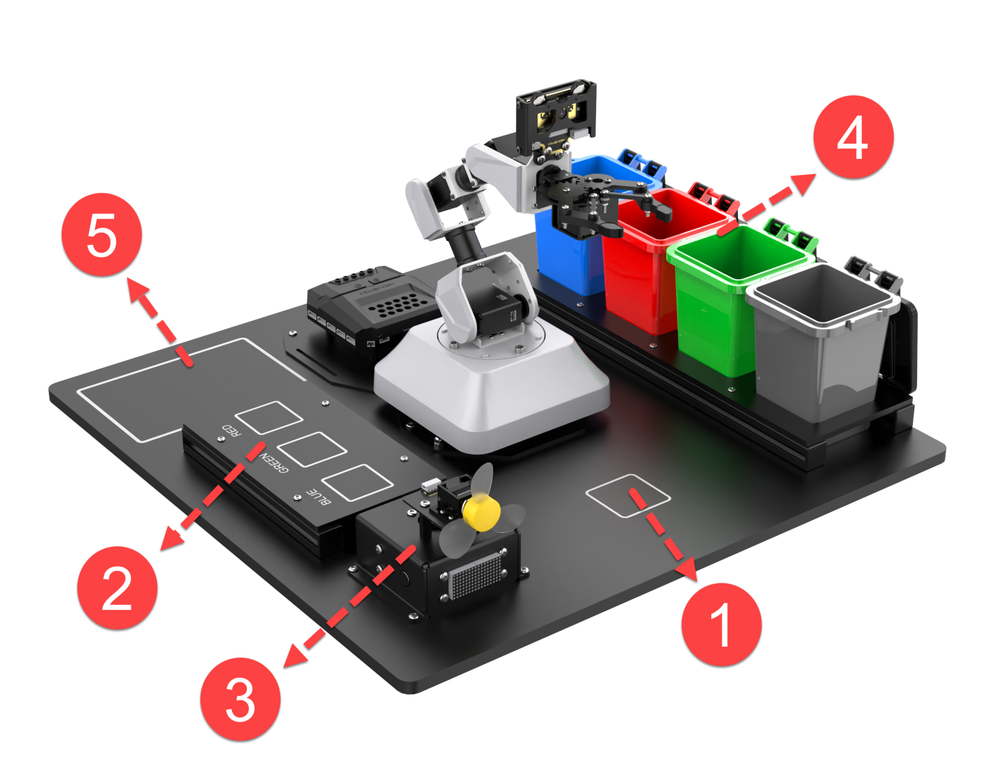
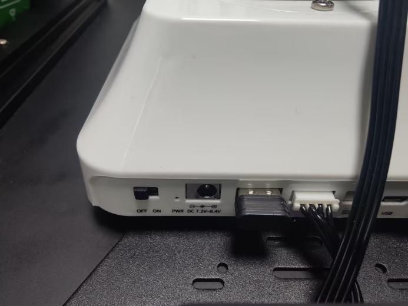
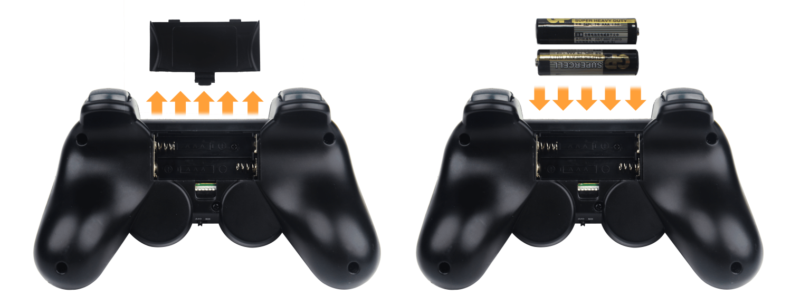
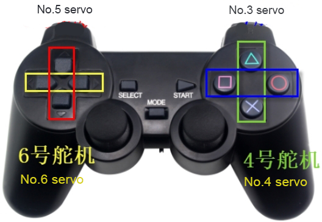
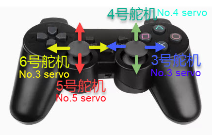
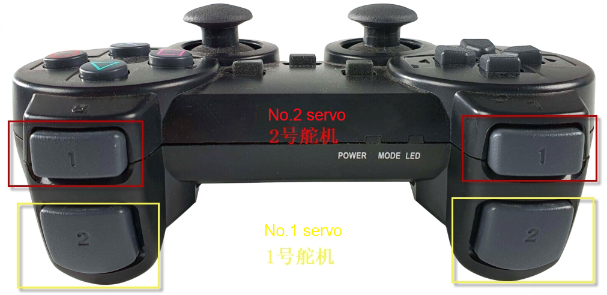

# 1. Getting Ready

## 1.1 AiArm Introduction

### 1.1.1 Description

1. The AiArm robotic arm, combined with the base scene map and sensor kit, forms an intelligent educational robotic kit that simulates industrialization scene.

2. It is equipped with a WonderCam vision module, various sensor modules including an glowing ultrasonic module, LED dot matrix module, MP3 module and fan module. AiArm robotic arm enables color recognition, tag recognition, face recognition, QR code recognition and waste card recognition and the sensor modules provides feedback based on programs.

3. In terms of programming, it utilizes Scratch graphical programming and Python programming. It is designed to cater to entry-level programming users and provides a good understanding of program logic.

### 1.1.2 Packing List

1. After receiving the package, you can first refer to the below packing list to check out if all accessories are complete according. If any missing parts are found, please contact our customer service for assistance.

|                                        |                                   |
|:--------------------------------------:|:---------------------------------:|
|                Product                 |                Qty                |
|            AiArm robot arm             |                 1                 |
|         Power adaptor/ 7.5V 7A         |                 1                 |
|            Wireless handle             |                 1                 |
|        WonderCam vision module         |                 1                 |
|               USB cable                |                 1                 |
|             Big base board             |                 1                 |
|        Waste sorting base board        |                 1                 |
|        Color sorting base board        |                 1                 |
|      Waste sorting aluminium bar       |                 2                 |
|      Color sorting aluminium bar       |                 2                 |
|       Glowing ultrasonic sensor        |                 1                 |
|           Dot matrix module            |                 1                 |
|       MP3 module (with SD card)        |                 1                 |
|               Fan module               |                 1                 |
|            4PIN wire (50cm)            |                 5                 |
|             Sensor bracket             |                 1                 |
|              Card reader               |                 1                 |
|       Colored block (3*3*3cm)        | 1 set (red, green, blue per each) |
| Primary-color wooden block (4*4*4cm) |                 4                 |
| Primary-color wooden block (3*3*3cm) |                 3                 |

### 1.1.3 Hardware Wiring

1. The wiring diagram of the controller, expansion board and hardware modules is shown below:

### 1.1.4 Learning Guide

1. **Step 1**: get to know AiArm robotic Arm

2. **Step 2**: learn about how to use PC software to control the robotic arm and edit action

3. **Step 3**: install programming software and learn how to write program.

4. **Step 4**: get to know the driver module

5. **Step 5**: the application WonderCam vision module

6. **Step 6**: start game and grasp the programming logic

7. **Step 7**: Understand the coordinate system of a robotic arm and control the robot arm using coordinates

## 1.2 Props Placement and Assembly

AiArm robotic arm advanced kit is equipped with a set of scene props to enable diverse functions. Having received the package, please get your robotic kit assembled according to the provided assembly tutorial. The main function of each area of the scene props is introduced below.

1.  **Picking /recognizance Area**

When the picking or recognition function is executed, AiArm robotic arm will place colored block, labeled wooden block or waste card into this area.

2.  **Sorting Area**

When the sorting function is performed, AiArm robotic arm will pick and place the wooden block to the sorting area.

3.  **Sensor Integration Area**

With the ultrasonic sensor, voice recognition module, MP3 module and dot matrix module assembled in this area, a variety of interaction games can be realized.

4.  **Waste Sorting Area**

This area is equipped with four categories of trash bins, namely recyclable waste (blue), hazardous waste (red), kitchen waste (green), and other waste (gray), used for placing corresponding waste cards.

5.  **Props Placement Area**

This area is used for placing the props that are not currently used in the game.

## 1.3 Wireless Handle Control

### 1.3.1 Preparation

1. **Step 1**: Before tuning on robotic arm, please ensure that the handle receiver is connected to the controller on the robotic arm.

2. **Step 2**: Prepare two AAA batteries.

3. **Step 3**: Take out the battery cover, and put the batteries into the battery slot. Please note that do not reverse the negative pole and positive pole of the battery.

### 1.3.2 Device Connection

1. **Step 1**: Switch on the robotic arm.

2. **Step 2**: Turn on the wireless handle. The two LEDS (red and green) on the handle will blink at the same time.

3. **Step 3**: The robotic arm will automatically match with the wireless handle in few minutes, and the green LED keeps on.(If two lights blink after pressing Mode button,)

4. **Step 4**: if you fail to connect, please switch off the robotic arm and wireless handle. Then start over from step 1.

> [!NOTE]
>
> **Sleep mode: if the wireless handle isn’t connected with the robotic arm in 30 seconds, or has no operation in 5 minutes after connection, the wireless handle will enter the sleep mode. If you want to activate it, you can press the “START” button.**

### 1.3.3 Mode Instruction

1. There are two modes for wireless handle control: action group mode and single servo mode. After the wireless handle is received, it defaults to the action group mode.

2. **Action group mode**: press the buttons to perform the corresponding action.

3. **Single servo mode**: press the buttons to control the forward and reverse rotation of each button on the robotic arm.

4. The way to switch two modes: first press **“SELECT”** key without releasing, and then press the **“Start”** key. After hearing a **“Di”** sound, the mode will switch to the action group mode and you can release **“SELECT”** button. If hearing a **“Di Di”** two beeps after releasing, the mode is the single servo mode.

### 1.3.4 Key Instruction

1. The key instruction for the action group mode is shown in the below table.(For the combined keys, you need to first press the **“SELECT”** key without releasing, and then press the corresponding keys)

|               |                           |
|:-------------:|:-------------------------:|
|    **Key**    |       **Function**        |
|   **START**   |    **Run No.0 action**    |
|     **↑**     | **Run No.1 action once**  |
|     **↓**     | **Run No.2 action once**  |
|     **←**     | **Run No.3 action once**  |
|     **→**     | **Run No.4 action once**  |
|     **△**     | **Run No.5 action once**  |
|     **×**     | **Run No.6 action once**  |
|     **◻**     | **Run No.7 action once**  |
|     **○**     | **Run No.8 action once**  |
|    **L1**     | **Run No.9 action once**  |
|    **R1**     | **Run No.9 action once**  |
|    **L2**     | **Run No.11 action once** |
|    **R2**     | **Run No.12 action once** |
| **SELECT+△**  | **Run No.13 action once** |
| **SELECT+×**  | **Run No.14 action once** |
| **SELECT+◻**  | **Run No.15 action once** |
| **SELECT+○**  | **Run No.16 action once** |
| **SELECT+L1** | **Run No.17 action once** |
| **SELECT+R1** | **Run No.18 action once** |

2. The key instruction for the single servo mode is shown below:

> [!NOTE]
>
> **In the single servo mode, you can press the “START” button to reset servo to the initial position.**

