# 2. AiArm Control

## 2.1 AiArm PC Software

### 2.1.1 Install Software

1)  Find **“PC software Installation Pack”** under the same directory.

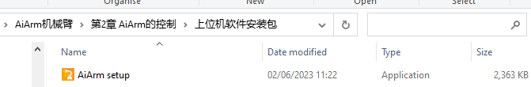

2)  Double click to install the software.

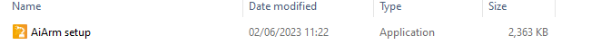

3)  Select language.

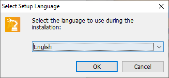

4)  Select the path where the software is installed.

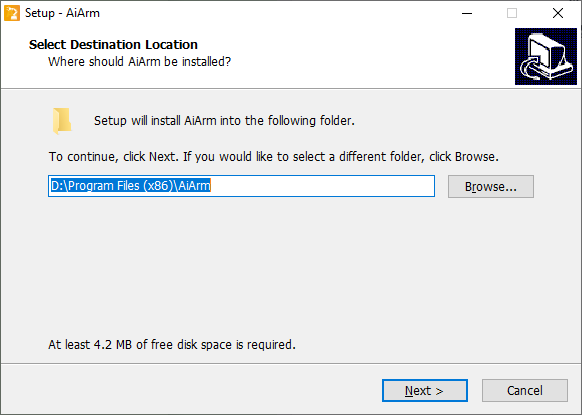

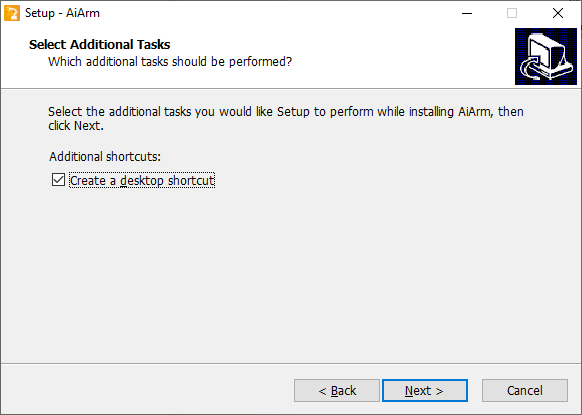

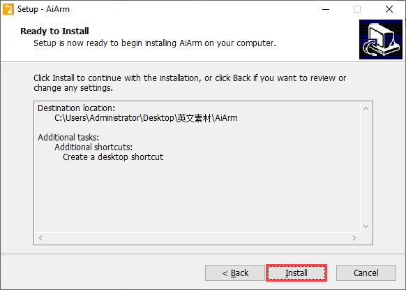

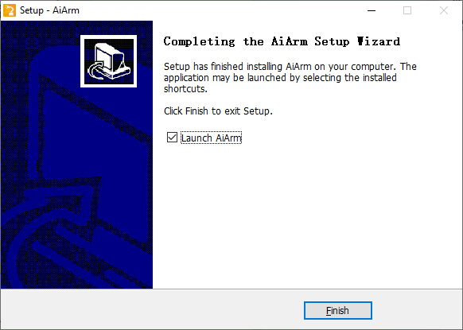

5)  The main interface of the PC software is as follow:

### 2.1.2 Connect Robotic Arm to PC Software

1)  Connect one end with DC plug of the power adapter to the robotic arm, and plug the other end into a power strip to supply power to the robotic arm.

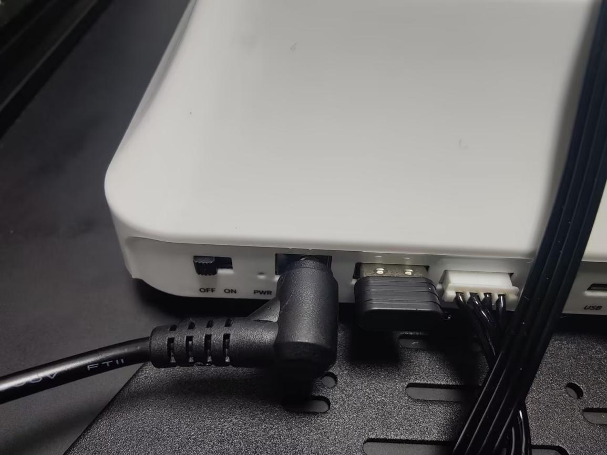

2)  Turn on the switch of the robotic arm. Connect the robotic arm to your computer with the provided USB cable.

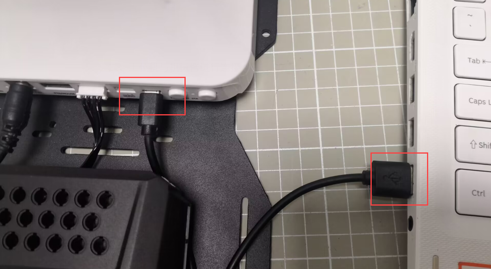

3)  The PC software have an icon for displaying the port connection status. Red icon indicates that the robotic arm does not connect to the PC software. This situation may be due to the robotic arm not being powered on, or there could be an issue with the USB cable. In this case, try to reconnect the cable or restart robot.

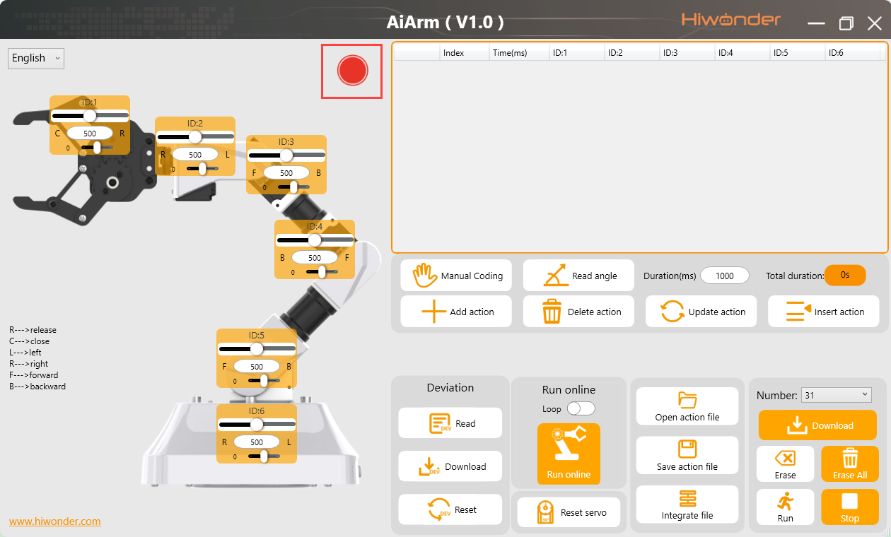

4)  When the icon turns green, it indicates that the robotic arm is connected to the PC software successfully.

### 2.1.3 Introduction to PC Software Interface

The software interface is divided into six areas, including status bar, robot control area, action data list, action editing area, action settings area and deviation adjustment area.

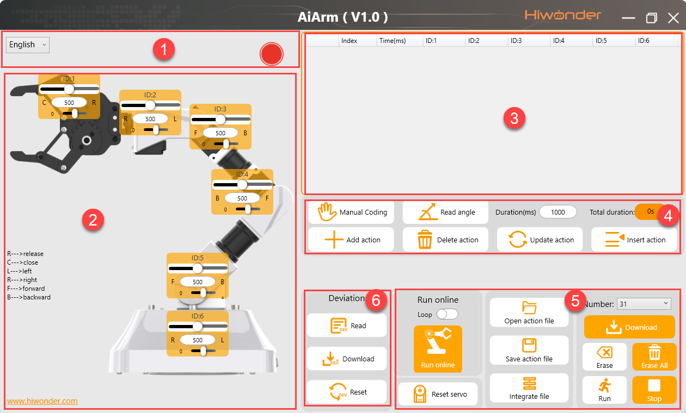

The function of six areas are described as follow:

1.  **The language can be switched on status bar**

<table>
<colgroup>
<col style="width: 54%" />
<col style="width: 45%" />
</colgroup>
<tbody>
<tr>
<td style="text-align: center;">Icon</td>
<td style="text-align: center;">Description</td>
</tr>
<tr>
<td style="text-align: center;">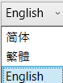</td>
<td style="text-align: left;">
Language selection box

Select language in the drop-down menu.
</td>
</tr>
<tr>
<td style="text-align: center;"></td>
<td style="text-align: left;">
Connection status bar

Display whether the robotic arm is connected to the COM port.

When the icon is red, it indicates that the robot is not connected. When the icon turns green, it indicates that the connection is successful.
</td>
</tr>
</tbody>
</table>

2.  **Robot Control Area**

​	(1) Before start controlling robot, first get to know about the “Reset servo” button.

​	(2) The **“Reset servo”** button needs to be used before servo control, action editing and deviation adjustment. It aims at checking if the servo works properly or produces deviation.

​	(3) In robot control area, you can drag the big slider corresponding to each servo to control robot movement.

> [!NOTE]
>
> **the value “500” represents that the servo is in the middle position. If you want to use PC software to control the robotic arm, you need to first click on “Reset servo” button to prevent damage caused by a sudden exertion on the servo when dragging the slider.**

3.  **Action Data List**

​	(1) The servo value and running time of each servo can be clearly viewed in the action data list, as shown in the below figure.

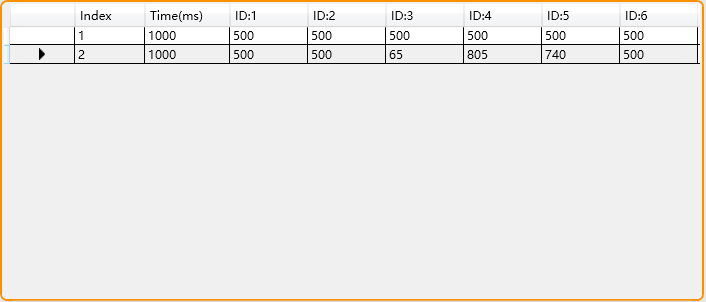

| **Icon** | **Description** |
|:--:|:--:|
|  | Action number |
| 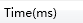 | The running time of a single servo in ms |
| 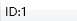 | Display the ID number of the servo |

4.  **Action Editing Area**

    (1) You can use the buttons in this area to add or insert an action to the action that has been edited.

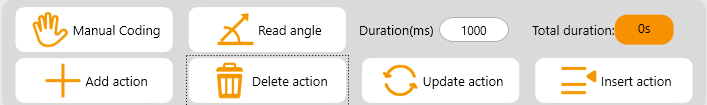

​	(2) The function of each buttons in the action editing area is shown in the following table.

<table>
<colgroup>
<col style="width: 37%" />
<col style="width: 62%" />
</colgroup>
<tbody>
<tr>
<td style="text-align: center;">Icon</td>
<td style="text-align: center;">Description</td>
</tr>
<tr>
<td style="text-align: center;"></td>
<td style="text-align: left;">Having returned the servo to the initial position, click on “manual programming” button to get the robot’s joints loose. At this time, you can manually rotate the joints to design action.</td>
</tr>
<tr>
<td style="text-align: center;"></td>
<td style="text-align: left;">Read the angle information of the servo. This function needs to use with “manual programming”.</td>
</tr>
<tr>
<td style="text-align: center;">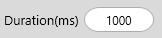</td>
<td style="text-align: left;">The running time of a single action. You can click on 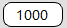 ti modify the value.</td>
</tr>
<tr>
<td style="text-align: center;"></td>
<td style="text-align: left;">The total duration of a whole set of action group.</td>
</tr>
<tr>
<td style="text-align: center;"></td>
<td style="text-align: left;">Add action to the end of the current action group in data list.</td>
</tr>
<tr>
<td style="text-align: center;"></td>
<td style="text-align: left;">Delete the selected action in action data list.</td>
</tr>
<tr>
<td style="text-align: center;"></td>
<td style="text-align: left;">
Replace the selected action in action data list.

(The servo value is replaced by the current servo value in servo control area, and the running time is replaced by the time set in the “action time” )
</td>
</tr>
<tr>
<td style="text-align: center;"></td>
<td style="text-align: left;">Insert an action in front of the selected action.</td>
</tr>
</tbody>
</table>

5.  **Action Settings Area**

​	(1) You can run, save or integrate the pre-edited action group in the action settings area.

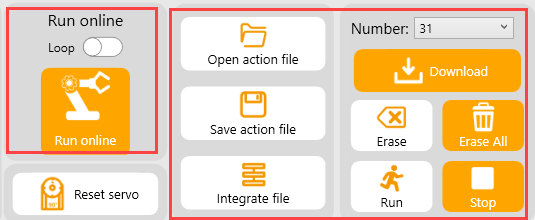

​	(2) The function of each buttons in the action settings area is shown in the following table.

<table>
<colgroup>
<col style="width: 34%" />
<col style="width: 65%" />
</colgroup>
<tbody>
<tr>
<td style="text-align: center;"><strong>Icon</strong></td>
<td style="text-align: center;"><strong>Description</strong></td>
</tr>
<tr>
<td style="text-align: center;">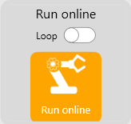</td>
<td style="text-align: left;">
Click on this button to perform the actions in the action data list once.

(if you check “loop”, the action will run this action repeatedly.)
</td>
</tr>
<tr>
<td style="text-align: center;">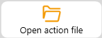</td>
<td style="text-align: left;">Select an action group to add it to the action data list.</td>
</tr>
<tr>
<td style="text-align: center;"></td>
<td style="text-align: left;">Save the current actions in the list to a specific position.</td>
</tr>
<tr>
<td style="text-align: center;"></td>
<td style="text-align: left;">After opening an action group, you can click on this button to open another action group file. This allow you to combine the two action groups into a new action group.</td>
</tr>
<tr>
<td style="text-align: center;">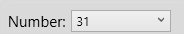</td>
<td style="text-align: left;">Action group selection box. It can display the serial number of the action group downloaded into the robotic arm on PC software. (Restriction protection is set for this section to avoid the loss of built-in action group deletion)</td>
</tr>
<tr>
<td style="text-align: center;"></td>
<td style="text-align: left;">Download the action group into the robotic arm.</td>
</tr>
<tr>
<td style="text-align: center;">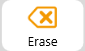</td>
<td style="text-align: left;">Delete the current action group file in the action group selection box.</td>
</tr>
<tr>
<td style="text-align: center;"></td>
<td style="text-align: left;">(Caution) delete all the action group files.</td>
</tr>
<tr>
<td style="text-align: center;"></td>
<td style="text-align: left;">Perform the selected action group once.</td>
</tr>
<tr>
<td style="text-align: center;"></td>
<td style="text-align: left;">Stop running the action group.</td>
</tr>
</tbody>
</table>

6.  **Deviation Adjustment Area**

​	(1) You can adjust the deviation generated on robot in the deviation adjustment area. (The robot has been tested before shipment, so you do not need to adjust deviation for your robot. If you need to get the servo changed or removed, you need to adjustment deviation before assembling. For the specific adjustment method, please refer to **“Appendix/ Deviation Adjustment”**.)

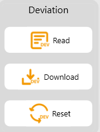

| **Icon** | **Description** |
|:--:|:--:|
|  | After the servo is reset to the middle position, read the deviation data. |
|  | After the deviation is adjusted, click on this button to save the deviation. |
|  | Click on this button if the expected performance is not realized . |

## 2.2 PC Software Control

### 2.2.1 Control Robot Using Slider

1)  As shown in the below figure, there is a yellow box corresponding to each servo, in which the ID number of servo is displayed and there are two sliders that can be dragged. The longer slider is used to control the servo movement, while the shorter one is only required for adjusting offset.

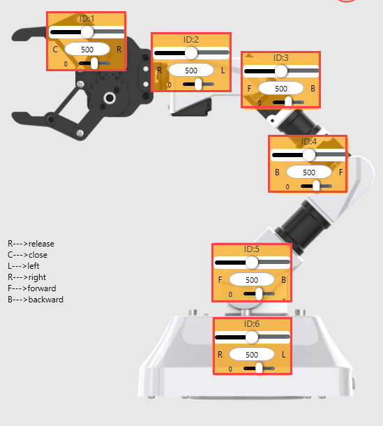

2)  Please note that the value for each servo shown in the robot control corresponding to the value of the servo at the middle position.

3)  The middle pose of robot is shown below:
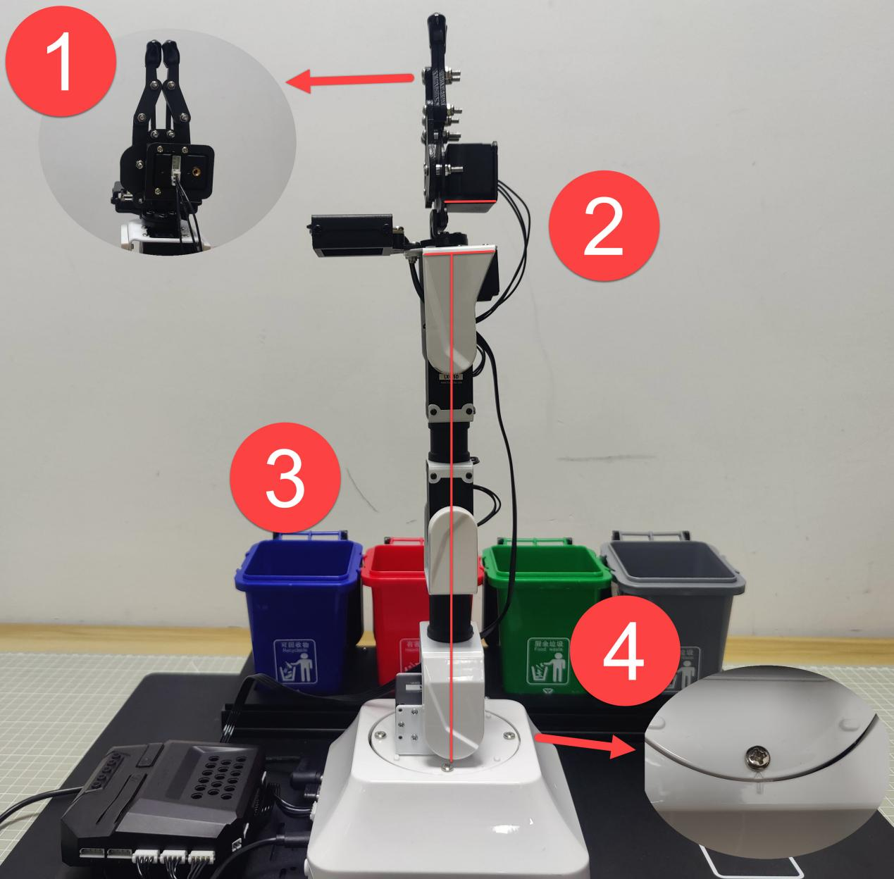

4)  Therefore, if you want to use PC software to control the robotic arm, you must click on the **“reset servo”** button first to make the robotic arm restore to the centre, then drag the slider to control each servo.

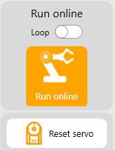

5)  When control the servo movement, please pay attention to the annotation at the sides of each slider such as **“forward”**, **“backward”**, **“Left”** and **“right”**. These direction takes robot as the first-person view.

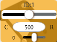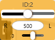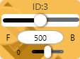

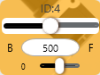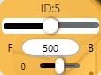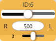

6)  In addition, you can slowly drag the slider, click on the slider bar and use the arrow keys **“↑”, “↓” ,“←”, “→”** on keyboard, or click on the sides of slider bars to control each servo.

7)  If the slider is moved abruptly, it may cause the servo to exert sudden force, potentially hitting the nearby objects and causing damage to the robot.

8)  Let’s try to edit an action. For example, gently drag the slider of ID3 servo to rotate in forward direction. When the value of ID3 servo is dragged to 120, the robotic arm is in a flat-view pose.

9)  Then click on **“Add action”** to save this action. Thus, multiple actions can be created to form an complete action group.

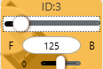

### 2.2.2 Call Action Group

1)  Click on **“Open Action File”** and find the action files stored in **“Appendix/ Action Group File”**.

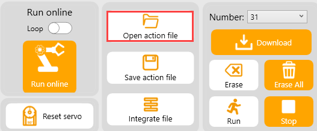

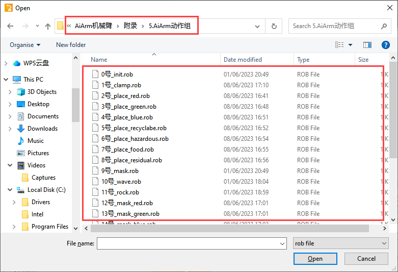

2)  Select and open No.0 action group. It is a initialization action set for robot to conveniently identify object.

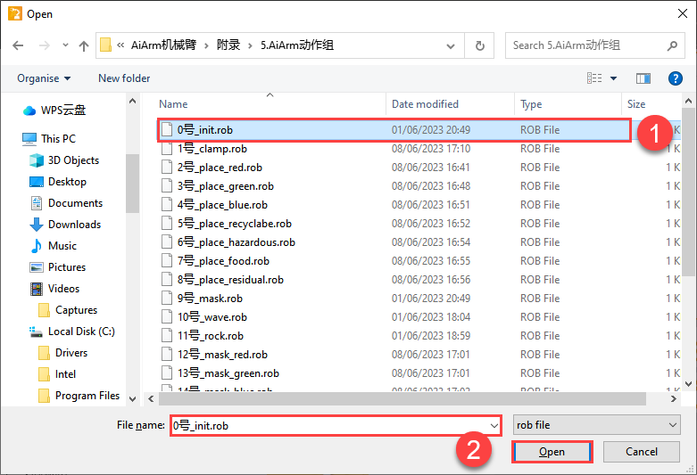

3)  After opening this action, it will be listed on blew area. Click on “▶” to individually run this action.
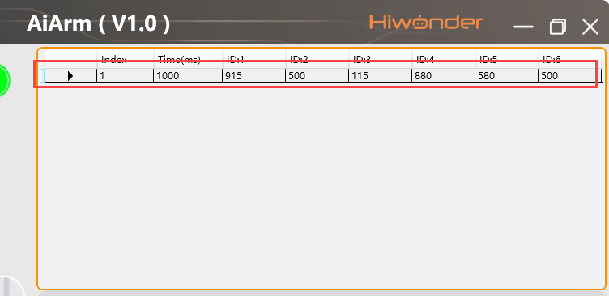

4)  Then, try to combine two action files. Click on **“Integrate action file”**, select and open No.1 action. At this time, No.0 action group will be followed by No.1 action group.

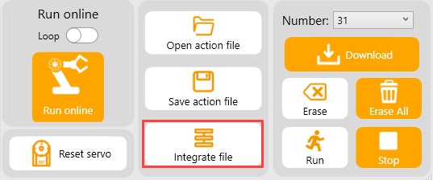

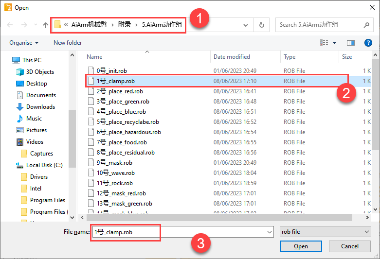

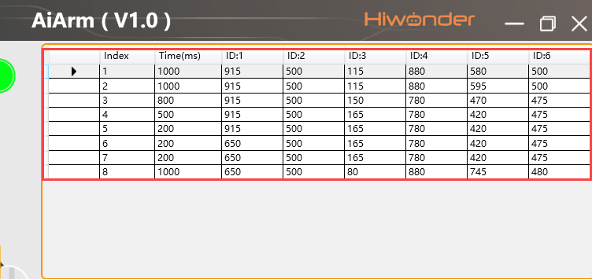

5)  Click on “▶” in front of the first action in this list and click on **“Online running”**.

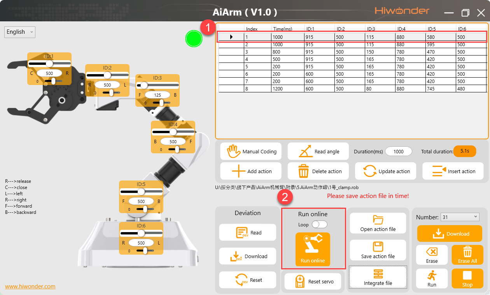

> [!NOTE]
>
> 1.  **All the actions appears in this lesson are encrypted and is pre-loaded before shipment.**
>
> 2. **User can only download the action group after No.30 action group.**

## 2.3 Edit Robot Action Through Slider

### 2.3.1 Project

1. Edit a simple action group for AiArm using PC software. AiArm picks the colored block up and place it to the right side.

2. For the standard action group, please refer to the action group folder in “**Appendix/ Action Group File**”.

### 2.3.2 Action Realization

1)  **Design Action**

​	(1) Switch on AiArm and connect it to your computer with USB cable, then open PC software.

​	(2) Click **“Reset servo”** to restore servo to the centre.

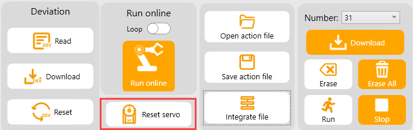

​	(3) Change the action time to **“1000”** ms and click on **“Add action”** button to add this action as the first action.

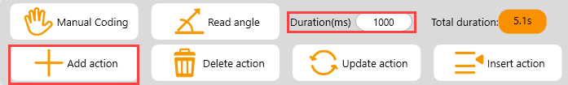

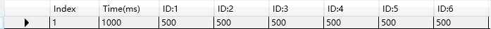

​	(4) Drag the sliders of servo ID3, ID4 and ID5 to lower the robotic arm above the robotic arm.

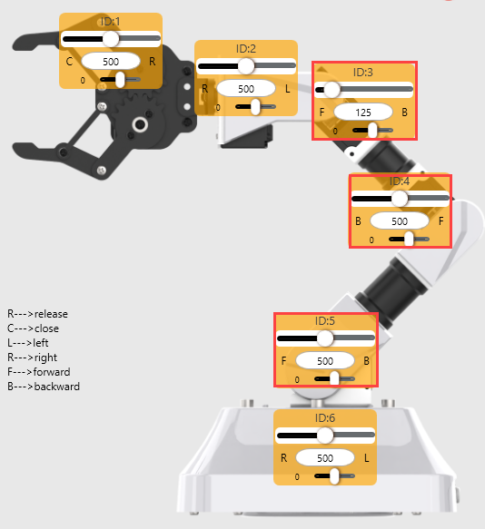

> [!NOTE]
>
> 1.  **Dragging slider needs to be slow. Or you can click on the slider bar with the left and right mouse buttons to adjust the value, which prevents any sudden force generated by robot.**
>
> 2.  **PC software has no a position restriction to servo, so you need to pay attention to the servo position while editing action for robot. Reaching an extreme position will cause damage to the servo.**

​	(5) Chang the running time to 800ms and click on **“Add action”** to add the current action to the action data list.

​	(6) Add a transition action to make this action group smooth. You just need to reduce the running time for the current action, for example 200ms, then click on **“Add action”**.

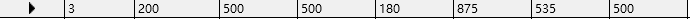

​	(7) Drag the slider to get the gripper open and set the running time as 800ms, then click on **“Add action”**.

​	(8) Chang the time of the current action to 200ms to add a transition action.

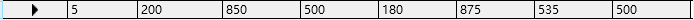

​	(9) Lower the robotic arm to a position where the colored block can be picked up and set the running time as 800ms, then click on **“Add action”**.

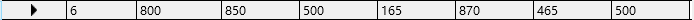

​	(10) Chang the running time of the current action to 200ms to add a transition action.

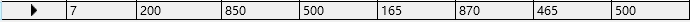

​	(11) Drag the slider to control robot to pick the colored block up and set the running time as 800ms, then click on **“Add action”**.

​	(12) Chang the running time of the current action to 200ms to add a transition action.

​	(13) Lift the robotic arm up and set the running time as 800ms, then click on **“Add action”** to save this action.

​	(14) Chang the running time of the current action to 200ms to add a transition action.

​	(15) Rotate the robotic arm to the left and set the running time as 800ms, then click on **“Add action”** to save this action.

​	(16) Chang the running time of the current action to 200ms to add a transition action.

​	(17) Lower the robotic arm and set the running time as 800ms, then click on **“Add action”** to save this action.

​	(18) Chang the running time of the current action to 200ms to add a transition action.

​	(19) Loose the colored block and set the running time as 800ms, then click on **“Add action”** to save this action.

​	(20) Chang the running time of the current action to 200ms to add a transition action.

​	(21) Control the robotic arm go back to the fourth action. You can click on “” in front the fourth action and change the running time to 800ms, then click on **“Add action”** to save this action.

​	(22) The data of a complete action group is shown in the below table. If you need to make an adjustment for a single action, you can double click on the the corresponding value to modify.

2. **Run Action Group**

​	(1) Click on the “**Online run**” button check the perform of this action group.

3. **Save and Download Action Group**

​	(1) Click on the **“Save action file”** button to save the action group to the local for debug. The action group is named as **“put_right”** here, you can change it as requirement.

​	(2) Then download the action group to the corresponding action group number. Select the serial number of the action group at right, and then click on **“Download”** button.

> [!NOTE]
>
> **No.1- No.30 action group are encrypted, which can not be downloaded. Please select the serial number from 31.**

​	(3) After download is done, you will be prompted **“Download successful”**.

## 2.4 Manual Coding

### 2.4.1 Project

1. Edit a simple action group for AiArm through manual editing function. AiArm picks the colored block up and place it to the right side.

2. For the standard action group, please refer to the action group folder in **“Appendix/ Action Group File”**.

### 2.4.2 Action Realization

1. **Design Action**

   (1) Switch on AiArm and connect it to your computer with USB cable, then open PC software.

​	(2) Click **“Reset servo”** to restore servo to the center.

​	(3) This example will set the running time as 1000ms. Then click on **“Add action”** to add this initial action as the first action.

​	(4) Click on the **“Manual program”** button. You can start rotating servo to adjust the servo angle after a prompt pops up. If the servos fail to move, click on **“Manual program”** button again, do not violently rotate the robotic arm.

​	(5) Rotate the servo of pan-tilt above the colored block to be gripped on the right, and click **“Read angle”**.

​	(6) Add a transition action. Set the running time to 200ms and click on the **“Read angle”** button.

​	(7) Get the gripped open and lower its height to the position where the colored block can be picked up. Set the running time as 1000ms and click on **“Read angle”**.

​	(8) Change the running time of the current action to 200ms and click on **“Read angle”** to add a transition action.

​	(9) Adjust the gripper to clamp the colored block and set the running time as 1000ms, then click on **“Read angle”**.

​	(10) Change the running time of the current action as 200ms and click on **“Read angle”** to add a transition action.

​	(11) Adjust the position of the robotic arm to the front and set the running time as 1000ms. Then click **“Read angle”**.

​	(12) Change the running time of the current action to 200ms and click on **“Read angle”** to add a transition action.

​	(13) Lower the robotic arm and put the block down. Set the running time as 1000ms and click on the **“Read angle”** button.

​	(14) Change the running time of the current action to 200ms and click on **“Read angle”** to add a transition action.

​	(15) Adjust the gripper to loose the colored block and set the running time as 1000ms. Then click on the **“Read angle”** button.

​	(16) Click on the “” button in front of the first action to get AiArm back to the centre, and then click on the **“Add action”** button to add this action to the end.

> [!NOTE]
>
> 1.  **During this process, if other operations is performed, such as pressing the “run” button, the servos will be re-powered. In this case, you need to click on “Manual program” again to continue to manually adjust the robot’s position.**
>
> 2.  **If the robotic arm is hard to rotate, you can click on the “Manual program” again, do not violently operate.**

​	(17) The data of a complete action group is shown in the below table. If you need to make an adjustment for a single action, you can double click on the the corresponding value to modify.

2. **Run Action Group**

​	(1) Click on the **“Online run”** button check the perform of this action group.

3. **Save and Download Action Group**

​	(1) Click on the **“Save action file”** button to save the action group to the local for debug. The action group is named as “**put_middle**” here, you can change it as requirement.

​	(2) Then download the action group to the corresponding action group number. Select the serial number of the action group at right, and then click on **“Download”** button.

> [!NOTE]
>
> **No.1- No.30 action group are encrypted, which can not be downloaded. Please select the serial number from 31.**

​	(3) After download is done, you will be prompted **“Download successful”**.

## 2.5 Download Action Group

### 2.5.1 Preparation

Turn on AiArm and connect it to PC software.

### 2.5.2 Download Action Group

Download the pre-edited action group to the robotic arm. The specific operation steps are as follow:

1)  Click on the action selection box. Select the action to be downloaded into the robotic arm. The optional action number ranges from 31 to 230.

> [!NOTE]
>
> **The action groups before the 30th are encrypted. The robot has been pre-installed a certain number of actions for user experience. Therefore, the action to be downloaded must start from No.31 action group.**

2)  Then select **“31”** as the serial number of this action.

3)  Click on **“Download”** button.

4)  Then, you will be prompted **“Download successful”**, which indicates that the action group file is successfully downloaded into the robotic arm.

5)  Click on the **“Run”** button to run No.31 action group. You can click on **“Stop”** button to stop running this action group.

6)  If you need to delete one of the single groups, you can click on **“Single ease”**. If you click on **“Erase all”**, the action group from No.31 to No.230 will be deleted at once, and can not be restored.

