# 3. Scratch Programming

## 3.1 CoreX Controller Introduction

Robots detect the surrounding environment and gather information through sensor, and then respond accordingly based on the external environment.

Based on this, Hiwonder has developed a CoreX controller, which is used to control these sensors.

1.  **Introduce to Electronic Module on Controller**

​	(1) The CoreX controller allows you to control the electronic modules and external modules through programming.

2.  **Controller Structure**

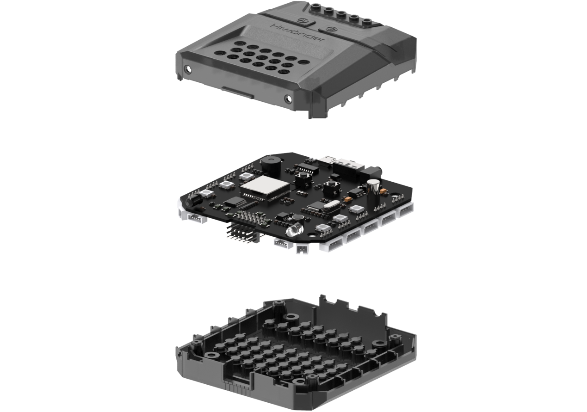

​	(2) The controller consists of ESP32 microcontroller, buzzer, infrared emitter and receiver, sound module, two programmable buttons as well as six RGB light modules.

3.  **On-board Modules Instruction**

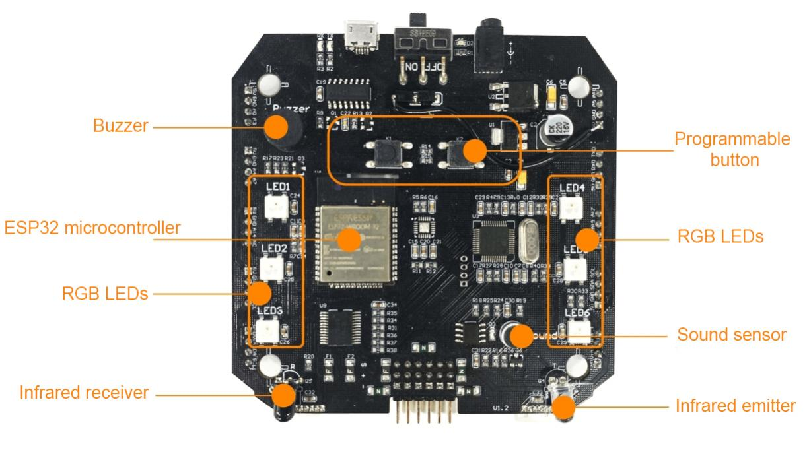

(1) **ESP32 microcontroller**

​	EPS32 microcontroller integrates WIFI functionality, supports Bluetooth, and features 32-bit dual-core processor, EPS32 microcontroller integrates WIFI functionality, supports Bluetooth, and features 32-bit dual-core processor, which is developed for more complicated application.

(2) **Buzzer**

​	A buzzer is an electronic device that produces sound. It can play music through program setting.

(3) **RGB light module**

​	An RGB light module is a compact electronic component that integrates red, green, and blue LEDs into a single module. The color output can be customized by program.

(4) **Infrared emitter and receiver**

​	An infrared emitter and receiver are electronic components used to transmit and receive infrared (IR) signals, and perform the desired action based on the received data. The commonly is widely used in applications such as TV remote controls and wireless data transmission between devices.

(5) **Sound sensor**

​	A sound sensor is an electronic component that detects and measures sound levels.

(6) **Programmable button**

​	CoreX controller contains two programmable buttons A and B that can be configured to perform different actions or functions based on user-defined settings or programming.

### 3.1.1 Interface Instruction

The corresponding interface of CoreX controller and its function is shown below:

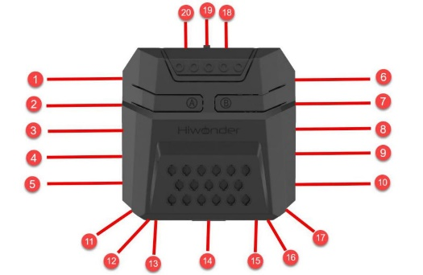

> [!NOTE]
>
> **Either IIC communication module or I/O sensor module can be hooked up to No.6 port. A program can not be defined as both IIC port and I/O port. Therefore, during secondary development, if you want to connect MP3 module to controller, it can only be connected to No.6 port and other ports will affect the performance of MP3 module.**

| **Port** | **Function** |
|:--:|:--:|
| 1、2、6 | Analog signal sensor |
| 3、4、5、9 | IIC communication |
| 8 | Digital signal sensor |
| 7 | WiFi module |
| 10 | Bus servo |
| 11、17 | Motor |
| 12 | Infrared receiver component |
| 13、15 | Motor with speed encoder |
| 16 | Infrared emitter |
| 14 | PWM servo port ( from top to bottom, the ports correspond to “-”, “+” and “S” respectively. The voltage of “-” and “+” is the power voltage.) |
| 18 | Power supply |
| 19 | Switch |
| 20 | Micro-USB port (for uploading code) |

## 3.2 WonderCode Introduction and Installation

### 3.2.1 WonderCode Software Introduction

1. WonderCode is a user-friendly programming software. It offers automatic conversion between graphical instruction blocks and Python code, allowing users to easily create programs by simply dragging and arranging instruction blocks. WonderCode is especially well-suited for beginners, providing an intuitive platform for learning programming concepts in a beginner-friendly manner.

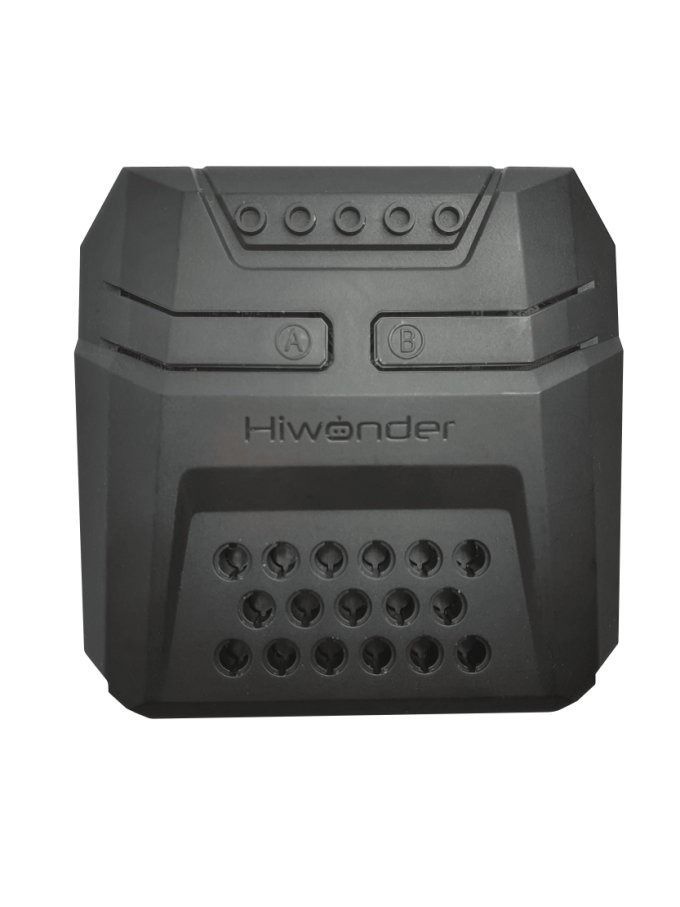

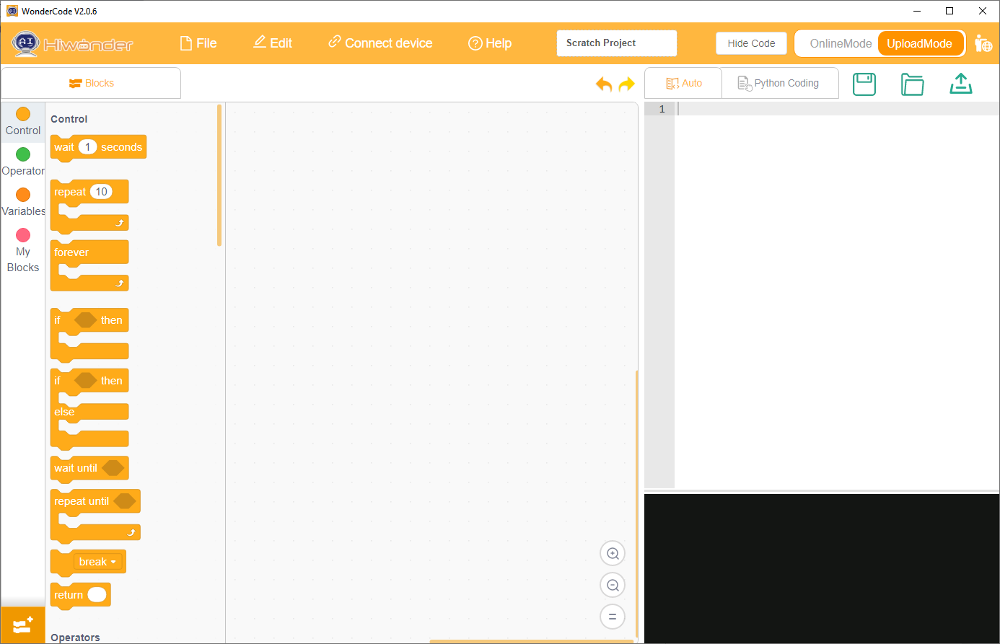

### 3.2.2 Installation

1)  Go to the folder “Appendix” and install “**WonderCode setup.exe**”.

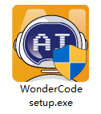

2)  Select the language to use.

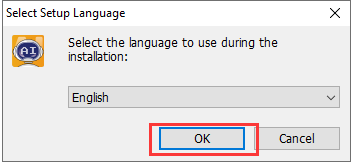

3)  Next, you need to choose the folder to save the software. Then click **“Next”**.

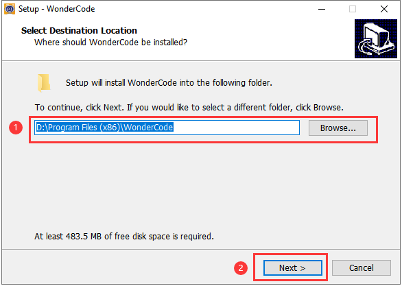

4)  Select **Create a desktop shortcut** , and then click “**Next**”.

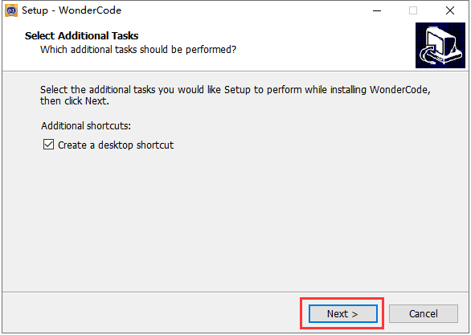

5)  Click the **Install** button on the interface to install.

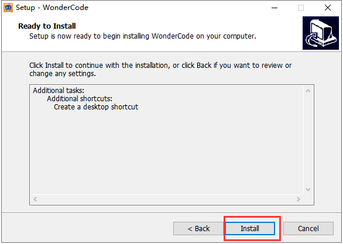

6)  Please allow time for installation progress.

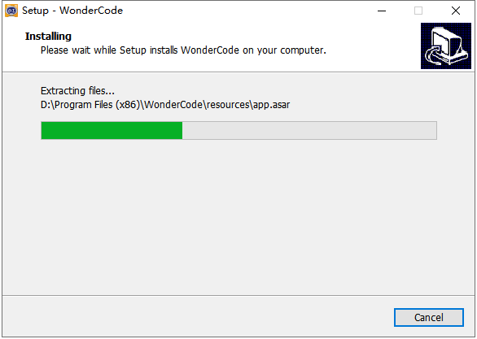

7)  Once the installation is completed, select “**Finish**”.

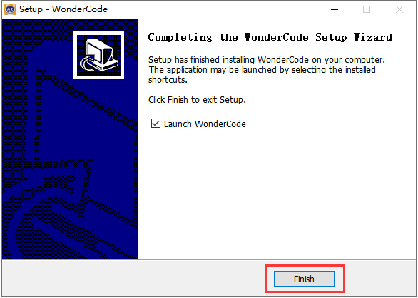

8)  Open the WonderCode software.

### 3.2.3 Establish connection

1)  Connect CoreX controller and your computer using USB cable.

2)  Then double-click **WonderCode** software to open.

3)  You need to add device extension package before connecting the device, otherwise the device cannot be connected. Click  in the lower left corner, then select “Robot -\>**AiArm**” in turn.

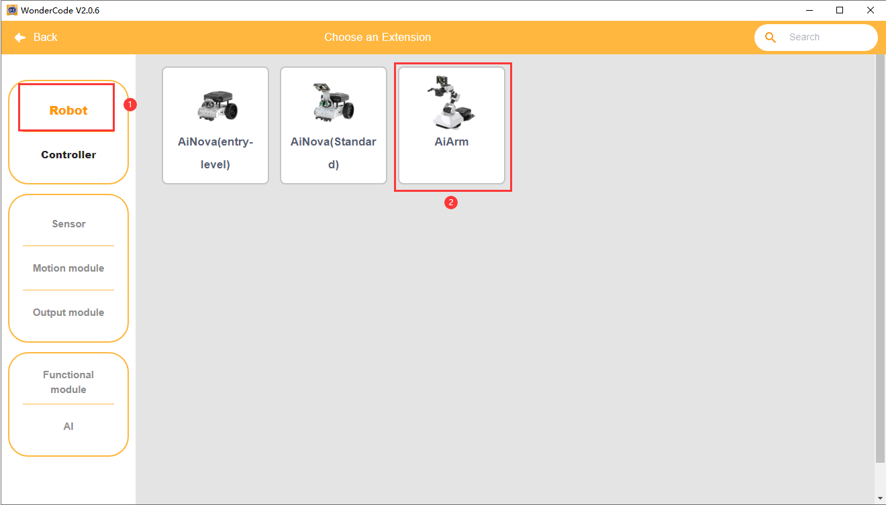

4)  Then click **“Connect device”** button and select the corresponding port to connect.

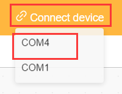

> [!NOTE]
>
> 1. **The port number for establishing the connection may vary and should be determined based on the specific configuration of each computer. In the following example, COM 4 is used, but please avoid selecting COM1 as it is typically reserved for system communication interfaces.**
>
> 2. **In cases where multiple USB devices are connected, the specific port number may not be clear. To identify the corresponding port number for the AiArm robot master, open This PC on your computer desktop and click on Manage -\> Device Manager. Look for the port that contains the CH340 identifier to determine the correct port for your connection.**
>
> 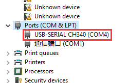

5)  When the device is successfully paired with the software, **“Connect success”** will appear.

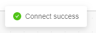

### 3.2.4 Function Description

①Menu bar, ②Instruction area, ③Script area, ④Code display and upload area

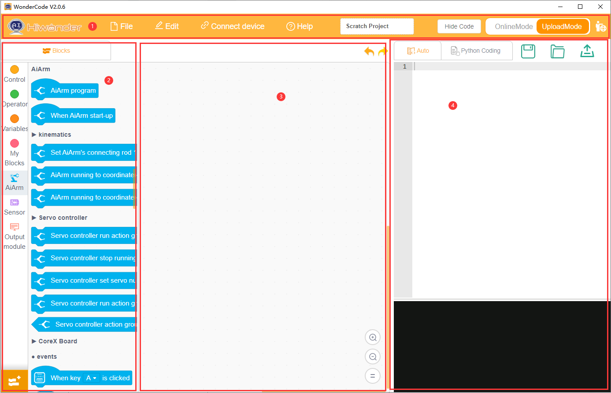

| **Icon** | **Function** |
|:--:|:--:|
|  | Create, save, and open program files |
|  | Used in online mode |
|  | Connect the device to the software |
|  | Used to find help, check for updates, and install drivers |
|  | Show the program file name. “Scratch Project” will be displayed when the program has not started or the file has not been saved |
|  | Switch between “OnlineMode” and “UploadMode”. Remember to save the edited program file before switching. The file will be lost if the file is not saved. |
|  | Select the interface display language. |
|  | Actions can be undone or restored when the program is written |
| 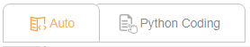 | Edit mode switch button, “Auto” can convert instruction block programs to Python form, When switching to “Python Coding”, you can directly use Python to edit the program |
|  | Save the program as Python code |
|  | Open the saved Python file |
|  | Download the program to the main controller |
|  | Used to add equipment expansion pack |
|  | Control the code editing interface to zoom in, zoom out, and restore the default size |

> [!NOTE]
>
> **Upload mode is mainly used in conjunction with our main controller. The online mode is the native part of Scratch, users can edit content like animations or games themselves.**

### 3.2.5 Programming Method

> [!NOTE]
>
> **Here is an example of how to use the WonderCode software by editing a program that makes the LED light on the main controller steady red. The steps are as follow**

1)  Once the device is successfully connected, you can start writing program. First, locate the **AiArm program** instruction block in the AiArm instruction set and drag it to the code editing area.

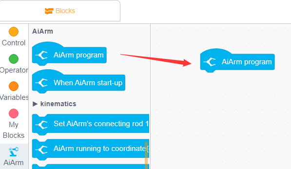

> [!NOTE]
>
> **To delete a command block, simply drag it backwards from the code editing area back into the instruction collection area.**

2)  Then put **“forever”** after the previous code block.

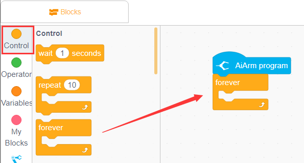

3)  Then drag out the below code block in AiArm section and put it in **“forever”**. After that, choose to set all LED lights illuminate red.

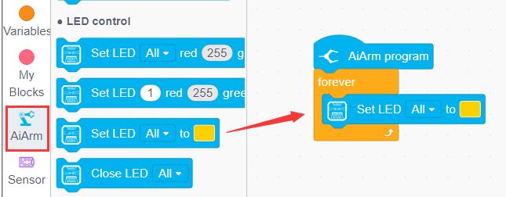

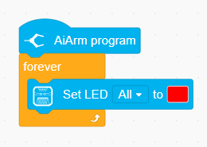

4)  Then click-on Upload button to download the program to the main controller.

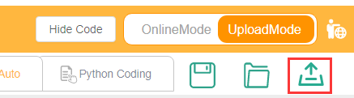

5)  If you hear the controller emit beeping sounds, the main controller releases a low power alarm which is a normal phenomenon. Drag the **“Disable low power alarm”** block to turn off the low power alarm, and then download the program to the main controller.

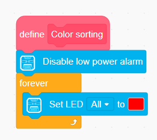

6)  After editing the program, you can also click **File -\> Save to your computer** in the upper left corner of the page to save the program to the computer.

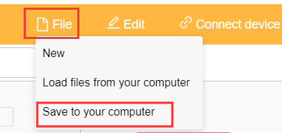

## 3.3 Make Your First Program

### 3.3.1 Learning Objective

1.  Get to know Scratch Programming.

2.  Get familiar with the interfaces and use of WonderCode software.

### 3.3.2 Learning Guide

1. **What is programming?**

​	(1) To enable us to control computer or other hardware, a computer needs to get our intention. Thus, the problem-solving logic and skills needs to be understand by a computer.

​	(2) After a computer understands our intention, it will execute step by step. The goal of programming is to create a program that can solve a problem or automate a task efficiently and accurately. Programmers use their logical thinking and problem-solving skills to break down complex problems into smaller, manageable steps and then translate those steps into code.

2. **Is it hard to learn programming?**

​	(1) For underlying development, you not only need to master various programming language such as C++ and Java, but also the basics of mathematics and physics.

​	(2) For the education of young people, it is vital to develop interest and hands-on creativity. Using block-based code allows children to quickly experience the essence of programming without losing their confidence and excitement due to tedious codes.

​	(3) Therefore, the programming is not just sitting in front of computer and writing code, it is a kind of thinking and skill development.

3. **What is Scratch programming?**

​	(1) Scratch is a graphical programming tool designed and developed by MIT for teenage, enabling user to perform programming by snapping together blocks of code without writing code and any programming instructions.

​	(2) Regardless of whether you have a programming background, users can quickly get familiar with the operation and design of programs. Scratch has become popular due to this revolutionary creation and has a profound impact on programming education.

### 3.3.3 WonderCode Software

1. Powerful but limited. The official Scratch software has limited support for a specific range of hardware devices. and it does not support Arduino or Python extensions.

2. Indeed, while Scratch is powerful, it does have certain limitations in terms of functionality. The official Scratch software has limited support for a specific range of hardware devices, and it does not directly support Arduino or Python extensions.

3. Let’s have a look at the layout distribution of Wondercode.

4. Double click to open the WonderCode software. The most upper part is the menu bar. It is mainly composed of File, Edit, Connect and Help. An **“Uplode mode”** button on the upper right corner is used to switch the display of the stage and code on the right side of the interface.

5. The left side of the interface is the block code area. The function extension button is on the lower left corner. Clicking on it can extent the type of the block code. In the middle is the script area, where the block code is placed during programming.

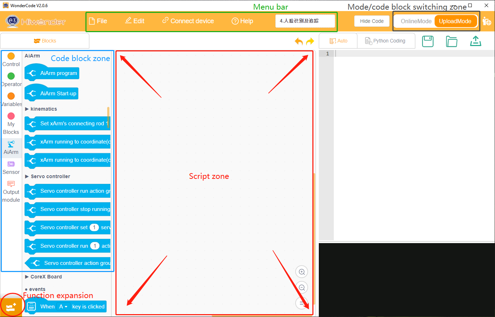

6. Click on  to open AiArm software expansion package. The function of AiArm is realized by using the provided expansion package to enable the corresponding software programming. Otherwise, you will fail to call the hardware module. In software, the expansion package requires to be manually installed and added.

7. The way to add expansion package: click onand select “Robot-\> **AiArm**” in the pop-up window.

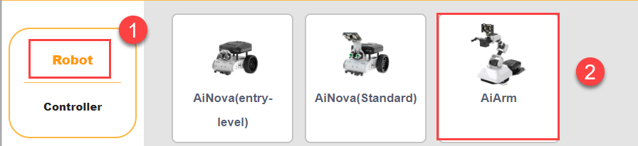

8. Proceed to write program.

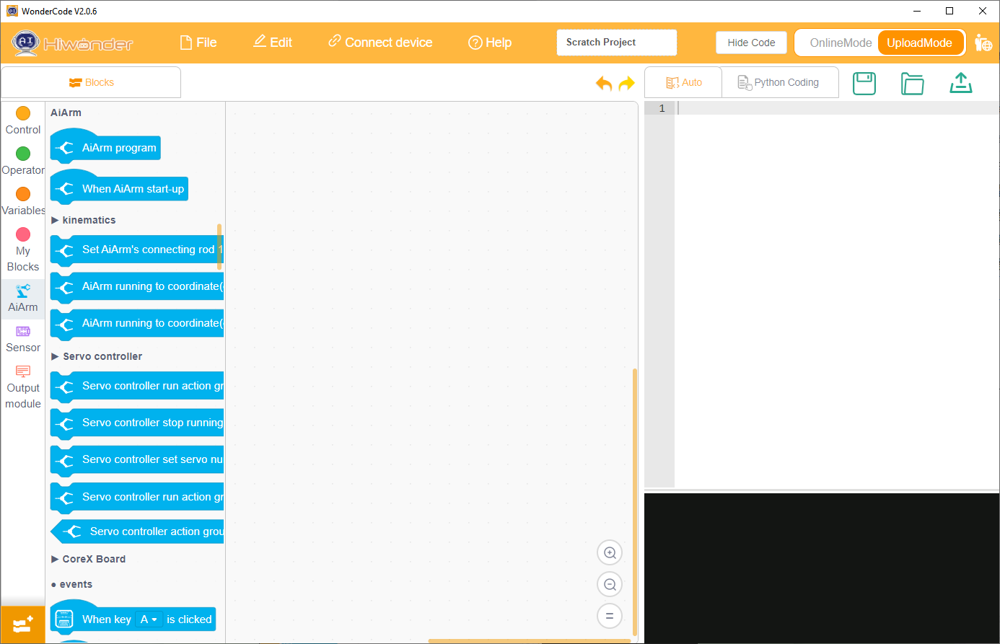

9. Use the left mouse button to drag  on the left to the middle of the script area. The middle script area corresponds to the code area on the right, as shown in the below figure:

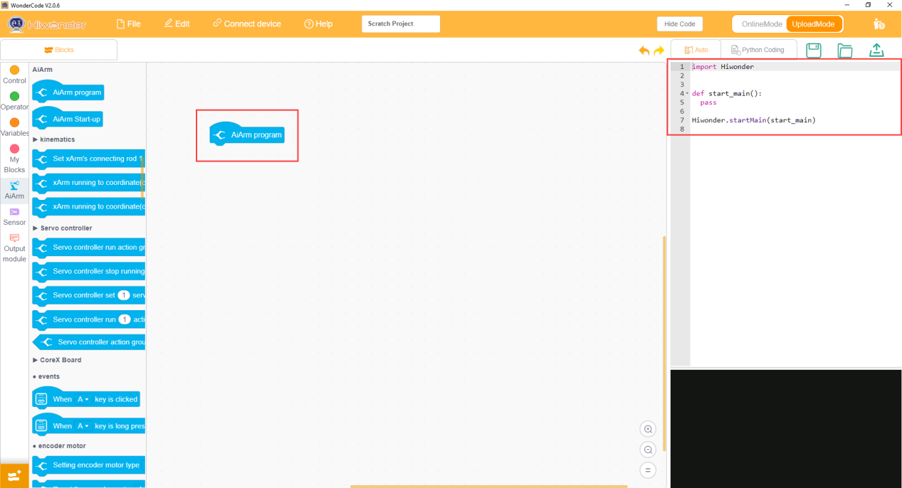

10. Connect the device to a computer and click on the **“Connect”** button to select the corresponding COM port. (The COM can be viewed by opening the device manager. Here assumes **“COM4”** as an example.)

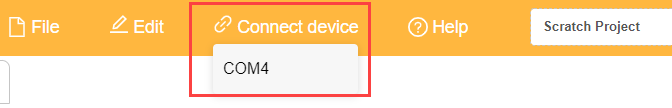

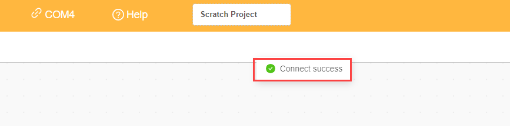

11. Click on  on the right to download program to CoreX controller. Wait for a while to complete uploading.

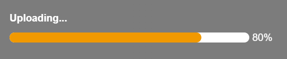

12. Right click on the block code to copy, add comments or delete the code.

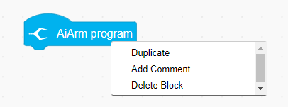

13. You can also drag the code block to the left to delete.

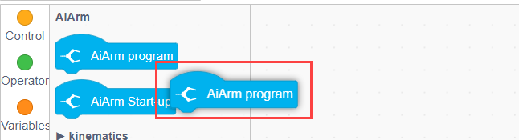

14. For saving the project, you can click on **“File”** to select **“Save to the local”**, and name the file on in the pop-up window.

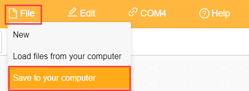

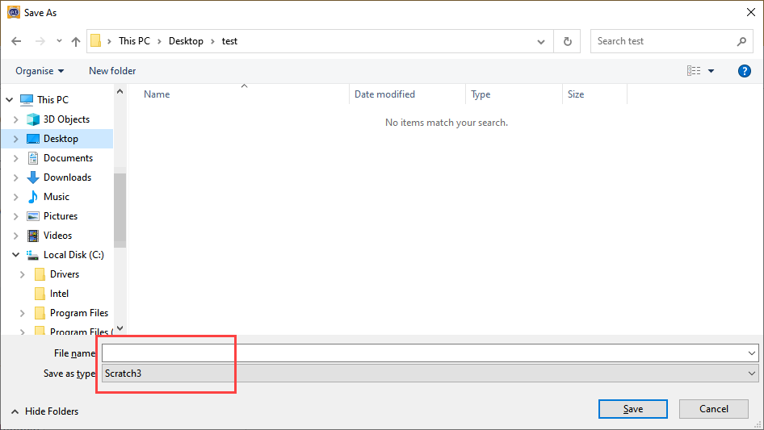

15. If you want to load the provided example program or self-programmed project, please operate according to the following prompt. 

> [!NOTE]
>
> **open only specified type of format files.**

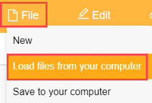

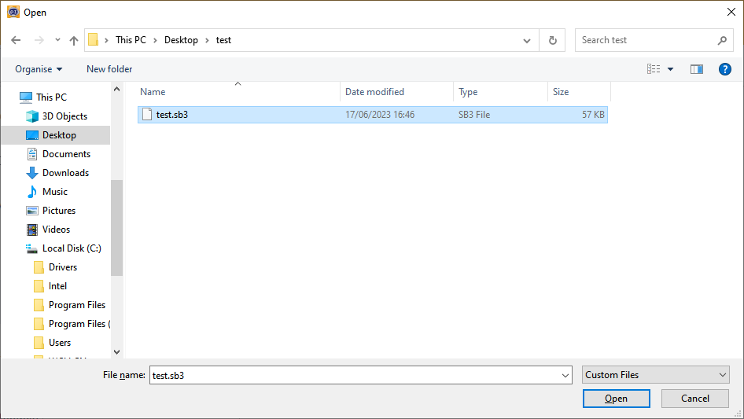

16. There is another shortcut to open a project. First minimize the WonderCode window and place it on the left side of your computer screen. Then drag the program to be loaded withount releasing to any areas in software. Then the software will automatically load the program.

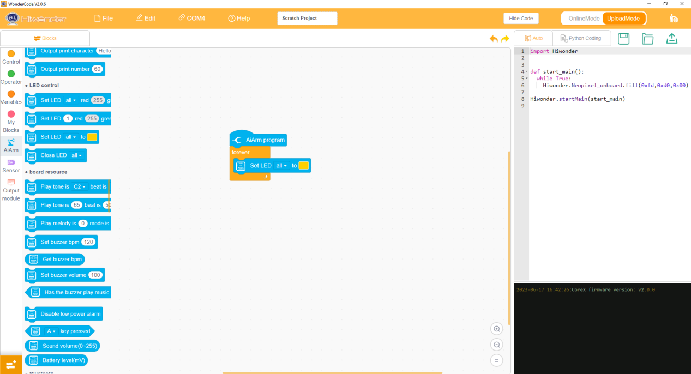

### 3.3.4 Application

A program is created to control CoreX controller to play music.

1)  Move the **“AiArm Main Program”** block on the left to the script area.

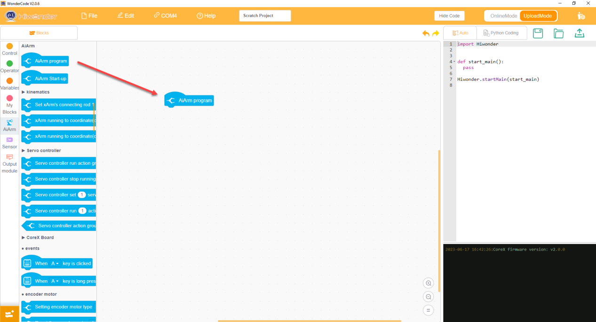

2)  In the AiArm onboard resource area, drag the block-based code for playing music to under the **“AiArm main program”** block.

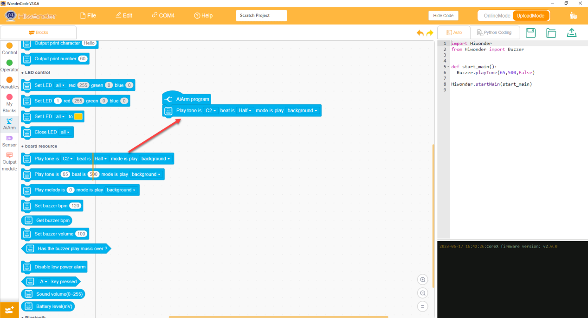

3)  Click on  button to upload the program into CoreX controller.

4)  Wait for the program to be uploaded. Then CoreX controller will play the music once.

5)  Click on **“File-\> Save to the local”** to save the program named as **“My First Program”**.

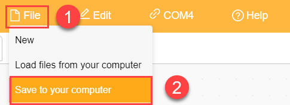

 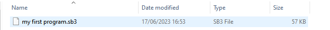

6)  Clear the script area and drag the program to any area of the software interface.

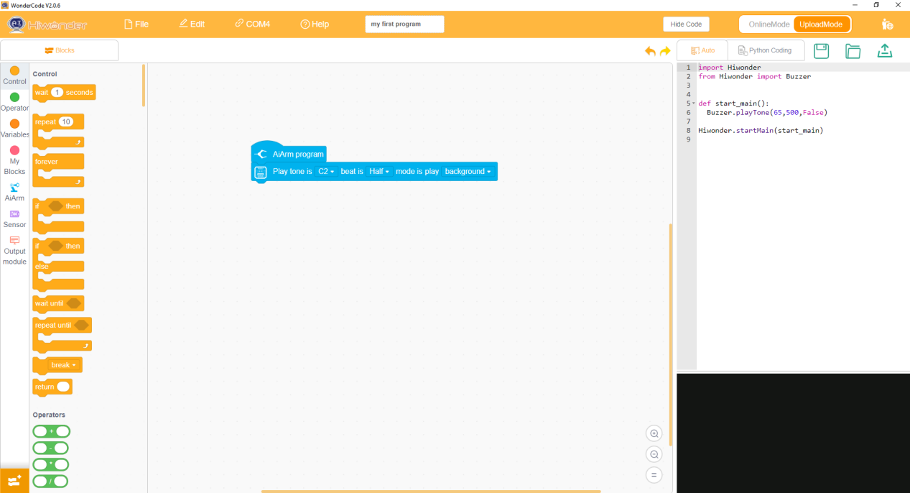

### 3.3.5 Extension Task

Creating a new program allows controller to play three different types of music in sequence.

## 3.4 Light up RGB LED in Sequence

### 3.4.1 Learning Objective

1.  Get to know the component of three types of the program structure.

2.  Understanding the concept of sequence structure

3.  Get a preliminary understanding of the execution mechanism of sequence structure.

### 3.4.2 Brief Introduction to the loop structure

1. In 1996, computer scientist Bohm and Jacopini proved that any simple or complex algorithm can be composed of sequential structure, loop structure and selection structure. Just like human body, programming consists of many elements, but relying solely on these elements is far from sufficient. It also requires the structure of the program to control and organize them effectively.

2. Sequential structure is a simple and ordered linear structure where a program is executed in the order it is written. The program runs from top to bottom, executing one statement at a time until it reaches the end.

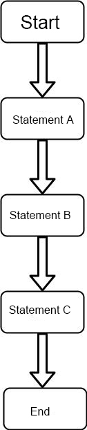

- **Command Module Instruction**

<table>
<colgroup>
<col style="width: 37%" />
<col style="width: 31%" />
<col style="width: 30%" />
</colgroup>
<tbody>
<tr>
<td style="text-align: center;"><strong>Command module</strong></td>
<td style="text-align: center;"><strong>Type</strong></td>
<td style="text-align: center;"><strong>Function</strong></td>
</tr>
<tr>
<td style="text-align: center;"></td>
<td rowspan="2" style="text-align: center;"></td>
<td style="text-align: left;">Light up the corresponding RGB LED on CoreX controller and display the set color.</td>
</tr>
<tr>
<td style="text-align: center;">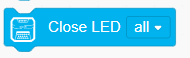</td>
<td style="text-align: left;">Turn off the corresponding RGB on CoreX controller.</td>
</tr>
<tr>
<td style="text-align: center;">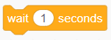</td>
<td style="text-align: center;"></td>
<td style="text-align: left;">Delay command block. The program is executed after the set time.</td>
</tr>
</tbody>
</table>

### 3.4.3 Performance

1)  Drag the following blocks on the left to the script area. The block can be directly copy and paste in the script area.

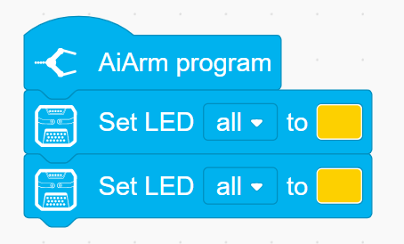

2)  Set the LEDs to **“all”** and set the color sequentially to red and green, as shown in the below figure:

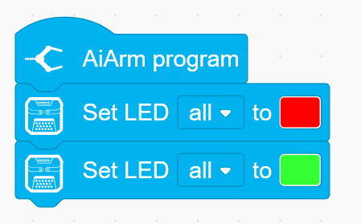

3)  Add a delay command block after each RGB LEDs command block, as shown in the figure below.

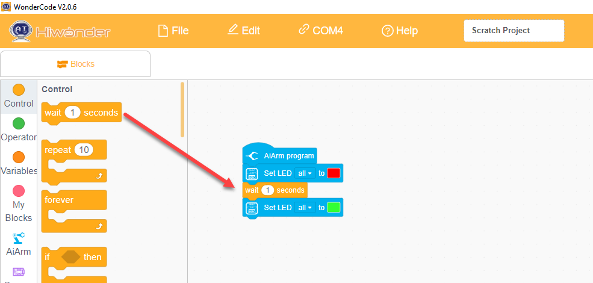

4)  Download the program into the controller.

### 3.4.4 Extension Task

1. Create a new program to enable LED1, LED2 and LED3 on CoreX controller light up in red, and switch these three LEDs to green with a interval of one second. 
2. Then, after another 1-second interval, make LED4, LED5 and LED6 light up in red. After 1 second, switch these three LEDs to green. Wait for 2 seconds, then turn off all six LEDs completely.

## 3.5 Light Up RGB LED Using a Loop Statement

### 3.5.1 Learning Objective

1.  Get the know the concept of the loop structure.

2.  Get a preliminary understanding of the execution mechanism of loop structure.

3.  Exemplify the loop structure of your daily life.

### 3.5.2 Introduction to the loop structure

1. The loop structure refers to a kind of program structure set for repeatedly executing a block of code multiple times. A loop statement is usually composed of a loop body and a termination condition, and whether it can continue repeating is determined by the termination condition of the loop.

2. It is generally divided into two types: judge the condition before repeat
3. Loop structures can be further divided into two types: pre-test loops and post-test loops. Pre-test loops first evaluate the condition before entering the loop, while post-test loops first perform the loop body and then evaluate the condition. They are particularly useful when dealing with iterative tasks or processing collections of data, enabling the program to leverage the computational strengths of computers.

### 3.5.3 Command Module Instruction

<table>
<colgroup>
<col style="width: 33%" />
<col style="width: 33%" />
<col style="width: 33%" />
</colgroup>
<tbody>
<tr>
<td style="text-align: center;"><strong>Command Module</strong></td>
<td style="text-align: center;"><strong>Type</strong></td>
<td style="text-align: center;"><strong>Function</strong></td>
</tr>
<tr>
<td style="text-align: center;"></td>
<td rowspan="3" style="text-align: center;">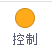</td>
<td style="text-align: left;">Repetitive execution of program</td>
</tr>
<tr>
<td style="text-align: center;">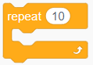</td>
<td style="text-align: left;">Set the number of the repetitive execution</td>
</tr>
<tr>
<td style="text-align: center;">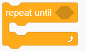</td>
<td style="text-align: left;">Execute the statement repeatedly until the set condition is terminated.</td>
</tr>
</tbody>
</table>

### 3.5.4 Application

1)  Place two RGB light commands to under the **“AiArm main program”**.

2)  Set LED as **“all”**. The color is red and green in sequence, as shown in the below figure:

3)  Set a delay of 1 second between the colors.

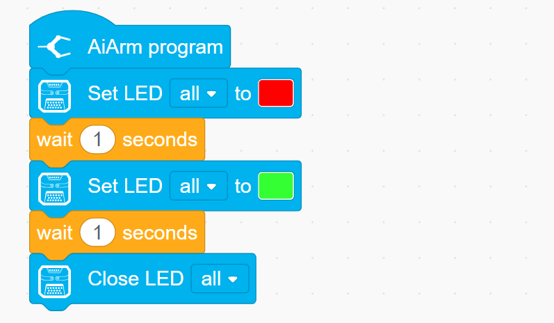

4)  To achieve the purpose of repeatedly light up RGB LEDs, select the **“Repetitive execution”** command module on the left.

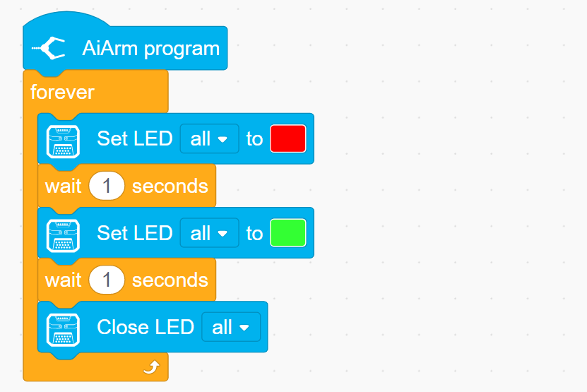

5)  Then download the program into CoreX controller. The RGB LEDs will repeatedly light up the corresponding LEDs.

### 3.5.5 Outcome

The loop structure is widely used to reduce the amount of the code, improving the running efficiency of a computer.

### 3.5.6 Extension Task

Create a program to make the RGB LED sequentially display red and yellow five times, followed by sequentially displaying green and blue five times.

## 3.6 LED Display Variable

### 3.6.1 Learning Objective

1.  Get to know the basic concept of variable and learn about the form of data stored in program

2.  Distinguish between variables and constants

3.  Create variables in command module.

### 3.6.2 Learning Guide

- **Command Module Instruction (Partial command module)**

<table>
<colgroup>
<col style="width: 45%" />
<col style="width: 21%" />
<col style="width: 33%" />
</colgroup>
<tbody>
<tr>
<td style="text-align: center;"><strong>Command module</strong></td>
<td style="text-align: center;"><strong>Type</strong></td>
<td style="text-align: center;"><strong>Function</strong></td>
</tr>
<tr>
<td style="text-align: center;">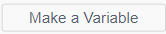</td>
<td rowspan="3" style="text-align: center;">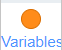</td>
<td style="text-align: left;">Create a variable</td>
</tr>
<tr>
<td style="text-align: center;"></td>
<td style="text-align: left;">Variable assignment</td>
</tr>
<tr>
<td style="text-align: center;"></td>
<td style="text-align: left;">Increase the value of variable (it can be set)</td>
</tr>
<tr>
<td style="text-align: center;"></td>
<td style="text-align: center;">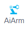</td>
<td style="text-align: left;">Display the color and the position where the variable is displayed (on-board LED).</td>
</tr>
</tbody>
</table>

### 3.6.3 Application

Create a variable and assign a value, then display it through LED on controller.

1)  Create a variable named **“a”** through the **“Variables”** area on the left.

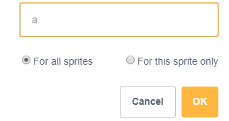

2)  Assign the **“a”**variable a value of 1, and move the command block to under the main program.

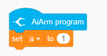

3)  Move the command block of the expression panel to the variable assignment statement in the **“LED control”** area on the left.

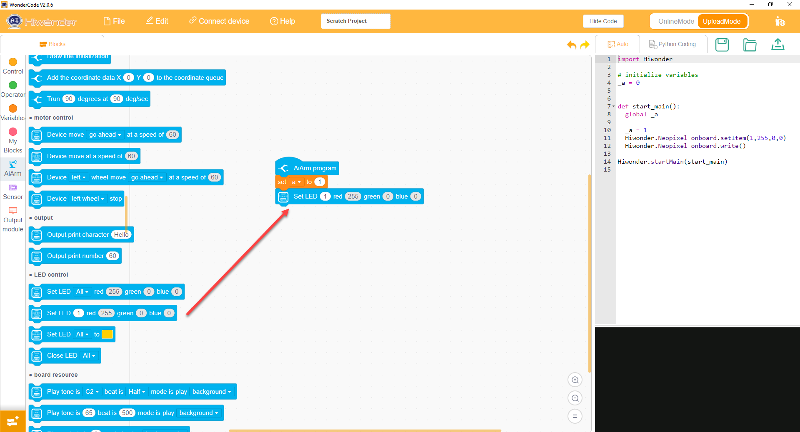

4)  Drag the variables to the corresponding position.

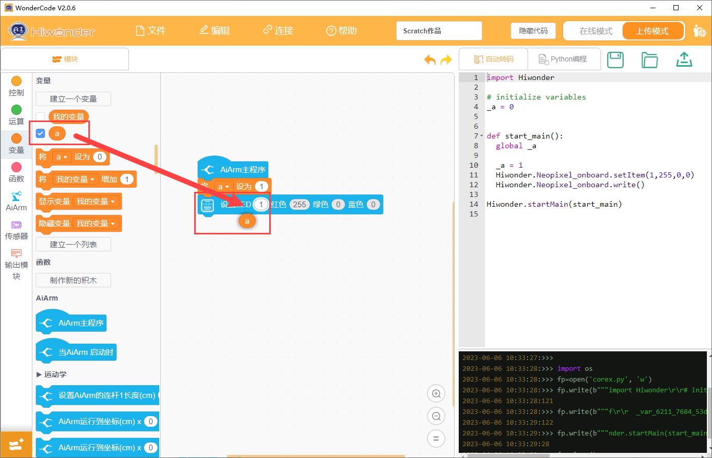

5)  The complete program is shown in below figure:

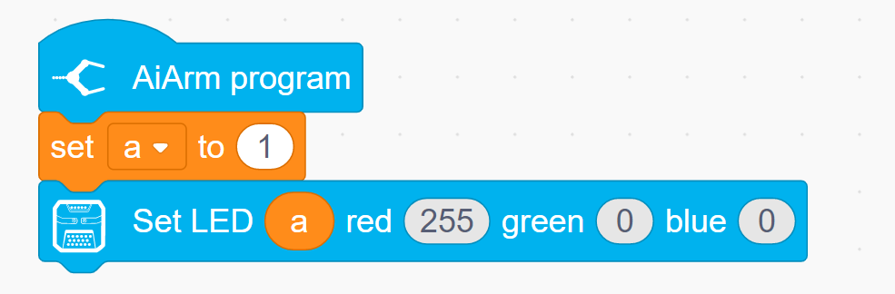

6)  Download the program into the CoreX control and observe the performance of dot matrix display.

### 3.6.4 Outcome

Learn about how the data is stored in computer through the above program. The primary role of variables in programming languages is to store information that will be used in computer programs.

### 3.6.5 Extension Task

Create a project to light up LED in different positions on controller by setting variables.

## 3.7 Select LED Color

### 3.7.1 Learning Objective

1.  Understand the concept of the selection structure.

2.  Get a preliminary understanding of the execution mechanism of selection structure.

3.  Distinguish between selection structure and Loop structure.

### 3.7.2 Introduction to the selection structure

1. The selection structure in program is used to first evaluate a given condition, and then control the program based on its result.

2. The selection structure is used in a program to first evaluate a given condition and then control the program based on the result of the evaluation. The selection structure has two forms including a single-selection structure and dual-selection structure. In actual development, there may be more than two structures. The multiple-selection structure can be derived from the dual-selection structure.

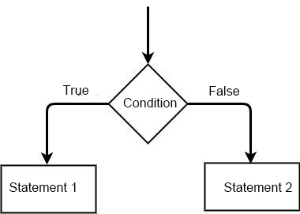

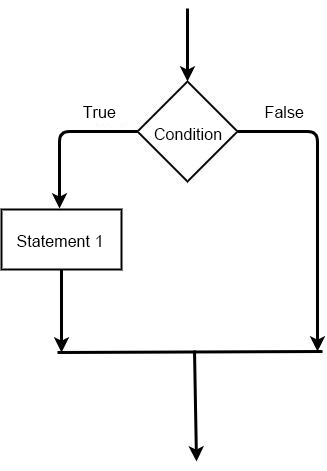

- **Command Module Instruction**

<table>
<colgroup>
<col style="width: 33%" />
<col style="width: 33%" />
<col style="width: 33%" />
</colgroup>
<tbody>
<tr>
<td style="text-align: center;"><strong>Command module</strong></td>
<td style="text-align: center;"><strong>Type</strong></td>
<td style="text-align: center;"><strong>Function</strong></td>
</tr>
<tr>
<td style="text-align: center;">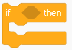</td>
<td rowspan="2" style="text-align: center;">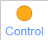</td>
<td style="text-align: left;">The condition is evaluated, and if it is True, the statement is executed.</td>
</tr>
<tr>
<td style="text-align: center;">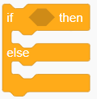</td>
<td style="text-align: center;">The condition is evaluated, and if it True, the statement 1 will be executed, otherwise, the statement 2 is executed.</td>
</tr>
</tbody>
</table>

### 3.7.3 Application

1)  Create a variable named **“a”** through the **“Variables”** area on the left, and assign the **“a”** variable a value of 1, and move the command block to under the main program.

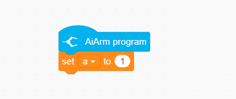

2)  Use a loop structure with an command block and set the loop iteration to 10 times.

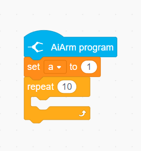

3)  Increment the value of variable **a** by 1 at the beginning of each loop iteration. For example, after the first increment, the value of **a** will be 1, after the second increment, it will be 2, and so on, until the loop completes 10 increments.

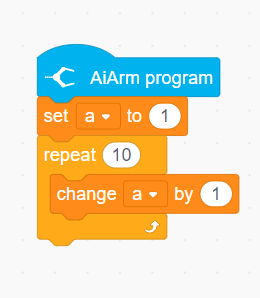

4)  Create a condition to evaluate the value of variable **a**. If a certain condition is met, execute statement 1, otherwise, execute statement 2.

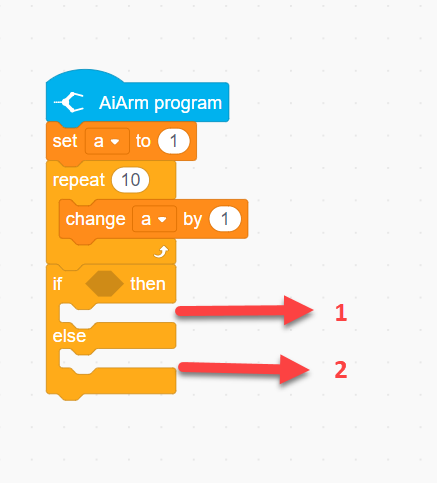

5)  Place the operator inside the conditional statement to the **expression** area on the left.

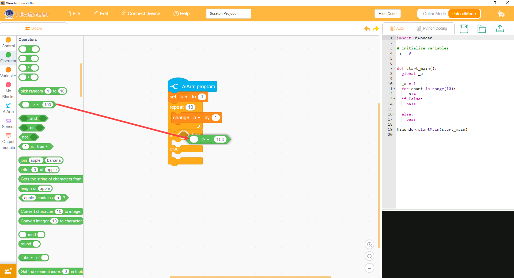

6)  Drag variable **a** to the left side of the operator and change the value on the right side to 6. This way, we have created a condition to use the value of variable **a** being less than 6 as a basis for evaluation.

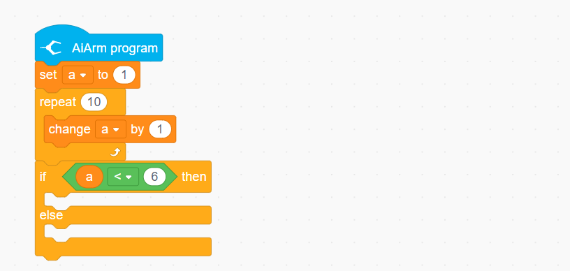

7)  Lastly, add two execution statements. When the condition is met, the RGB lights of the CoreX controller display red, otherwise, display yellow RGB LED.

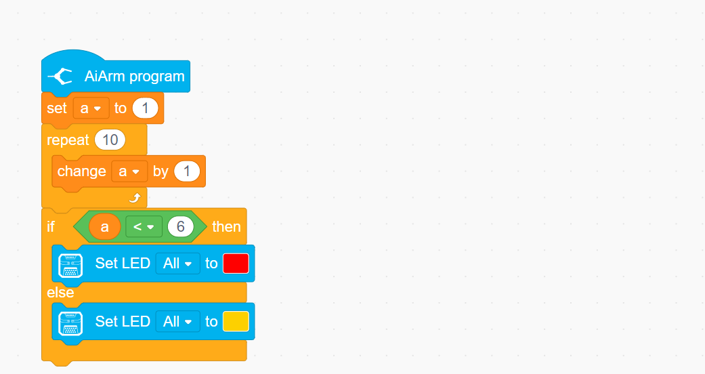

8)  Download the program into the CoreX controller and observe the porformance of CoreX controller.

### 3.7.4 Extension Task 

1. Create a new project, set up two variables and make them increment. 
2. At the same time, establish a condition: compare the two variables, and if the condition is met, light up the LED lights on the controller in green. Otherwise, display the LED lights in red.

## 3.8 Display a Random Number

### 3.8.1 Learning Objective

1.  Master the basic use of operation in programming

2.  Design a operation example

### 3.8.2 Learning Guide

- **Command Module Instruction**

<table>
<colgroup>
<col style="width: 32%" />
<col style="width: 29%" />
<col style="width: 37%" />
</colgroup>
<tbody>
<tr>
<td style="text-align: center;">Command module</td>
<td style="text-align: center;">Type</td>
<td style="text-align: center;">Function</td>
</tr>
<tr>
<td style="text-align: center;">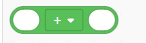</td>
<td rowspan="4" style="text-align: center;">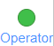</td>
<td style="text-align: left;">Perform addition, subtraction, multiplication, and division calculations in programming</td>
</tr>
<tr>
<td style="text-align: center;">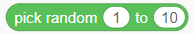</td>
<td style="text-align: left;">Set a range of values and generate random numbers within that range.</td>
</tr>
<tr>
<td style="text-align: center;"></td>
<td style="text-align: left;">set numerical values and compare them.</td>
</tr>
<tr>
<td style="text-align: center;"></td>
<td style="text-align: left;">round constants or variables to the nearest whole number using rounding operations in programming</td>
</tr>
</tbody>
</table>

### 3.8.3 Application

1)  Create **“a”** and **“b”** two variables, assign the **“a”** variable as a value of 0, and the **“b”** variable generates a random value ranging form 0 to 6.

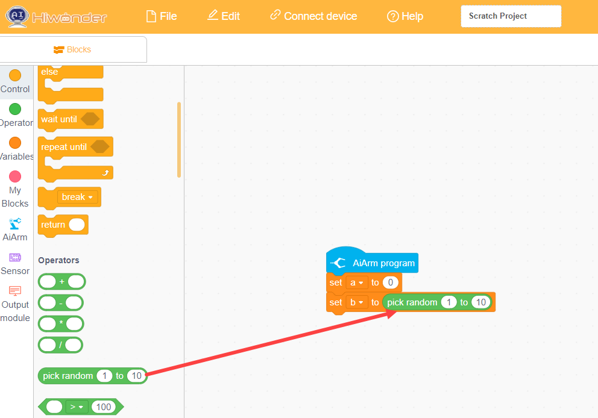

2)  Add the values of variable **a** and variable **b**, and create a condition. If the sum is less than 6, light up the corresponding LED light (0 to 5 corresponding to the lights on the controller). If the condition is not met, that is, if the sum is greater than or equal to 6, light up all the LED lights on the controller in red.

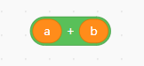

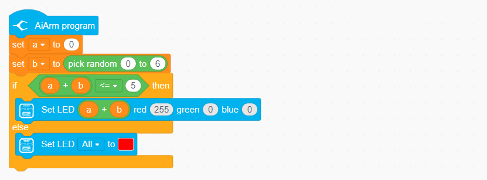

3)  Download the program into the CoreX controller and observe the porformance of CoreX controller.

### 3.8.4 Extension Task

1. To create a new project, you need to set two variables, a and b, and assign them random numbers within the range of 0-5. 
2. Then, add the two numbers together. If the sum is less than 6, light up the corresponding LED light. If the sum is greater than or equal to 6, light up all the LED lights in yellow.

## 3.9 LED Light Water

### 3.9.1 Learning Objective

1.  Get to know the working principle of RGB Led module and its application.

2.  Follow the operation steps to write program.

### 3.9.2 Learning Guide

- **Hardware**

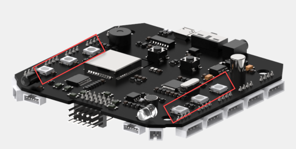

1. There are six RGB lights embedded on AiArm controller. An RGB light module is a compact electronic component that integrates red, green, and blue LEDs into a single module. The RGB light is widely used in our daily life, such as signal light and decoration light.

- **Programming Knowledge**

**Diagram design:**

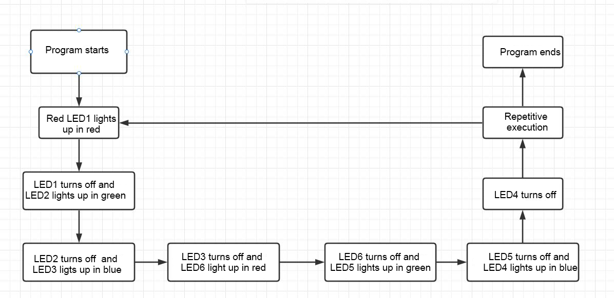

- **Command Module Instruction**

<table>
<colgroup>
<col style="width: 47%" />
<col style="width: 26%" />
<col style="width: 26%" />
</colgroup>
<tbody>
<tr>
<td style="text-align: center;"><strong>Command module</strong></td>
<td style="text-align: center;"><strong>Type</strong></td>
<td style="text-align: center;"><strong>Instruction</strong></td>
</tr>
<tr>
<td style="text-align: center;">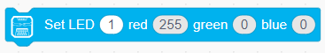</td>
<td style="text-align: center;"></td>
<td style="text-align: left;">Light up the corresponding RGB lights on CoreX controller and display the set color (0-225).</td>
</tr>
<tr>
<td style="text-align: center;"></td>
<td rowspan="2" style="text-align: center;">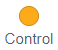</td>
<td style="text-align: left;">Set a delay for program</td>
</tr>
<tr>
<td style="text-align: center;"></td>
<td style="text-align: left;">The program is set to execute repeatedly.</td>
</tr>
</tbody>
</table>
### 3.9.3 Performance

- **Preparation**

<table>
<colgroup>
<col style="width: 20%" />
<col style="width: 22%" />
<col style="width: 30%" />
<col style="width: 25%" />
</colgroup>
<tbody>
<tr>
<td style="text-align: center;">No.</td>
<td style="text-align: center;">Name</td>
<td style="text-align: center;">Picture</td>
<td style="text-align: center;">Qty</td>
</tr>
<tr>
<td style="text-align: center;"><ol type="1">
<li></li>
</ol></td>
<td style="text-align: center;">Power adapter</td>
<td style="text-align: center;">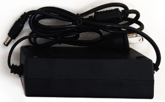</td>
<td style="text-align: center;">1</td>
</tr>
<tr>
<td style="text-align: center;"><ol start="2" type="1">
<li></li>
</ol></td>
<td style="text-align: center;">USB cable</td>
<td style="text-align: center;"></td>
<td style="text-align: center;">1</td>
</tr>
<tr>
<td style="text-align: center;"><ol start="3" type="1">
<li></li>
</ol></td>
<td style="text-align: center;">
AiArm

(CoreX controller has been installed)
</td>
<td style="text-align: center;"></td>
<td style="text-align: center;">1</td>
</tr>
</tbody>
</table>

- **Programming Development**

1)  Drag **“AiArm main program”** command block to the script area.

2)  According to the above prompt, if we need to get LED light up, you need to drag the following block to the the script area. To enable the first LED on controller emit red light, you need to set the serial number of LED to 0 and set **“red”** as 255.

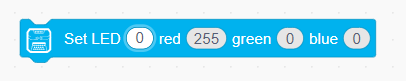

3)  Then set the execution duration.

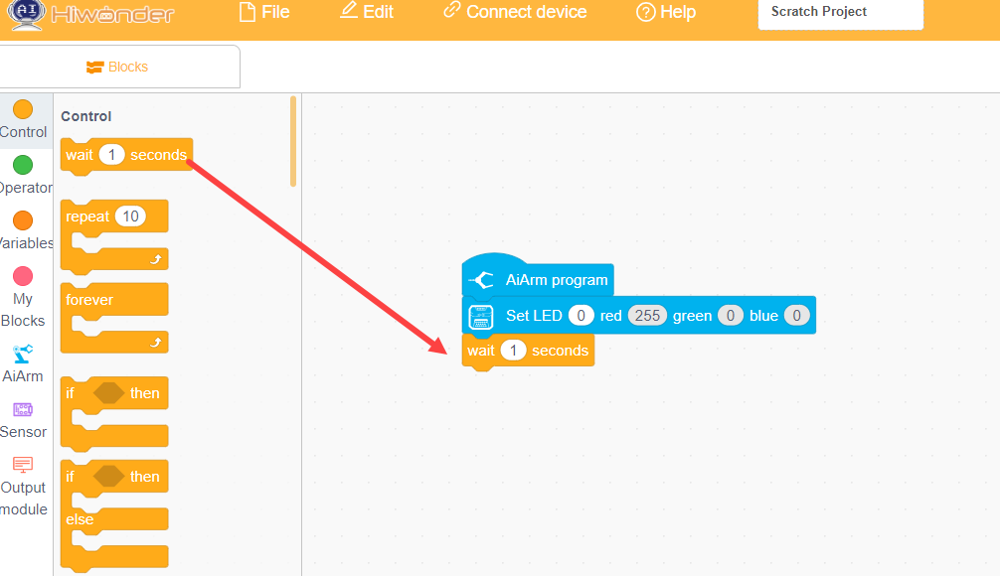

4)  According to the above diagram, LED1 turns off first before LED2 lights up, then LED2 turns off before LED3 lights up. The command blocks are added in sequence as follow:

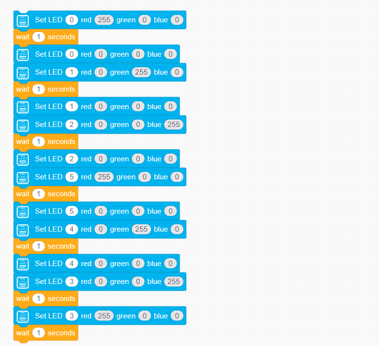

5)  Lastly, add a loop command block to perform a repetitive running of LEDs.

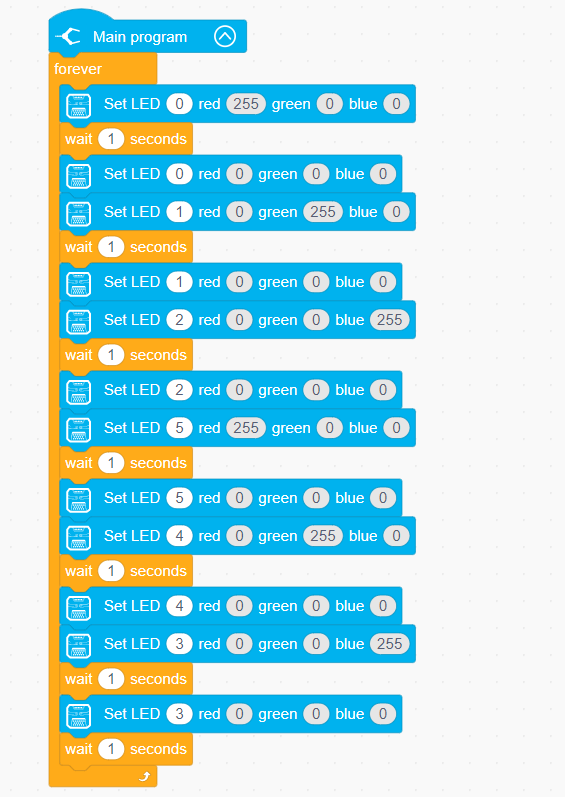

6)  Download the program into CoreX controller and observe the performance of each LED.

### 3.9.4 Extension Task

1. Create a scenario trigger condition. Set a random variable ranging from 0 to 10. When the value is less than or equal to 5, the LED will cycle in the direction from LED1 to LED6. 
2. When the value is greater than or equal to 6 and less than or equal to 10, the LED lights will cycle in the direction from LED6 to LED1.

## 3.10 Button Control Action Group

### 3.10.1 Learning Objective

1.  Understand the working logic of the programming button.

2.  Get familiar with the operation steps and write your own program.

### 3.10.2 Learning Guide

- **Hardware**

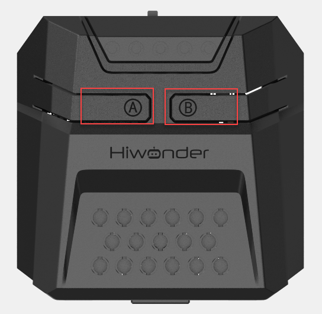

1. The CoreX controller comes with A and B two programmable buttons that belongs to the button switch. When the button is pressed, the metal piece undergoes deformation and make contact with the soldering point, points, causing the two sets of pins to get connected. 
2. As a result, the circuit becomes closed, allowing current to flow. Conversely, when we release the external force, the metal piece returns to its original shape, separating from the soldering points. This discontinues the connection between two sets of pins, and the circuit enters an open state, cutting off the current flow.

- **Programming Knowledge**

**Diagram design:**

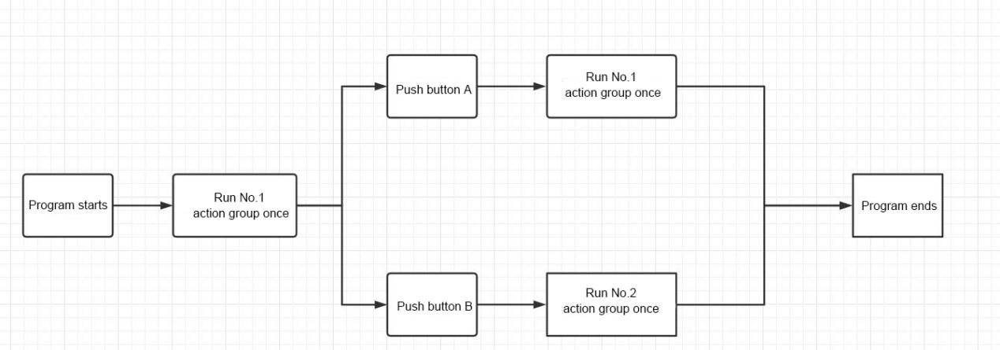

- **Command Module Instruction**

<table>
<colgroup>
<col style="width: 45%" />
<col style="width: 27%" />
<col style="width: 27%" />
</colgroup>
<tbody>
<tr>
<td style="text-align: center;">Command module</td>
<td style="text-align: center;">Type</td>
<td style="text-align: center;">Instruction</td>
</tr>
<tr>
<td style="text-align: center;"></td>
<td rowspan="2" style="text-align: center;">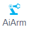</td>
<td style="text-align: left;">AiArm performs a specified action group once. (The serial number and number of times can be set. The serial number corresponding action group must contain action group file. The number of times “0” represents an infinitely repeated execution.)</td>
</tr>
<tr>
<td style="text-align: center;"></td>
<td style="text-align: left;">Pressing this button to trigger condition</td>
</tr>
</tbody>
</table>

### 3.10.3 Performance

- **Project Logic**

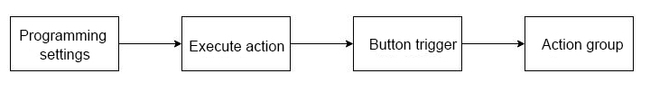

- **Preparation**

<table>
<colgroup>
<col style="width: 22%" />
<col style="width: 23%" />
<col style="width: 32%" />
<col style="width: 22%" />
</colgroup>
<tbody>
<tr>
<td style="text-align: center;"><strong>No.</strong></td>
<td style="text-align: center;"><strong>Name</strong></td>
<td style="text-align: center;"><strong>Picture</strong></td>
<td style="text-align: center;"><strong>Qty</strong></td>
</tr>
<tr>
<td style="text-align: center;">1</td>
<td style="text-align: center;">Power adapter</td>
<td style="text-align: center;"></td>
<td style="text-align: center;">1</td>
</tr>
<tr>
<td style="text-align: center;">2</td>
<td style="text-align: center;">USB cable</td>
<td style="text-align: center;">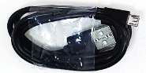</td>
<td style="text-align: center;">1</td>
</tr>
<tr>
<td style="text-align: center;">3</td>
<td style="text-align: center;">Colored block</td>
<td style="text-align: center;"></td>
<td style="text-align: center;">3</td>
</tr>
<tr>
<td style="text-align: center;">4</td>
<td style="text-align: center;">
AiArm

(CoreX controller has been installed)
</td>
<td style="text-align: center;"></td>
<td style="text-align: center;">1</td>
</tr>
</tbody>
</table>

- **Programming Development**

1)  Drag **“AiArm main program”** command block to the script area.

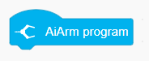

2)  Drag the following command block on the left to the **“AiArm main program”**. Change the serial number of the action group to 0, and the No.0 action group will be executed once when the robot is turned on.

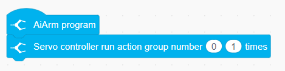

3)  Drag the following command block on the left to the script area.The logic is to execute No.1 action group, with a trigger condition of pressing button A.

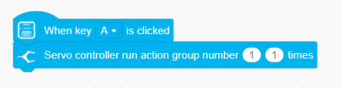

4)  Based on the same method, create another button trigger condition. When pressing button B, AiArm will execute No.2 action group.

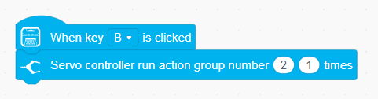

5)  The complete program is shown as follow:

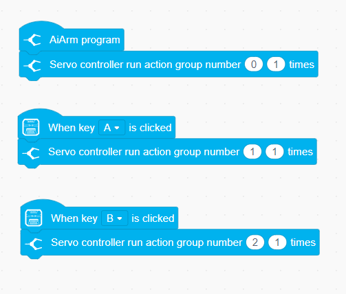

6)  Download the program into CoreX controller. Press button A and B to observe the performance of robotic arm.

### 3.10.4 Extension Task

Create a new project that control the on and off of RGB LED by buttons.

## 3.11 Sound Volume Detection

### 3.11.1 Learning Objective

1.  Understand the working principle and application of the sound sensor.

2.  Get familiar with the operation steps and write your own program.

### 3.11.2 Learning Guide

- **Hardware**

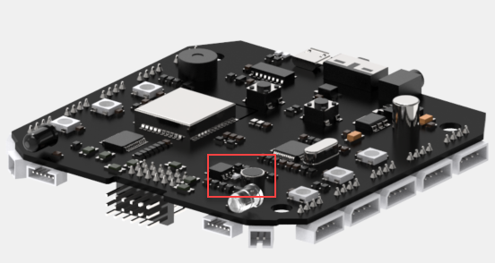

A sound sensor is used to receive the sound waves and display the vibration image of the sound, However, it can’t be used to detect the intensity of noise. The working principle involves outputting the detected sound intensity through ADC module and send the values through a program.

- **Programming Knowledge**

**Diagram design:**

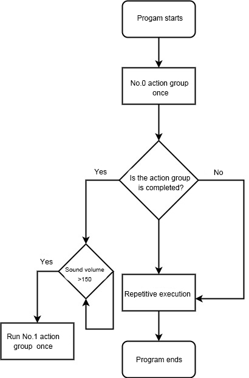

- **Command Module Instruction**

|  |  |  |
|:--:|:--:|:--:|
| **Command module** | **Type** | **Instruction** |
|  |  | AiArm performs a specified action group once. (The serial number and number of times can be set. The serial number corresponding action group must contain action group file. The number of times “0” represents an infinitely repeated execution.) |
|  |  | The sound value detected by sound sensor is a variable. |
| 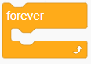 | 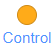 | Program is performed repeatedly for multiple times. |
| 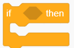 |  | If the condition is met, the statement is executed. |

### 3.11.3 Performance

- **Project Logic**

- **Preparation**

<table>
<colgroup>
<col style="width: 21%" />
<col style="width: 24%" />
<col style="width: 32%" />
<col style="width: 21%" />
</colgroup>
<tbody>
<tr>
<td style="text-align: center;"><strong>No.</strong></td>
<td style="text-align: center;"><strong>Name</strong></td>
<td style="text-align: center;"><strong>Picture</strong></td>
<td style="text-align: center;"><strong>Qty</strong></td>
</tr>
<tr>
<td style="text-align: center;">1</td>
<td style="text-align: center;">Power adapter</td>
<td style="text-align: center;"></td>
<td style="text-align: center;">1</td>
</tr>
<tr>
<td style="text-align: center;">2</td>
<td style="text-align: center;">USB cable</td>
<td style="text-align: center;"></td>
<td style="text-align: center;">1</td>
</tr>
<tr>
<td style="text-align: center;">3</td>
<td style="text-align: center;">Colored block</td>
<td style="text-align: center;">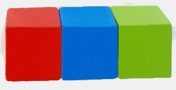</td>
<td style="text-align: center;">3</td>
</tr>
<tr>
<td style="text-align: center;">4</td>
<td style="text-align: center;">
AiArm

(CoreX controller has been installed)
</td>
<td style="text-align: center;">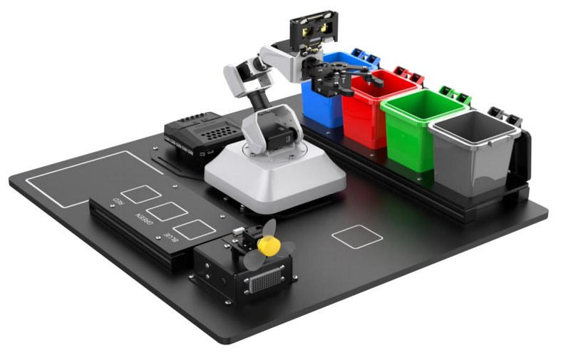</td>
<td style="text-align: center;">1</td>
</tr>
</tbody>
</table>

- **Programming Development**

1)  Drag **“AiArm main program”** command block to the script area.

2)  Drag the following command block on the left to the **“AiArm main program”**. Change the serial number of the action group to 0, and the No.0 action group will be executed once when the robot is turned on.

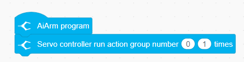

3)  Create a condition to evaluate whether the action has been executed.

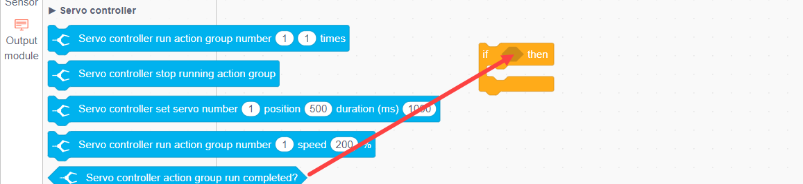

4)  If the action is completed, we need to create a new condition to evaluate whether the volume value detected by the sound sensor meets this condition. The volume threshold in program is set as 150.

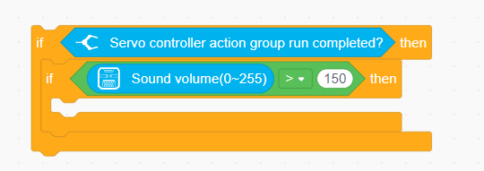

5)  If the condition is met, AiArm will perform No.1 action group once.

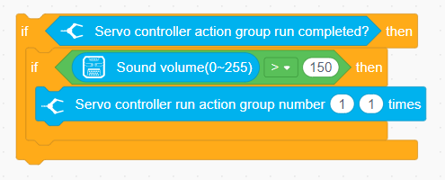

6)  Lastly, we need to repeatedly execute this program.Add a loop command block in front of the first judgement condition.

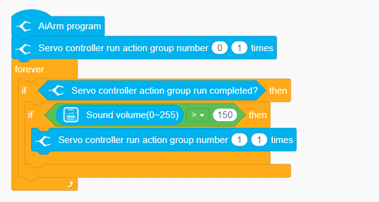

7)  Download the program into CoreX controller. Then you can clap your hands to control the performance.

### 3.11.4 Extension Task

1. Create a new project, with the sound sensor as a trigger control. 
2. When the sound is detected, the green LED on CoreX controller will light up for 1 second, and AiArm will perform an action. If not, the red LED on CoreX controller will light up.

## 3.12 Calling Program on App

> [!NOTE]
>
> **this lesson will teach you how to control AiArm via Bluetooth connection using CoreX and app. It is necessary to first upload the program to CoreX controller and then establish Bluetooth connection. Before getting started, please learn WonderCode programming software.**

### 3.12.1 **Getting Started**

1)  Please install WonderCode and connect to device according to “3. Scratch Programming/1.WonderCode Installation.

2)  Open WonderCode. Drag the “**App Control.sb3**” program file to WonderCode script area.

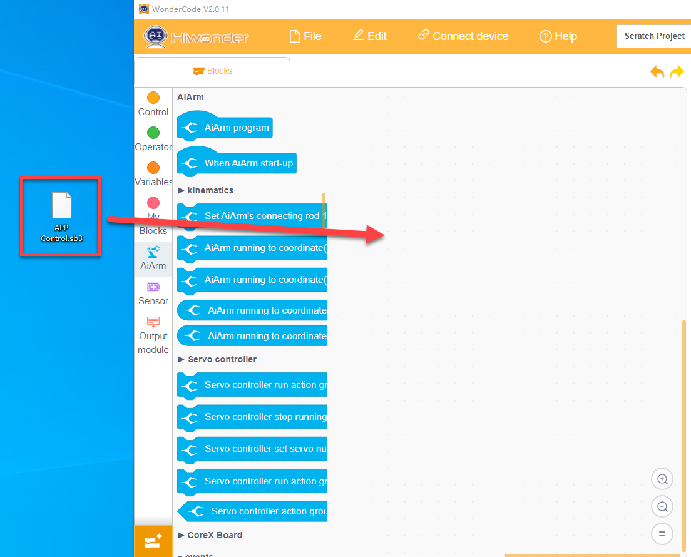

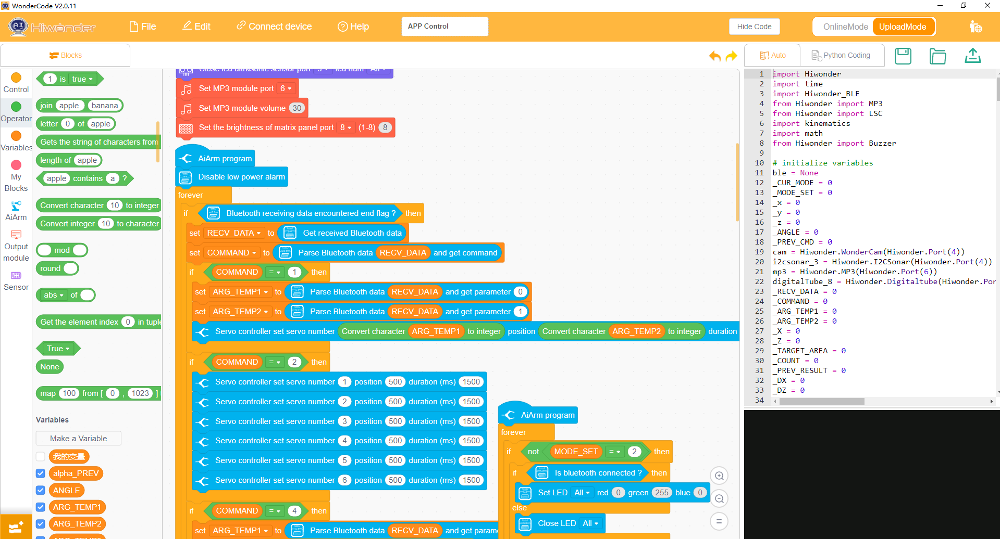

3)  Click on  to upload program. Then, the prompt of “**Success**” will pop up.

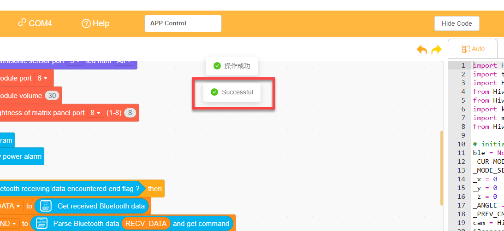

### 3.12.2 **Install APP**

1. **Android**: find a installation package in the same directory of this lesson and then transfer it to your phone for installation.

2. **iOS**: please search **“WonderCom”** on App store.

### 3.12.3 **Device Connection**

> [!NOTE]
>
> 1)  **Before using app, please enable Bluetooth and GPS service.**
>
> 2)  **Please pair and connect the device through the Bluetooth button in app instead of the passphrase in the phone settings.**
>
> 3)  **Please note that Android user must enable all permissions for app, otherwise, it will affect the use of function.**
>
> 4)  **In this case, the app of Android version will be used. The requirement for system must Android 6.0 or above, iOS 12 or above.**

1. Step 1: turn on the switch of AiArm and open **“WonderCom”**.

2. Step 2: Select **“AiArm”** on app interface.

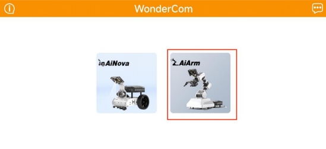

3. Step 3: Click on the flashing Bluetooth icon to enter a device searching state. After a while, find and select **“AiArm-8486”**.

> [!NOTE]
>
> **the device Bluetooth name is not unique, just find the device starting with** **“AiArm”**.

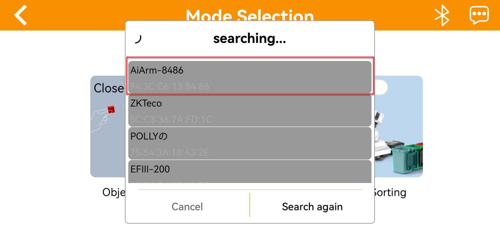

4. Step 4: When the Bluetooth icon stops flashing and keeps on, it indicates that the connection is successful.

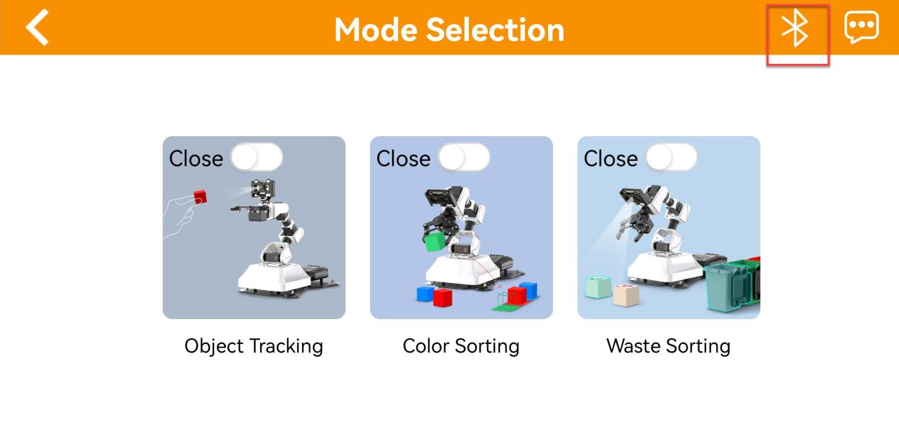

4.  **Mode Instruction**

<table>
<colgroup>
<col style="width: 21%" />
<col style="width: 78%" />
</colgroup>
<tbody>
<tr>
<td>Target Tracking</td>
<td>

It recognizes a colored block through WonderCam vision module and control robot to move with the block.

</td>
</tr>
<tr>
<td>Color sorting</td>
<td>

It recognizes the color of a block through WonderCam vision module and control robot to grip and place it to a corresponding position.

(Before starting this game, WonderCom must first learn color recognition according to “5. WonderCam Vision Module Usage”. This step can not be skipped!!)

</td>
</tr>
<tr>
<td>Wast Sorting</td>
<td>

It recognizes the tag through WonderCam vision module and control robot to grip and place it to a corresponding waste bin.

</td>
</tr>
</tbody>
</table>
