# 4. Sensor Application

## 4.1 Intelligent Fan

### 4.1.1 Introduction

1. This module is designed to enable motor rotation without the need for an additional motor driver board. It offers the flexibility to adjust the speed and direction of rotation as desired. Furthermore, it can be seamlessly integrated with various sensors, allowing for the creation of intelligent fan project.

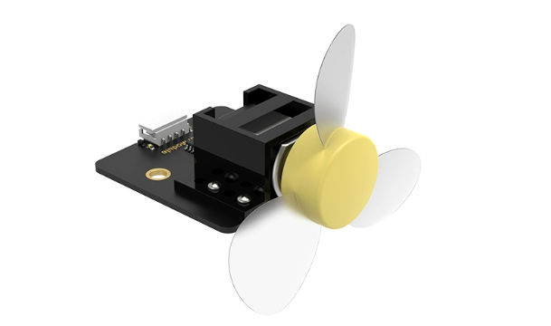

### 4.1.2 Working Logic

1. Utilizing IIC communication, the fan module effectively converts a preset digital signal into an analog signal using a Digital-to-Analog Converter (DAC). 
2. This analog signal is then transmitted to the fan module, enabling seamless adjustment of the fan's speed and rotation direction.

### 4.1.3 Module Features

1)  Adjustable fan’s speed and rotation direction.

2)  The module reserves holes for DIY expansion.

### 4.1.4 Module Parameters

| Working voltage voltage | Communication | Working current |    Size    |
|:-----------------------:|:-------------:|:---------------:|:----------:|
|           5V            |      IIC      |      125mA      | 48mm*48mm |

### 4.1.5 Preparation

1)  Install the fan module to the corresponding position according to the tutorial in “**1. Getting Ready Lesson 2 Props and Map**”, and connect it to port 3 of CoreX controller.

2)  Install WonderCode software referring to the instructions provided in “**3. Scratch Programming\Lesson 1 WonderCode Installation**”.

### 4.1.6 Program Logic

1. Upon AiArm starts, it will initialize port 3 where fan module is connected. Then it will employ loop statement to enable the fan module to rotate in this cycle “**rotate forward -\> stop -\> rotate reversely -\> stop**”.
2. Please set the speed in sequence as below in the main program.

​	(1) **Rotate forward**: Set the speed to 60 and duration to 3 seconds

​	(2) **Stop**: set the speed to 0 and the duration to 1.2 second.

​	(3) **Rotate reversely**: set the speed to -60 and the duration to 3 seconds

​	(4) **Stop**: set the speed to 0 and the duration to 1.2 seconds

3. Repeat the above steps to enable the fan module to realize “**rotate forward -\> stop -\> rotate reversely**”.

### 4.1.7 Connection

1)  Connect the CoreX controller and computer using USB cable, then turn on the controller.

2)  Open “**WonderCode**” software.

3)  Click on the  located at the lower left corner and select **AiArm** from the available options. This software will automatically establish a connection with AiArm in the subsequent operations.

4)  Click-on  and select the corresponding COM port, for example COM4. Please note that COM port options may differ from each computer.

> [!NOTE]
>
> **please do not select COM1, as it used for communication port in general.**
>
> 

5)  Once the connection is established successfully, the below prompt will appear.

### 4.1.8 Write Programs

1)  Click-on  at the lower left corner. Then enter **“Output Module”** section and select Fan.

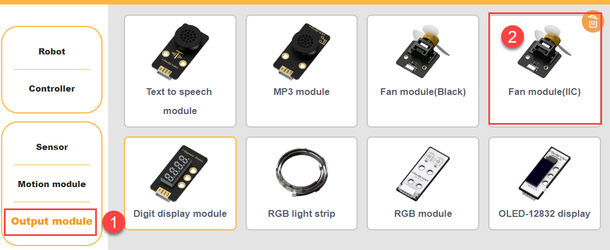

2)  When powering on AiArm, ensure that the port is set to 3, while leaving the address at its default value.

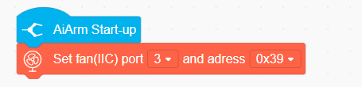

3)  Incorporate the following code blocks into the main program in sequence:

    (1) **Block 1**: Set the speed to 60 and the duration to 3 seconds.

    (2) **Block 2**: Set the speed to 0 and the duration to 1.2 seconds.

    (3) **Block 3**: Set the speed to -60 and the duration to 3 seconds.

    (4) **Block 4**: Set the speed to 0 and the duration to 1.2 seconds.

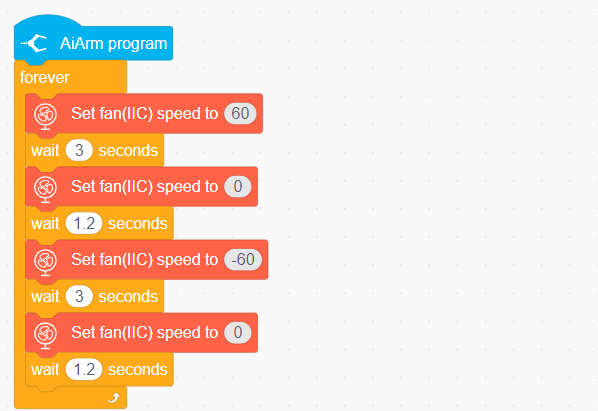

4)  The complete code block is as below.

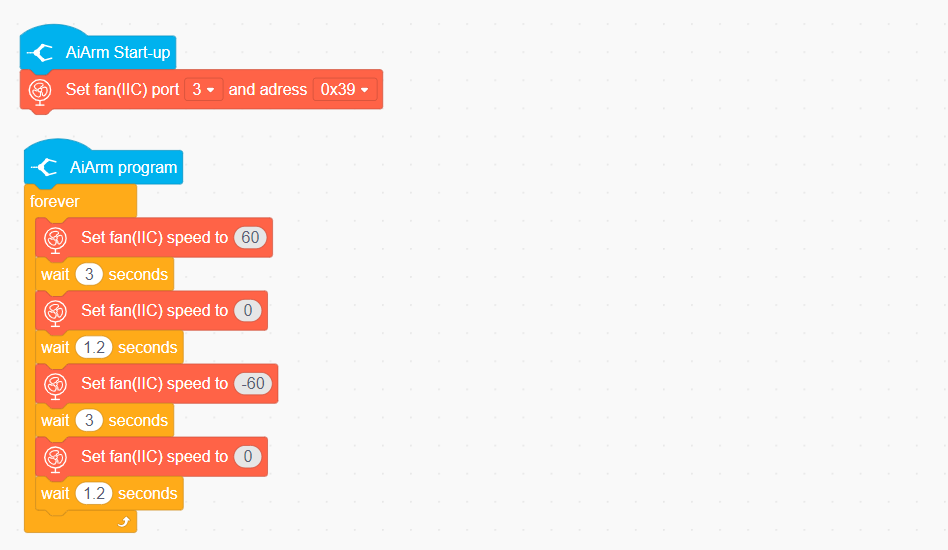

### 4.1.9 Download Programs

1)  Click-on  icon to upload the complete program.

2)  The upload may take some times, and please be patient!

### 4.1.10 Save Programs

1. Click-on **File -\> Save to your computer.**

### 4.1.11 Program Outcome

1. Once the program is downloaded successfully, power on AiArm. 
2. Then the fan module will rotate forward for 3 seconds, then stop for 1.2 second, next rotate reversely for 3 seconds, lastly stop for 1.2 second.

## 4.2 Dot Matrix Display

1. Once the program is downloaded successfully, power on the robot arm and turn on CoreX controller. The dot matrix display will demonstrate number “**123**” for 1 second, then automatically shut down.

### 4.2.1 Introduction

1. The dot matrix display comprises an 8x16 point board. Through programming, we can command the dot matrix display to display the desired pattern.

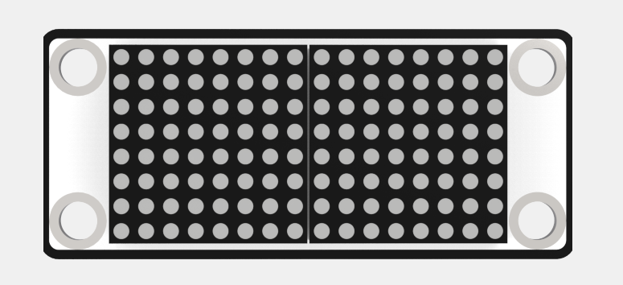

### 4.2.2 Working Logic

1. The dot matrix module is comprised of diodes (LEDs). It operates by utilizing X and Y coordinates to specify LED to display. The X coordinate represents the horizontal position, while the Y coordinate represents the vertical position.

2. The level can be understood as the strength of the voltage signal. When a specific column is set to a level of 1, the corresponding LED will light up, and when a certain row is set to a level of 0, the corresponding LED will be turned off.

3. The figure below illustrates the corresponding coordinate positions within the 8x16 dot matrix grid.

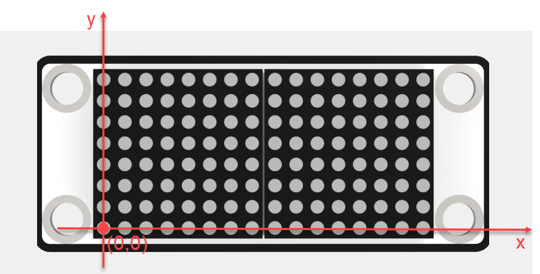

4. In the 8x16 dot matrix grid, the coordinate of the lower left corner is denoted as (0, 0), with X = 0 and Y = 0. When moving one grid to the right, the X coordinate increases by 1 in a sequential manner. Similarly, when moving one grid upwards, the Y coordinate increases by 1 in a sequential manner.

### 4.2.3 Module Features

1. High brightness, no flicker and easy wiring.

### 4.2.4 Module Parameters

| Working voltage voltage | Communication | Working current |    Size    |
|:-----------------------:|:-------------:|:---------------:|:----------:|
|           5V            |      I/O      |      45mA       | 56mm*24mm |

### 4.2.5 Preparation

1)  Install the dot matrix display to the corresponding position according to the tutorial in “**1. Getting Ready/Lesson 2 Props and Map**”, and connect it to port 8 of CoreX controller.

2)  Install WonderCode software referring to the instructions provided in “**3. Scratch Programming/Lesson 1 WonderCode Installation**”.

### 4.2.6 Program Logic

1. Upon AiArm starts, it will initialize the dot matrix display. Then set the port to connect the module, which should be consistent with the port where the dot matrix display is connected, and the brightness, followed by the displayed content.
2. Please execute the following steps to enable the dot matrix display to demonstrate.

​	(1) Drag the main program of AiArm to the script zone.

​	(2) Set the port to 8, and brightness to 8.

​	(3) Set the port to 8, position to 1, and displayed number to 123.

​	(4) Turn off the dot matrix display in 1 second.

### 4.2.7 Connection

1)  Connect the CoreX controller and computer using USB cable, then turn on the controller.

2)  Open “**WonderCode**” software.

3)  Click on the  located at the lower left corner and select **AiArm** from the available options. This software will automatically establish a connection with AiArm in the subsequent operations.

4)  Click-on  and select the corresponding COM port, for example COM4. Please note that COM port options may differ from each computer.

> [!NOTE]
>
> **please do not select COM1, as it used for communication port in general.**
>
> 

5)  Once the connection is established successfully, the below prompt will appear.

### 4.2.8 Write Programs

1)  Click-on  at the lower left corner. Then enter **“Output Module”** section and select dot matrix display.

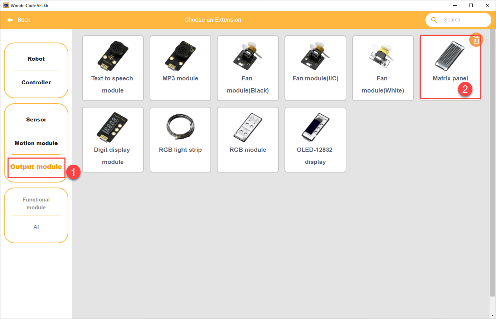

2)  Set the port in the main program of AiArm to 8, brightness to 8, position to 1 and displayed number to 123.

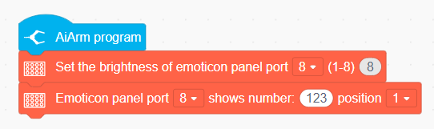

3)  Turn off the dot matrix display in 1 second.

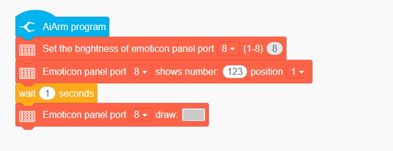

### 4.2.9 Download Programs

1)  Click-on  icon to upload the complete program.

2)  The upload may take some times, and please be patient!

### 4.2.10 Save Programs

1. Click-on **File -\> Save to your computer.**

### 4.2.11 Program Outcome

1. Once the program is downloaded successfully, turn on CoreX controller. Then the dot matrix module will display number **“123”**, and turn off in 1 second.

## 4.3 MP3 Module

1. Once the program is downloaded successfully, press button A on CoreX controller to enable the MP3 module to play music. 
2. If you want to pause the music, press button B.

### 4.3.1 Introduction

1. The MP3 module can play the music stored on the inserted TF card. 
2. Along with its primary function of music playback, it also allows you to switch between songs and adjust the volume to suit your preferences.

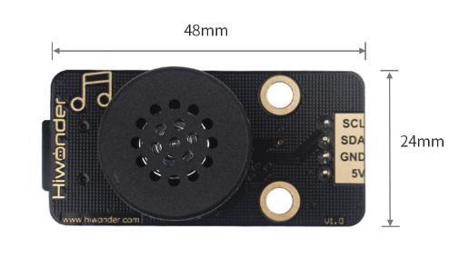

### 4.3.2 Working Logic

1. The MP3 module incorporates IIC communication and leverages a Digital Signal Processor (DSP) to handle the transmission and decoding of MP3 files. Firstly, the module's main chip retrieves MP3 files from the storage and reads the signal from the memory to the decoding circuit for decoding. 
2. Subsequently, the decoded digital signal is converted into an analog signal using a digital-to-analog converter (DAC). The converted analog signal is then amplified and finally outputted to headphones through a Lowpass Filter (LPF), enabling the playback of music.

### 4.3.3 Module Features

1)  Support FAT16 and FAT32 file systems

2)  Can play the songs in the format of MP3, WAV and WMA

3)  Can hold TF card with a storage of 32GB.

### 4.3.4 Module Parameters

| Working Voltage | Communication Method |    Size    |
|:---------------:|:--------------------:|:----------:|
|       5V        |         I2C          | 48mm*24mm |

### 4.3.5 Preparation

Please follow the below instructions to prepare for writing a program.

1)  Insert the TF card to any USB port on your computer using a card reader. Then create a new folder named **“MP3”** within the TF card.

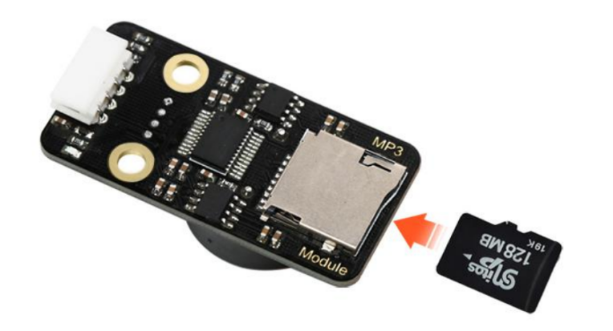

2)  Move the songs to be played, stored in the **Appendix -\> MP3 files**, and drag them into the newly created folder. In addition to the provided songs, you have the option to import other songs into this folder. 
2)  When naming the songs, please use the format: 0011 + song name or 0011, and so on, for each consecutive song. Please be aware that songs 1-10 are preset voice commands and must not be altered, as it may adversely affect the subsequent MP3 broadcast game.

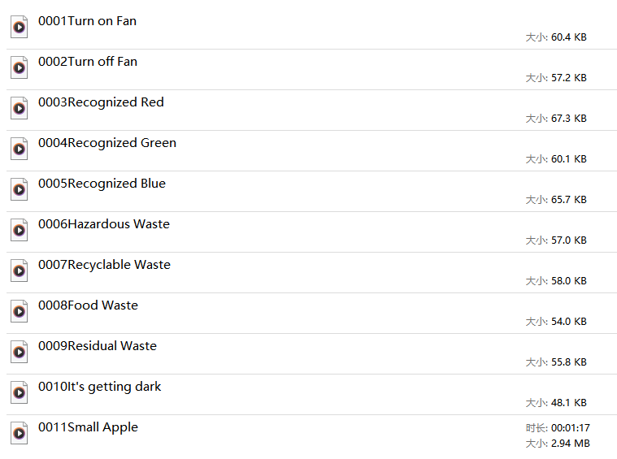

4. Please install the MP3 module onto the specific position, and connect it to port 6 of CoreX controller, according to the instructions provided in “**1. Getting Ready/Lesson 2 Props and Map**”.

5. Install WonderCode programming software referring to the file saved in “**3. Scratch Programming/Lesson 1 WonderCode Installation**”.

### 4.3.6 Program Logic

1. Firstly, the MP3 module will be initialized. Then you can press button A to play music and button B to pause the music. The specific routine is as below.

​	(1) When AiArm is powered on: initialize the port as 6, and the volume as 15.

​	(2) When button A is briefly pressed: the number of song to be played: 11

​	(3) When button B is briefly pressed: MP3 module: stop

### 4.3.7 Connection

1)  Connect the CoreX controller and computer using USB cable, then turn on the controller.

2)  Open “**WonderCode**” software.

3)  Click on the  located at the lower left corner and select **AiArm** from the available options. This software will automatically establish a connection with AiArm in the subsequent operations.

4)  Click-on  and select the corresponding COM port, for example COM4. Please note that COM port options may differ from each computer.

> [!NOTE]
>
> **please do not select COM1, as it used for communication port in general.**
>
> 

5)  Once the connection is established successfully, the below prompt will appear.

### 4.3.8 Write Programs

1)  Click-on  at the lower left corner. Then enter **“Output Module”** section and select MP3 module.

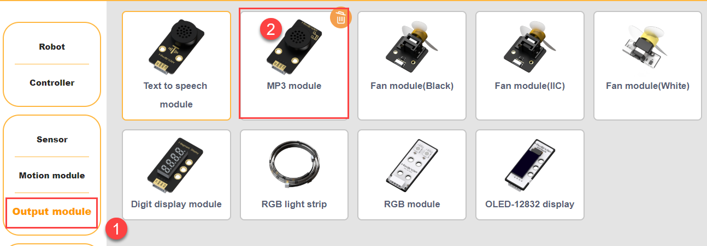

2)  Initialize the port connecting to MP3 module as 6, and set the volume as 15.

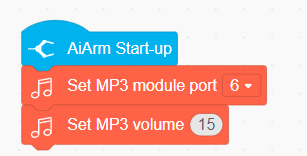

3)  Then control the playback and pause of the music through the two events: **when button A is briefly pressed** and **when the B key is briefly pressed**.

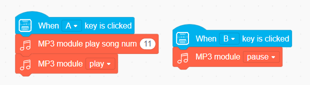

4)  The complete code block is as below.

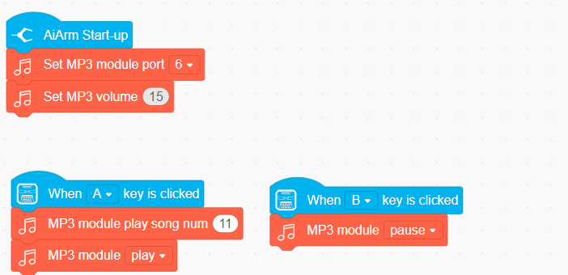

### 4.3.9 Download Programs

1)  Click-on  icon to upload the complete program.

2)  The upload may take some times, and please be patient!

### 4.3.10 Save Programs

1. Click-on **File -\> Save to your computer.**

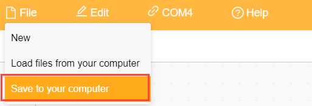

### 4.3.11 Program Outcome

1. Once the program is downloaded successfully, power on AiArm. 
2. Then press button A to play music. If you want to pause the music, press button B.

## 4.4 Ultrasonic Ranging and Display

1. Once the program is downloaded successfully, the dot matrix display will display the distance measured by ultrasonic sensor.

### 4.4.1 Module Introduction

1. This module is an advanced ultrasonic ranging device that emits and receives ultrasonic waves using a industrial-grade ultrasonic ranging chip. The chip incorporates essential components like the ultrasonic transmitting circuit, ultrasonic receiving circuit, and digital processing circuit. 
2. The module has an IIC communication interface, enabling the retrieval of distance measured by the ultrasonic sensor via IIC communication.

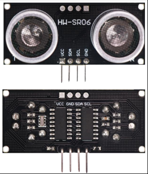

### 4.4.2 Working Logic

1. The distance measurement principle of this module is based on an automated process. It initiates by transmitting 8 square waves at a frequency of 40kHz and subsequently detects the presence of a signal return. When a signal return is detected, the module generates a high-level output, and the duration of this high-level signal corresponds to the time taken by the ultrasonic wave to travel from transmission to return.

2. To calculate the measured distance, the following formula is utilized: **test distance = (high-level time * speed of sound (340m/s))/2.**

### 4.4.3 Module Features

1. The ultrasonic probe of this module is equipped with 2 RGB lights. These lights’s brightness can be adjusted, and color can be changed by manipulating the changes in the red (R), green (G), and blue (B) color channels, as well as their combinations. 
2. This versatile module finds extensive applications, particularly in implementing obstacle avoidance functionality for intelligent vehicles and robots.

### 4.4.4 Module Parameters

| Working voltage | Communication | Working current |    Size    |
|:---------------:|:-------------:|:---------------:|:----------:|
|       5V        |      I2C      |       2mA       | 46mm*20mm |

### 4.4.5 Preparation

1. Please follow the below instructions to prepare for writing a program.

​	(1) Please install the ultrasonic sensor and dot matrix display onto the specific position , according to the instructions provided in “**1. Getting Ready/Lesson 2 Props and Map**”. Connect ultrasonic sensor to port 4 of CoreX controller, and dot matrix display to port 8

​	(2) Install WonderCode programming software referring to the file saved in “**3. Scratch Programming/Lesson 1 WonderCode Installation**”.

### 4.4.6 Program Logic

1. Upon program initialization, the dot matrix display will be initialized and the appropriate parameters will be set such as the number of ports connecting the display and the desired brightness level. 
2. Subsequently, a repetitive loop instruction is employed to continuously retrieve distance measurements from the ultrasonic sensor. These measurements are then displayed on the dot matrix display.

### 4.4.7 Connection

1)  Connect the CoreX controller and computer using USB cable, then turn on the controller.

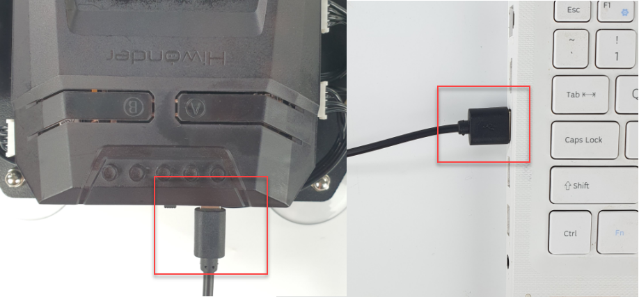

2)  Open “**WonderCode**” software.

3)  Click on the  located at the lower left corner and select **AiArm** from the available options.

4)  Click-on  and select the corresponding COM port, for example COM4. Please note that COM port options may differ from each computer.

> [!NOTE]
>
> **please do not select COM1, as it used for communication port in general.**
>
> 

5)  Once the connection is established successfully, the below prompt will appear.

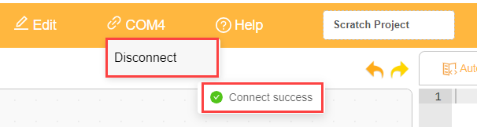

### 4.4.8 Write Programs

1)  Click-on  at the lower left corner. Then enter **“Output Module”** section to select Dot matrix display, then ultrasonic sensor in sensor section.

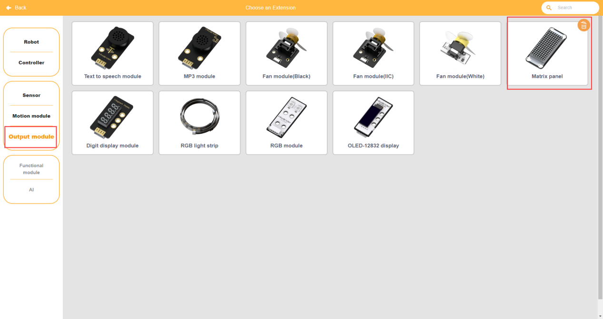

2)  Add the following block, and set the brightness as 8.

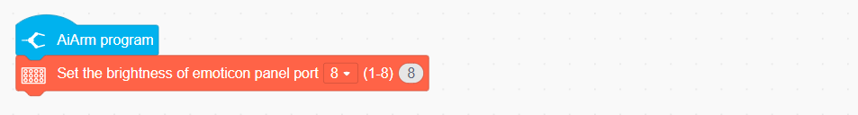

3)  Add repetitive loop instruction. It includes the addition of the dot matrix display interface at position 1 to display the number representing the obstacle distance detected by the ultrasonic interface at position 4.

4)  The complete code block is as below.

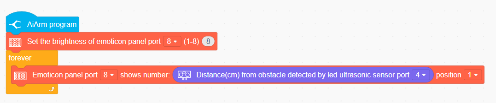

### 4.4.9 Download Programs

1)  Click-on  icon to upload the complete program.

2)  The upload may take some times, and please be patient!

### 4.4.10 Save Programs

1. Click-on **File -\> Save to your computer.**

### 4.4.11 Program Outcome

1. Once the program is downloaded successfully, power on AiArm.
2.  Dot matrix display will demonstrate the distance from the obstacle measured by ultrasonic sensor

