# 5. WonderCam Vision Module Usage

## 5.1 Color Recognition

1. In the preceding lessons, we covered the hardware details and functional features of the CoreX main controller and WonderCam vision recognition module. In this lesson, we will integrate the main controller with the vision module to delve into more AI applications.

2. After recognizing red, green and blue objects, WonderCam vision module will relay this information to the main controller whose RGB lights illuminate in corresponding colors.

### 5.1.1 Preparation

1)  Command WonderCam module to learn red, green and blue colors referring to “**1. WonderCam Vision Module Usage**”.

2)  Connect WonderCam vision module to port 9 of CoreX controller.

3)  Install WonderCode programming software according to the instructions provided in “**3. Scratch Programming**”.

### 5.1.2 **Program Logic**

1. The initial step involves initializing the vision module. This includes configuring the module's functionality, setting the initial position, and disabling the ultrasonic module. It is important to disable the ultrasonic module because its emission of light can potentially interfere with color recognition.

2. Following the initialization, the program proceeds to verify if the learned colors are being recognized. Based on the outcome of this verification, the hardware on the main controller provides corresponding feedback effects.

3. For detailed implementation of this game, please refer to the **5. Program Analysis** section.

### 5.1.3 Connection

1)  Connect the CoreX controller and computer using USB cable, then turn on the controller.

2)  Open “**WonderCode**” software.

3)  Click on the  located at the lower left corner and select **AiArm** from the available options.

4)  Click-on  and select the corresponding COM port, for example COM4. Please note that COM port options may differ from each computer.

> [!NOTE]
>
> **please do not select COM1, as it used for communication port in general.**
>
> 

5)  Once the connection is established successfully, the below prompt will appear.

### 5.1.4 Write Programs

1. **Initial Settings**

​	(1) To begin, the initialization process will involve initializing port 9, which is connected to WonderCam vision module. Following this, the mode of WonderCam will be switched to color recognition. To avoid any potential interference with color recognition, the ultrasonic module will be turned off.

​	(2) Next, an action group labeled as **0** will be invoked to position the robot arm in a downward attitude, facilitating efficient color recognition.

​	(3) A variable named **target area** will be established, with an initial value of 0. The detected area value of the color block will be assigned to this variable, allowing for further processing or analysis.

> [!NOTE]
>
> **action groups 0-30 are encrypted and serve as the mandatory action groups for robot games. If you intend to create a new action group, kindly ensure that you begin saving it from No. 31 onwards.**

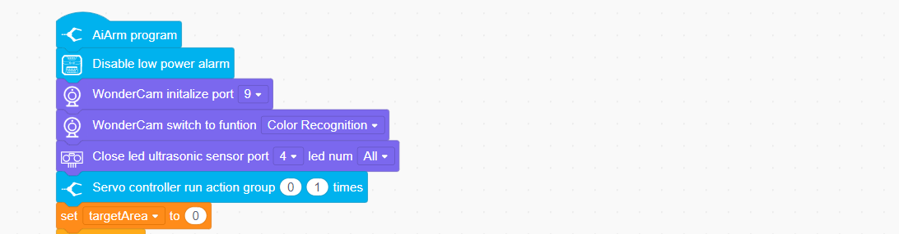

2. **Color Recognition**

​	(1) AiArm utilizes WonderCam vision module to achieve color recognition. A repetitive loop statement will be used to enable the vision module to recognize repeatedly. For example, when recognizing a red block, WonderCam vision module will perform recognition again to ensure the accuracy of the recognition result.

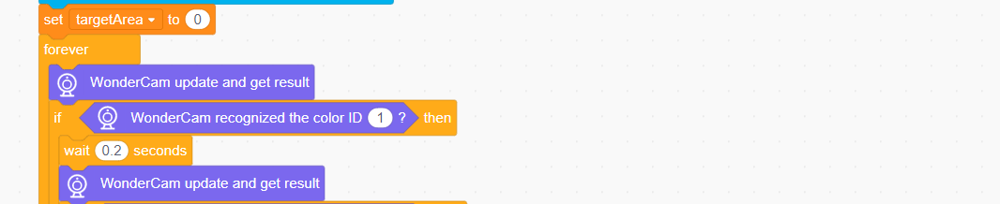

​	(2) If the WonderCam vision module successfully detects a red block, it will set two variables, namely **height** and **width,** to store the dimensions of the block image obtained from the module. Once these values are obtained, the area of the block image can be calculated. Subsequently, the following condition can be used to determine if the block area meets the specified threshold, confirming the identified object as the red block.

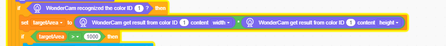

3. **Recognition Feedback**

​	(1) Configure recognition feedback based on color.

​	(2) If AiArm detects the color of the block is ID1 (red), set the color of LED light to red. At this time, RGB light on CoreX controller will illuminate in red. If no color is recognized, CoreX controller’s light will go off.

4. **Complete Code Block**

​	(1) The complete program is as below.

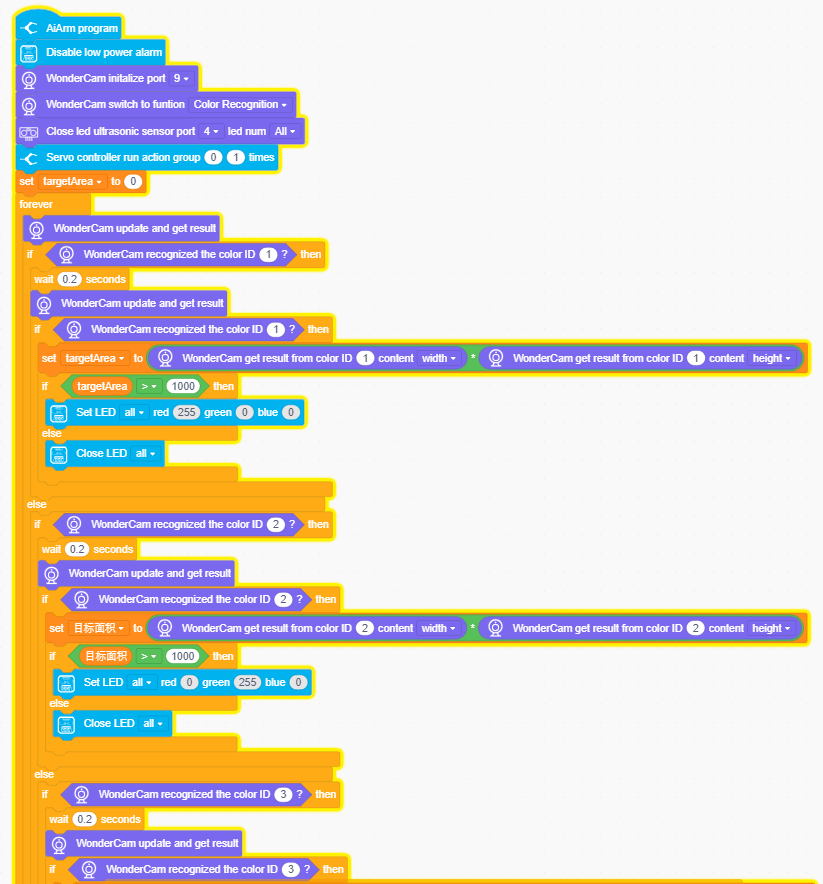

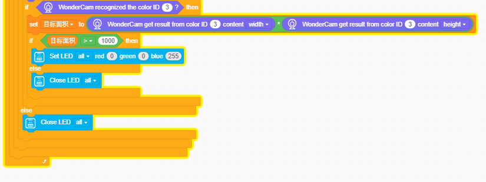

### 5.1.5 Download Programs

1)  Click-on  icon to upload the complete program.

2)  The upload may take some times, and please be patient!

### 5.1.6 Save Programs

1)  Click-on **File -\> Save to your computer.**

2)  Select a folder to save the file.

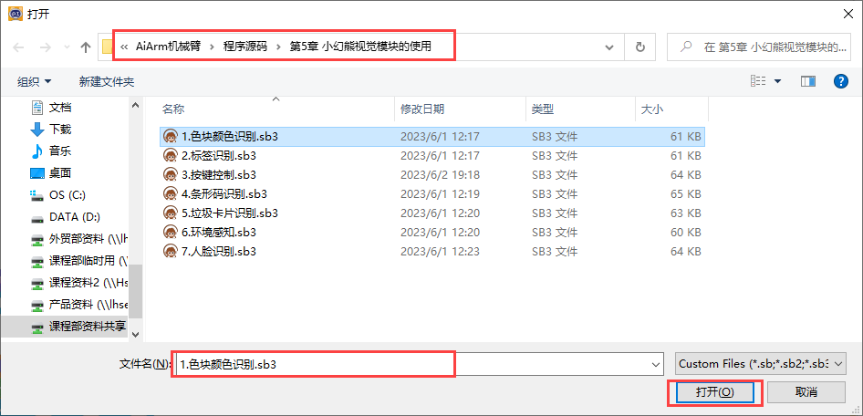

### 5.1.7 Program Outcome

1. Once the program is downloaded successfully, turn on AiArm. WonderCam vision module will automatically switch to “**Color Recognition**” mode.

2. Place red, green and blue blocks in sequence within WonderCam’s recognition zone, then WonderCam will start learning colors. When it recognizes color learned in consequent operation, CoreX controller’s light will illuminate in same color as the block. 
3. If WonderCam doesn’t recognize any color, CoreX controller’s light will go off.

## 5.2 Tag Recognition

1. The WonderCam vision module is capable of recognizing tags and decoding the information embedded within them. It then transmits this information to the main controller. 
2. Upon receiving the information, the main controller triggers the buzzer to emit a brief sound, repeating the number of times corresponding to the tags ID.

### 5.2.1 Preparation

1)  Connect WonderCam vision module to port 9 of CoreX controller.

2)  Install WonderCode programming software according to the instructions provided in “**3. Scratch Programming**”.

### 5.2.2 **Program Logic**

1. The initial step involves initializing the vision module. This includes configuring the modules functionality, setting the initial position, and disabling the ultrasonic module. It is important to disable the ultrasonic module because its emission of light can potentially interfere with tag recognition.

2. Following the initialization, the program proceeds to verify if tags are being recognized. Based on the outcome of this verification, the hardware on the main controller provides corresponding feedback effects.

3. For detailed implementation of this game, please refer to the **4. Program Analysis** section.

### 5.2.3 Connection

1)  Connect the CoreX controller and computer using USB cable, then turn on the controller.

2)  Open “**WonderCode**” software.

3)  Click on the  located at the lower left corner and select **AiArm** from the available options.

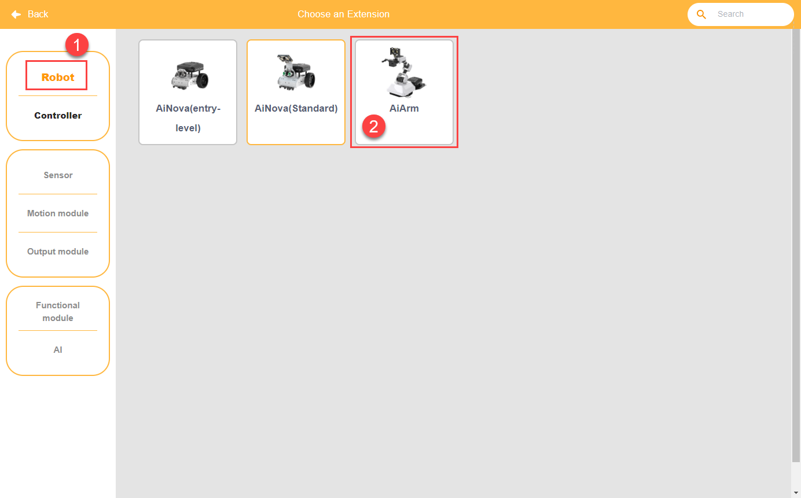

4)  Click-on  and select the corresponding COM port, for example COM4. Please note that COM port options may differ from each computer.

> [!NOTE]
>
> **please do not select COM1, as it used for communication port in general.**
>
> 

5)  Once the connection is established successfully, the below prompt will appear.

### 5.2.4 Write Programs

1. **Initial Settings**

​	(1) To begin, the initialization process will involve initializing port 9, which is connected to WonderCam vision module. Following this, the mode of WonderCam will be switched to tag recognition. To avoid any potential interference with tag recognition, the ultrasonic module will be turned off.

​	(2) Next, an action group labeled as **0** will be invoked to position the robot arm in a downward attitude, facilitating efficient tag recognition.

​	(3) A variable named **target area** will be established, with an initial value of 0. The detected area value of the tag will be assigned to this variable, allowing for further processing or analysis.

> [!NOTE]
>
> **action groups 0-30 are encrypted and serve as the mandatory action groups for robot games. If you intend to create a new action group, kindly ensure that you begin saving it from No. 31 onwards.**

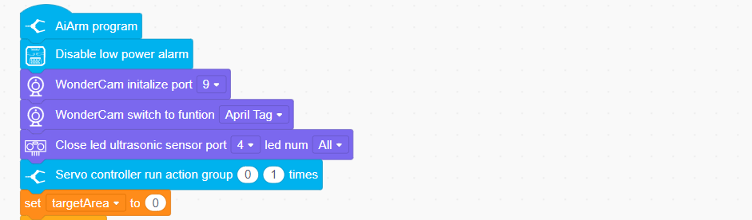

2. **Tag Recognition**

​	(1) AiArm incorporates the WonderCam vision module to facilitate tag recognition. A repetitive loop statement is employed to enable the vision module to continuously recognize tags. For instance, when recognizing tag 1, the WonderCam vision module undergoes repeated recognition to ensure the accuracy of the recognition results.

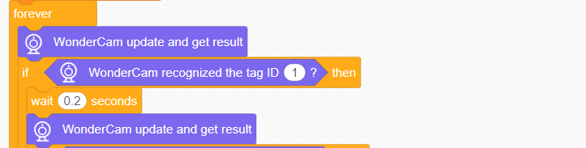

​	(2) If the WonderCam vision module successfully detects tag 1, it will set two variables, namely **height** and **width,** to store the dimensions of the tag image obtained from the module. Once these values are obtained, the area of the tag image can be calculated. Subsequently, the following condition can be used to determine if the tag area meets the specified threshold, confirming the identified object as tag 1.

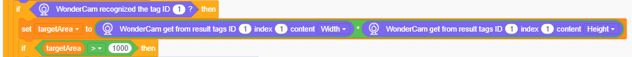

2. **Recognition Feedback**

​	(1) Set up the recognition feedback based on the tag ID. If the WonderCam vision module detects tag 1, the main controller's buzzer will emit a brief beeping sound at a tone of 1800 and a beat of 240. Afterwards, the target area is set to 0, and the program returns to the previous state to continue with the recognition process. If no tag is detected, the volume of the buzzer will be reduced to 0.

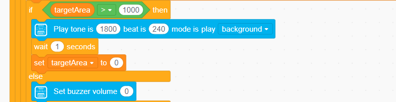

3. **Complete Code Block**

​	(1) The complete program is as below.

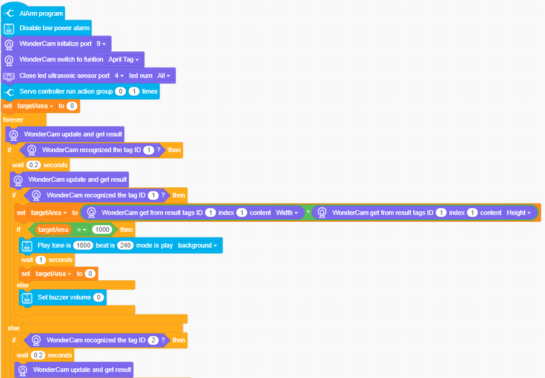

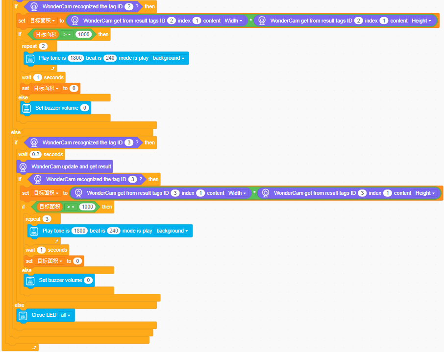

### 5.2.5 Download Programs

1)  Click-on  icon to upload the complete program.

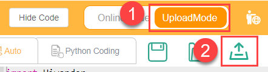

2)  The upload may take some times, and please be patient!

### 5.2.6 Save Programs

1)  Click-on **File -\> Save to your computer.**

2)  Select a folder to save the file.

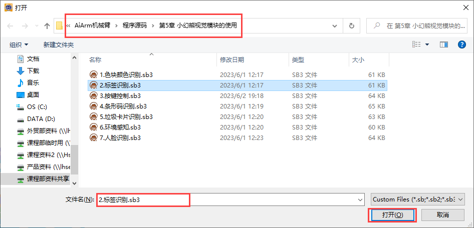

### 5.2.7 Program Outcome

1. Once the program is downloaded successfully, turn on AiArm. WonderCam vision module will automatically switch to “**Tag Recognition**” mode.

2. Arrange tag 1, 2, and 3 consecutively within the recognition zone of WonderCam. The module will commence recognizing the tags, accompanied by brief beeping sounds from the buzzer. For instance, when tag 2 is recognized, the buzzer will emit two beeps.

## 5.3 Key Control

1. When you press the specific key on the main controller, AiArm can switch different game mode.

### 5.3.1 Preparation

1)  Command WonderCam module to learn red, green and blue colors referring to “**1. WonderCam Vision Module Usage**”. Please do not skip this step.

2)  Connect WonderCam vision module to port 9 of CoreX controller.

3)  Install WonderCode programming software according to the instructions provided in “**3. Scratch Programming**”.

### 5.3.2 **Program Logic**

1. The comprehensive program logic for color recognition and tag recognition can be found in the two previous files. To learn how to switch between games using the key on the CoreX controller, please refer to the instructions below.

2. When the game initiates, AiArm will initialize its position. As the respective games have been associated with the key, pressing the key will transition AiArm into either color recognition or tag recognition mode.

3. For a detailed implementation of this game, kindly refer to the **5. Program Analysis** section.

### 5.3.3 Connection

1)  Connect the CoreX controller and computer using USB cable, then turn on the controller.

2)  Open “**WonderCode**” software.

3)  Click on the  located at the lower left corner and select **AiArm** from the available options.

4)  Click-on  and select the corresponding COM port, for example COM4. Please note that COM port options may differ from each computer.

> [!NOTE]
>
> **please do not select COM1, as it used for communication port in general.**
>
> 

5)  Once the connection is established successfully, the below prompt will appear.

### 5.3.4 Write Programs

1. **Initial Settings**

​	(1) To establish the initial position for AiArm, an action group labeled as **0** will be called. Subsequently, a loop function will be employed to check for any input command involving the key. In the absence of any command input, AiArm will remain in the initial position while the light on the CoreX controller illuminates in white.

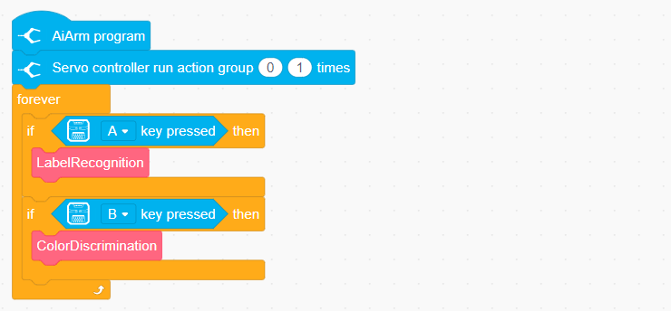

> [!NOTE]
>
> **action groups 0-30 are encrypted and serve as the mandatory action groups for robot games. If you intend to create a new action group, kindly ensure that you begin saving it from No. 31 onwards.**

2. **Feedback**

​	(1) Upon pressing the key, the program will transition to the relevant program, taking color recognition as an example. When the key is pressed, the LED light on the CoreX controller will turn off. Subsequently, the program will enter the corresponding program, allowing you to enable AiArm for color block recognition.

​	(2) To enable game switching using the key, a loop will execute until another command is received. As long as key B is not pressed, the color recognition program will continue to run. However, once key B is pressed, the current program will exit, and the program will switch to the tag recognition program.

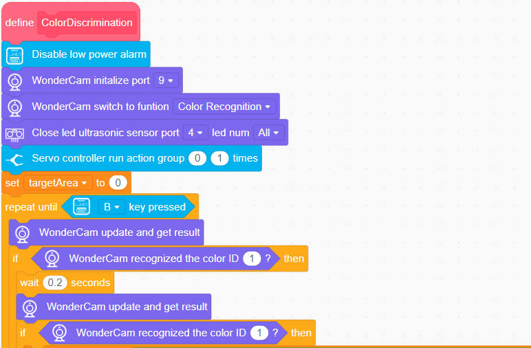

​	(3) Likewise, during AiArm is performing tag recognition, the program will transition to the color recognition program when key A is pressed.

3. **Complete Code Block**

​	(1) The complete program is as below.

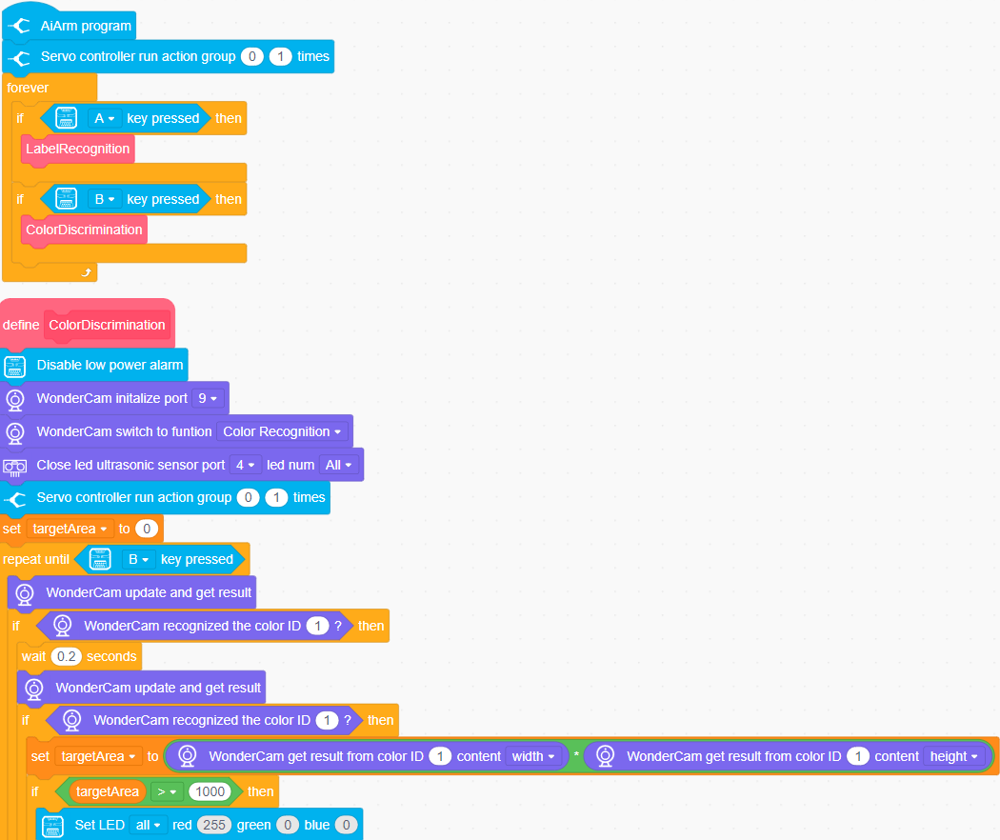

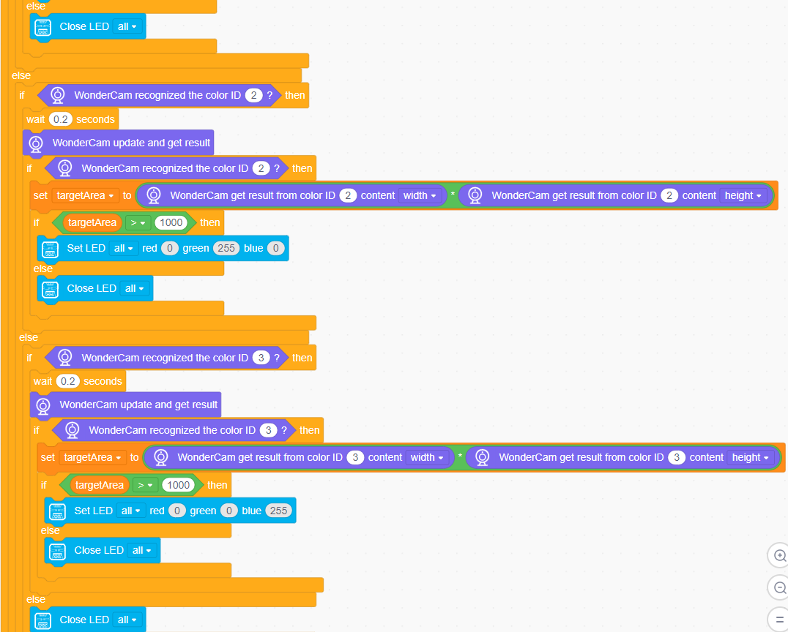

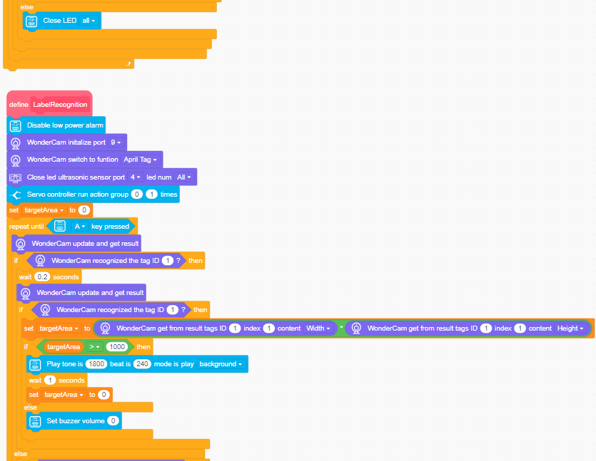

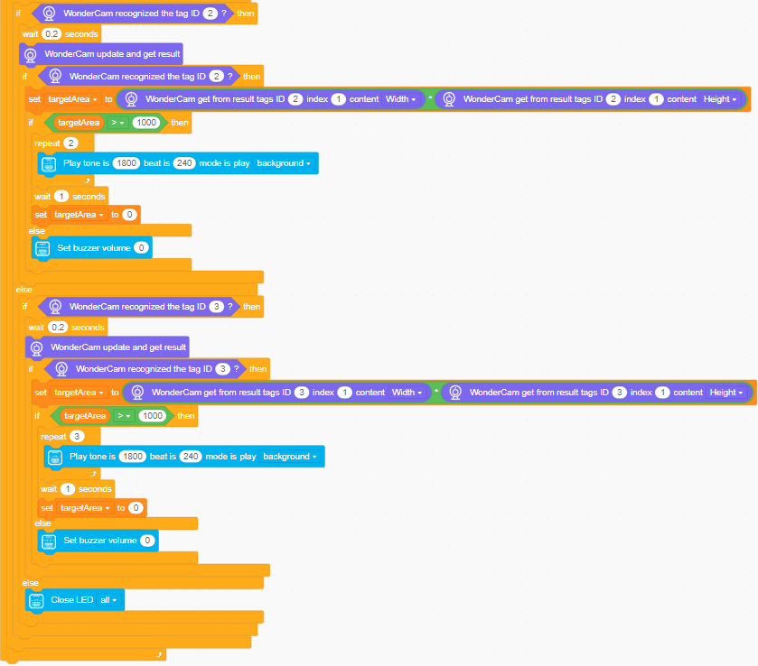

### 5.3.5 Download Programs

1)  Click-on  icon to upload the complete program.

2)  The upload may take some times, and please be patient!

### 5.3.6 Save Programs

1)  Click-on **File -\> Save to your computer.**

2)  Select a folder to save the file.

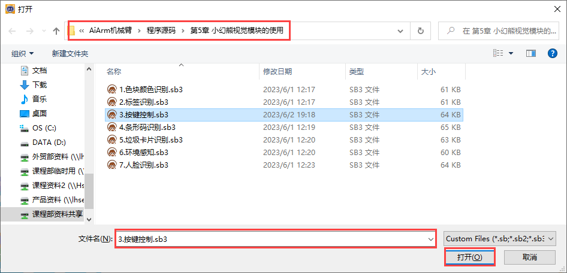

### 5.3.7 Program Outcome

1. Upon starting the game, AiArm will automatically initialize its position and wait for the command indicating that the key has been pressed.

2. When key A on the CoreX controller is pressed, AiArm will switch to color recognition mode, enabling it to recognize red, green, and blue. On the other hand, if key B is pressed, the mode will switch to tag recognition.

3. In each recognition mode, the hardware on the CoreX controller will provide specific feedback corresponding to the selected mode.

## 5.4 Barcode Recognition

1. When WonderCam vision module recognizes barcode, it will feedback the recognized information to CoreX controller. Once receiving the information, CoreX’s controller will illuminate in corresponding color.

### 5.4.1 Preparation

1)  Connect WonderCam vision module to port 9 of CoreX controller.

2)  Print barcodes saved in the same folder before initiating barcode recognition.

3)  Install WonderCode programming software according to the instructions provided in “**3. Scratch Programming**”.

### 5.4.2 **Program Logic**

1. The initial step involves initializing the vision module. This includes configuring the module's functionality, setting the initial position, and disabling the ultrasonic module. It is important to disable the ultrasonic module because its emission of light can potentially interfere with tag recognition.

2. Following the initialization, the program proceeds to verify if tags are being recognized. Based on the outcome of this verification, the hardware on the main controller provides corresponding feedback effects.

3. For detailed implementation of this game, please refer to the **4. Program Analysis** section.

### 5.4.3 Connection

1)  Connect the CoreX controller and computer using USB cable, then turn on the controller.

2)  Open “**WonderCode**” software.

3)  Click on the  located at the lower left corner and select **AiArm** from the available options.

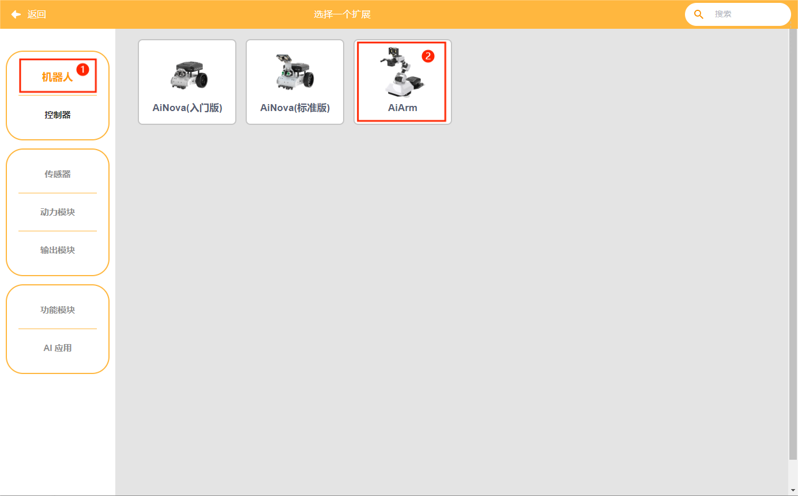

4)  Click-on  and select the corresponding COM port, for example COM4. Please note that COM port options may differ from each computer.

> [!NOTE]
>
> **please do not select COM1, as it used for communication port in general.**
>
> 

5)  Once the connection is established successfully, the below prompt will appear.

### 5.4.4 Program Analysis

1. **Initial Settings**

​	(1) To begin, the initialization process will involve initializing port 9, which is connected to WonderCam vision module. Following this, the mode of WonderCam will be switched to barcode recognition. To avoid any potential interference with barcode recognition, the ultrasonic module will be turned off.

​	(2) Then, turn on the fill light on WonderCam module. Next, an action group labeled as **0** will be invoked to position the robot arm in a downward attitude, facilitating efficient barcode recognition.

​	(3) A variable named **LED light** will be established, with an initial value of 0. This variable refers to the number of CoreX controller’s light that will light up when WonderCam recognizing barcodes.

> [!NOTE]
>
> **action groups 0-30 are encrypted and serve as the mandatory action groups for robot games. If you intend to create a new action group, kindly ensure that you begin saving it from No. 31 onwards.**

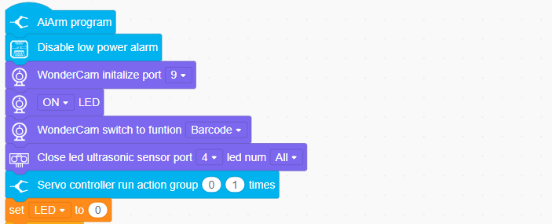

2. **Barcode Recognition**

​	(1) WonderCam incorporates barcode recognition functionality. A repetitive loop statement is employed to enable the vision module to continuously recognize tags.

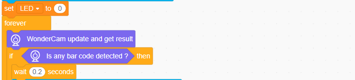

3. **Recognition Feedback**

​	(1) To configure the recognition feedback, let**s consider the example of using light 0 in WonderCam**s barcode recognition process. When WonderCam detects a barcode, light 0 will be turned on for 0.5 seconds before turning off. At the same time, a variable called **LED light** will be incremented from 0 to 1, indicating the change from **LED=0** to **LED=1**.

​	(2) The program will then proceed to check if WonderCam's vision module recognizes the barcode. If the barcode is successfully recognized, light 1 will be illuminated briefly and then turned off. This cycle will continue for the remaining lights. Subsequently, the variable will be reset to 0, and the loop will restart.

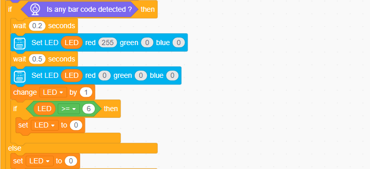

​	(3) If the barcode is removed from WonderCam's recognition zone, indicating that no barcode is currently being recognized, the program will exit the loop. In this case, the variable **LED light** will be set to 0. WonderCam will then resume its barcode recognition process and perform the above operations again.

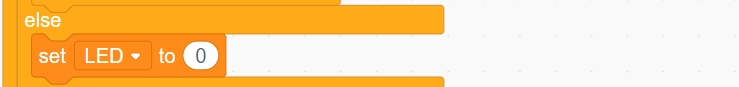

4. **Complete Program**

The complete program is as below.

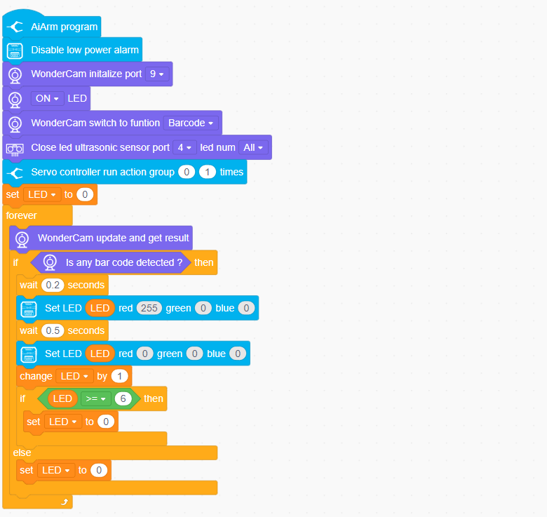

### 5.4.5 Download Programs

1)  Click-on  icon to upload the complete program.

2)  The upload may take some times, and please be patient!

### 5.4.6 Save Programs

1)  Click-on **File -\> Save to your computer.**

2)  Select a folder to save the file.

### 5.4.7 Program Outcome

1. After successfully downloading the program, activate the WonderCam vision module, and it will automatically switch to **Barcode Recognition** mode. Place barcodes within the recognition zone of WonderCam. 
2. When the WonderCam module detects barcodes, the RGB lights on the main controller will sequentially light up in red. If no barcode is detected or the barcode is removed from WonderCams recognition zone during the recognition process, the Marquee will reset to 0, and WonderCam will initiate re-recognition.

## 5.5 Waste Card Recognition

> [!NOTE]
>
> **If you have burnt the mask model or WonderCam has performed mask identification before, please start waste card recognition after re-burning the firmware of WonderCam module referring to the file saved in “Appendix -\> 3. WonderCam Firmware Burning”.**

1. When the WonderCam vision module recognizes waste cards, it will provide feedback on the recognized information to the main controller. As a result, the LEDs on the main controller will illuminate in various colors, indicating the recognition status.

### 5.5.1 Preparation

1)  Connect WonderCam vision module to port 9 of CoreX controller.

2)  Install WonderCode programming software according to the instructions provided in “**3. Scratch programming**”.

### 5.5.2 **Program Logic**

1. The initial step involves initializing the vision module. This includes configuring the modules functionality, setting the initial position, and disabling the ultrasonic module. It is important to disable the ultrasonic module because its emission of light can potentially interfere with waste card recognition.

2. Following the initialization, the program proceeds to verify if waste cards are being recognized. Based on the outcome of this verification, the hardware on the main controller provides corresponding feedback effects.

3. For detailed implementation of this game, please refer to the **4. Write Program** section.

### 5.5.3 Connection

1)  Connect the CoreX controller and computer using USB cable, then turn on the controller.

2)  Open “**WonderCode**” software.

3)  Click on the 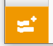 located at the lower left corner and select **AiArm** from the available options.

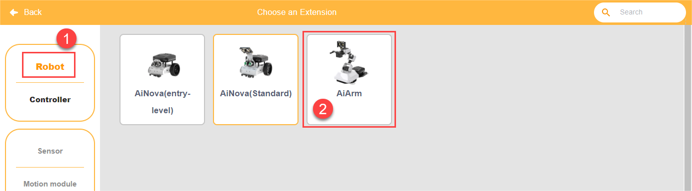

4)  Click-on  and select the corresponding COM port, for example COM4. Please note that COM port options may differ from each computer.

> [!NOTE]
>
> **please do not select COM1, as it used for communication port in general.**
>
> 

5)  Once the connection is established successfully, the below prompt will appear.

### 5.5.4 Write Program

1. **Initial Settings**

​	(1) To begin, the initialization process will involve initializing port 9, which is connected to WonderCam vision module. Following this, the mode of WonderCam will be switched to image classification. To avoid any potential interference with tag recognition, the ultrasonic module will be turned off. Next, an action group labeled as **0** will be invoked to position the robot arm in a downward attitude, facilitating efficient waste card recognition.

> [!NOTE]
>
> **action groups 0-30 are encrypted and serve as the mandatory action groups for robot games. If you intend to create a new action group, kindly ensure that you begin saving it from No. 31 onwards.**

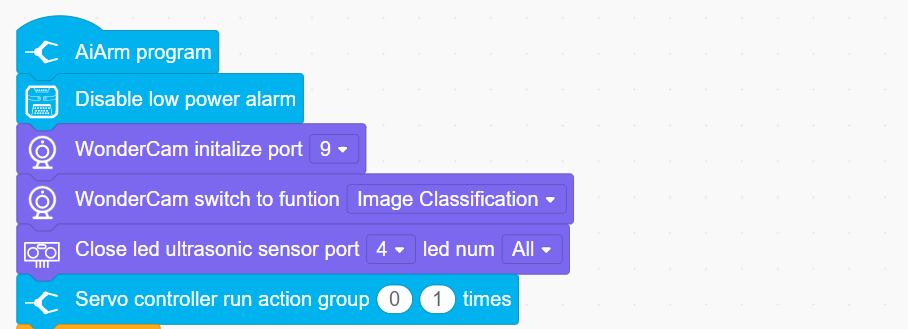

2. **Waste Card Recognition**

​	(1) Waste classification functionality is employed to achieve waste card recognition. A repetitive loop statement is employed to enable the vision module to continuously recognize waste cards.

3. **Recognition Feedback**

​	(1) The main controller will offer appropriate feedback depending on the category of the waste card. For instance, recyclable waste is assigned ID numbers ranging from 5 to 7. When the WonderCam vision module detects a waste card with ID 5, 6, or 7, LED lights 1, 2, 4, and 5 will illuminate in green. To adjust the LED light that illuminates, please choose a number between 0 and 5. If you wish to change the color of the light, you can modify the RGB value.

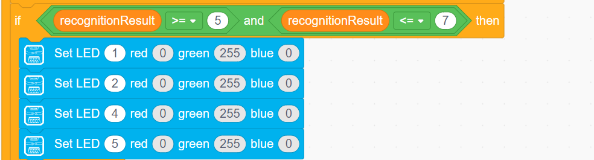

​	(2) When you remove the waste card from the recognition zone of the WonderCam or replace it with a waste card of a different category, the WonderCam will lose its target. In such a situation, the program will first turn off the LED and then proceed to determine the category of the new waste card.

4. **Complete Program**

​	(1) The complete program is as below.

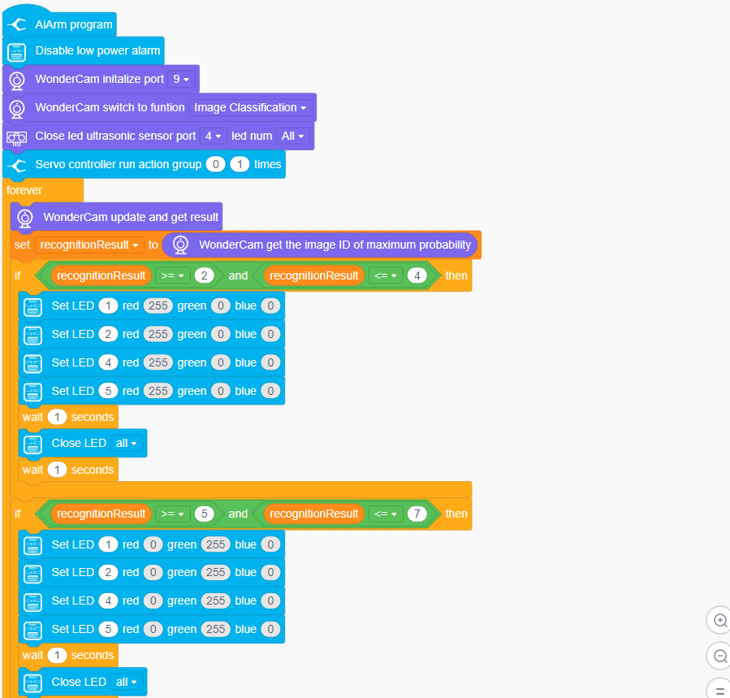

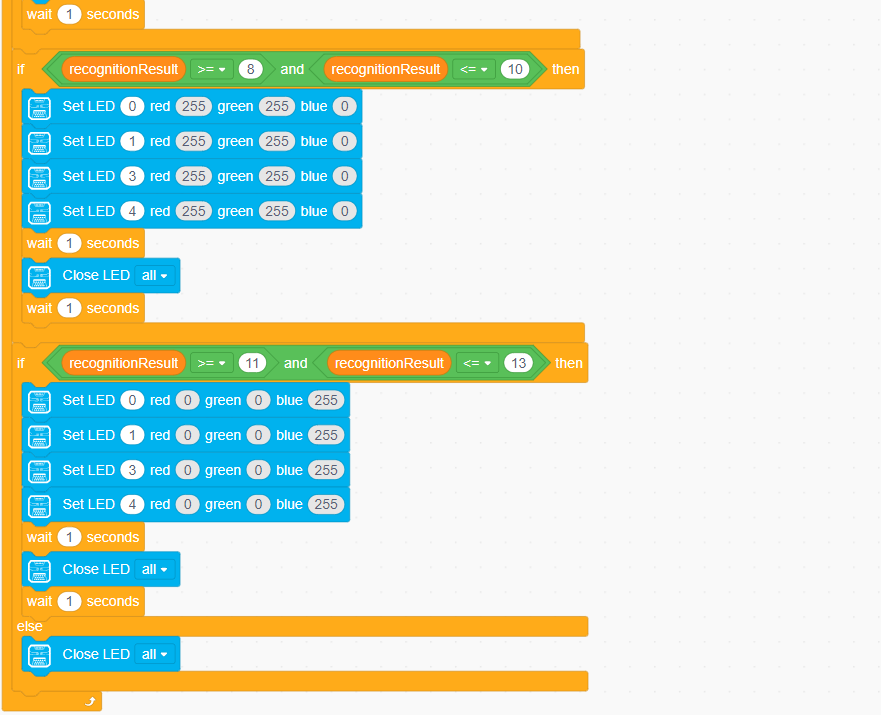

### 5.5.5 Download Programs

1)  Click-on  icon to upload the complete program.

2)  The upload may take some times, and please be patient!

### 5.5.6 Save Programs

1)  Click-on **File -\> Save to your computer.**

2)  Select a folder to save the file.

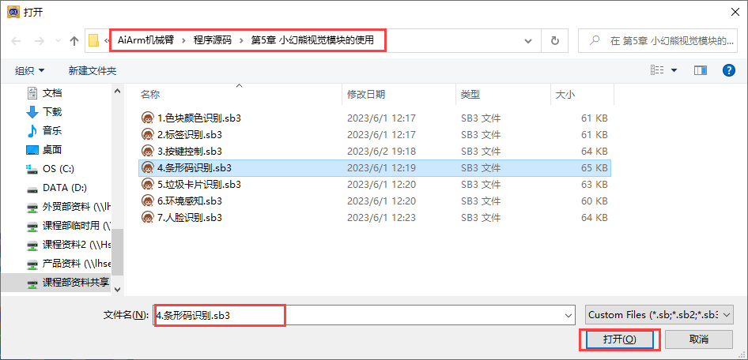

### 5.5.7 Program Outcome

1. After successfully downloading the program, activate the WonderCam vision module, and it will automatically switch to **Image Classification** mode.

2. Then, position the provided waste cards within WonderCam’s recognition zone. When determining the category of the waste card, specific LED light will light up in corresponding color.

3. For example, when WonderCam detects hazardous waste (ID: 2-4), 4 LED lights on CoreX controller will light up till the WonderCam module recognizes other waste card.

4. The ID of waste cards and the corresponding LED effect is as below.

| **Image** | **ID** | **Image** | **ID** |
|:--:|:--:|:--:|:--:|
| background | 1 |  | 2 |
| 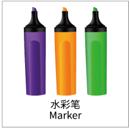 | 3 | 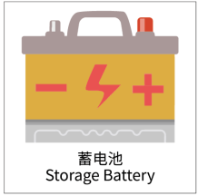 | 4 |
| 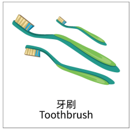 | 5 |  | 6 |
|  | 7 |  | 8 |
|  | 9 | 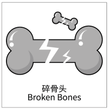 | 10 |
|  | 11 |  | 12 |
|  | 13 |  |  |

|      Waste card ID      |                LED effect                 |
| :---------------------: | :---------------------------------------: |
| Hazardous waste（2-4）  |  LED 1, 2, 4 and 5 will light up in red   |
| Recyclable waste（5-7） | LED 1, 2, 4 and 5 will light up in green  |
|   Food waste（8-10）    | LED 0, 1, 3 and 4 will light up in yellow |
| Residual waste（11-13） |  LED 0, 1, 3 and 4 will light up in blue  |

## 5.6 Environment Sensing

1. Based on its feature learning functionality, WonderCam module can detect the brightness of the environment.

### 5.6.1 Preparation

1)  Let WonderCam vision module learn under dim environment. For detailed instruction, please refer to the files locating in the folder “**1. WonderCam Vision Module Usage**”.

2)  Connect WonderCam vision module to port 9 of CoreX controller.

3)  Install WonderCode programming software according to the instructions provided in “**3. Scratch Programming**”.

### 5.6.2 **Program Logic**

1. WonderCam module will sense the brightness of the environment under feature recognition mode. After that, the program will determine whether the current brightness of the environment meets the learned brightness. If it meets, the hardware on CoreX controller will be trigger to provide corresponding feedback.

2. For detailed implementation of this game, please refer to the **4. Write Program** section.

### 5.6.3 Connection

1)  Connect the CoreX controller and computer using USB cable, then turn on the controller.

2)  Open “**WonderCode**” software.

3)  Click on the  located at the lower left corner and select **AiArm** from the available options.

4)  Click-on  and select the corresponding COM port, for example COM4. Please note that COM port options may differ from each computer.

> [!NOTE]
>
> **please do not select COM1, as it used for communication port in general.**
>
> 

5)  Once the connection is established successfully, the below prompt will appear.

### 5.6.4 Write Program

1. **Initial Settings**

​	(1) To begin, the initialization process will involve initializing port 9, which is connected to WonderCam vision module. Following this, the mode of WonderCam will be switched to feature learning. To avoid any potential interference, the ultrasonic module and fill light will be turned off. Next, an action group labeled as **0** will be invoked to set the initial position the robot arm.

> [!NOTE]
>
> **action groups 0-30 are encrypted and serve as the mandatory action groups for robot games. If you intend to create a new action group, kindly ensure that you begin saving it from No. 31 onwards.**

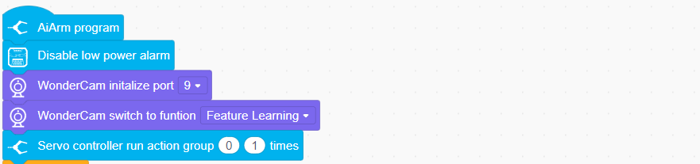

2. **Feature Recognition**

​	(1) The WonderCam module possesses the capability to perceive its environment through feature learning. To achieve this, a repetitive loop statement is utilized, allowing the vision module to consistently identify and analyze feature points within the current image. This information is then compared and matched against the learned content, enabling the module to make accurate assessments based on the recognized features.

3. **Recognition Feedback**

​	(1) If the WonderCam detects a low brightness environment that corresponds to the program settings with a **recognition result** of ID2, all LED lights on the CoreX controller will illuminate in white.

4. **Complete Program**

​	(1) The complete program is as below.

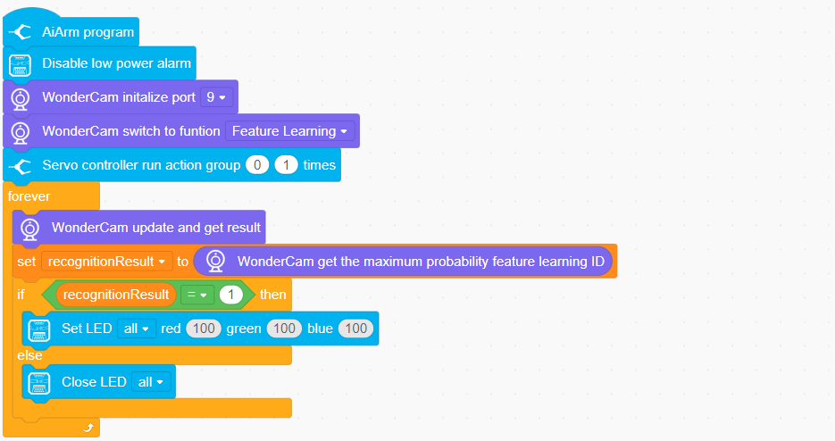

### 5.6.5 Download Programs

1)  Click-on  icon to upload the complete program.

2)  The upload may take some times, and please be patient!

### 5.6.6 Save Programs

1)  Click-on **File -\> Save to your computer.**

2)  Select a folder to save the file.

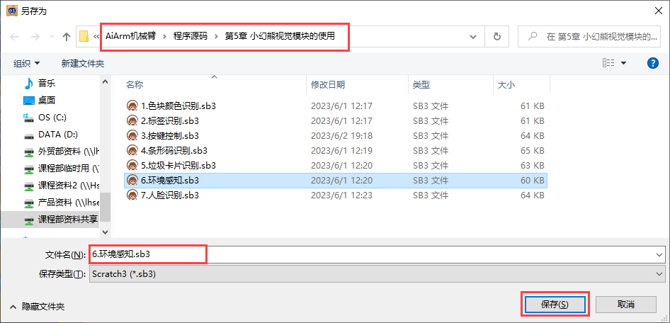

### 5.6.7 **Program Outcome**

1. Once you have successfully downloaded the program, activate the WonderCam vision module, and it will automatically transition to the **Feature Learning** mode. The WonderCam vision module should be configured to learn the bright environment as ID: 1 and the dim environment as ID: 2, referring to the file saved in the folder named **1. WonderCam Vision Module Usage** 
2. By learning the brightness of the environment, the WonderCam vision module becomes capable of sensing the brightness of its surroundings. For instance, you can turn on all the lights to examine AiArm's recognition result.

> [!NOTE]
>
> **please allow WonderCam to learn the environmental features under the same environment to avoid interference caused by other factors.**

## 5.7 Facial Recognition

1. WonderCam vision module can recognize the learned human face. Once recognizing human face, WonderCam will provide feedback on the recognized information to the hardware on the CoreX controller.

### 5.7.1 Preparation

1)  Let WonderCam vision module learn human face. For detailed instruction, please refer to the files locating in the folder “**1. WonderCam Vision Module Usage**”.

2)  Connect WonderCam vision module to port 9 of CoreX controller.

3)  Install WonderCode programming software according to the instructions provided in “**3. Scratch Programming**”.

### 5.7.2 **Program Logic**

1. WonderCam module will learn human face first. Once it finishes learning human face, the program will determine whether WonderCam module recognizes human face. If it recognizes human face, the hardware on CoreX controller will be triggered to provide corresponding feedback. 
2. For detailed implementation of this game, please refer to section 5 “**5. Program Analysis**”.

### 5.7.3 Connection

1)  Connect the CoreX controller and computer using USB cable, then turn on the controller.

2)  Open “**WonderCode**” software.

3)  Click on the  located at the lower left corner and select **AiArm** from the available options.

4)  Click-on  and select the corresponding COM port, for example COM4. Please note that COM port options may differ from each computer.

> [!NOTE]
>
> **please do not select COM1, as it used for communication port in general.**
>
> 

5)  Once the connection is established successfully, the below prompt will appear.

### 5.7.4 Write Program

1. **Initial Settings**

​	(1) To begin, the initialization process will involve initializing port 9, which is connected to WonderCam vision module. Following this, the mode of WonderCam will be switched to face recognition. Next, an action group labeled as **9** will be invoked to adjust the posture of AiArm so as to make the camera face horizontally.

​	(2) A variable named **target area** will be established, with an initial value of 0. The detected area value of human face will be assigned to this variable, allowing for further processing or analysis.

> [!NOTE]
>
> **action groups 0-30 are encrypted and serve as the mandatory action groups for robot games. If you intend to create a new action group, kindly ensure that you begin saving it from No. 31 onwards.**

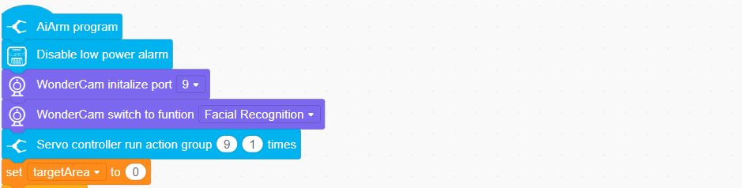

2. **Face Recognition**

​	(1) A repetitive loop statement is utilized, allowing the vision module to consistently identify and analyze the learned human face within the current image. To ensure the accuracy of the recognition, WonderCam module will learn human face again after recognizing human face.

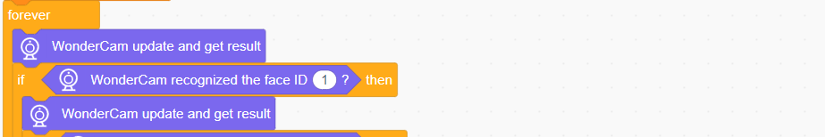

​	(2) If the WonderCam vision module successfully recognize the learned human face, it will set two variables, namely **height** and **width** to store the dimensions of the human face image obtained from the module. Once these values are obtained, the area of the face image can be calculated. Subsequently, the following condition can be used to determine if the face area meets the specified threshold, confirming the identified object as human face.

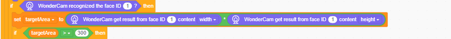

3. **Recognition Feedback**

​	(1) The hardware on the main controller will provide corresponding feedback when WonderCam module recognizes human face.

​	(2) When WonderCam module recognizes ID1 human face, all LED lights on the main controller will light up in red, and the buzzer will emit a long beeping. If WonderCam recognizes ID2 human face, all LED lights on the main controller will light up in white, and the buzzer will emit a short beeping per second.

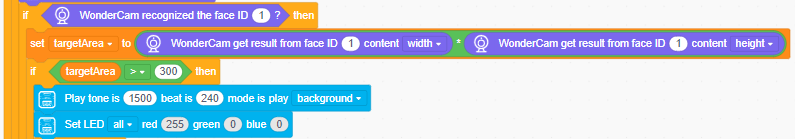

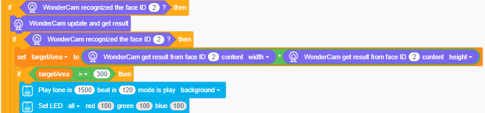

​	(3) Tone of buzzer, beat and RGB values of red, green and blue can be adjusted in blue code block.

4. **Complete Code Block**

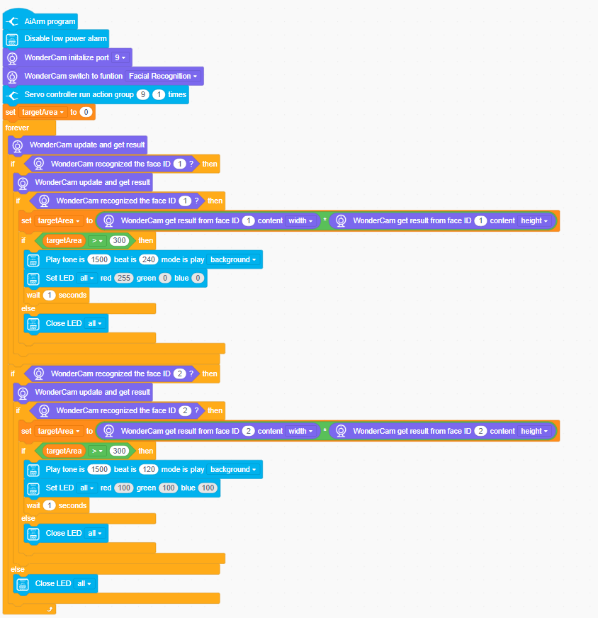

### 5.7.5 Download Programs

1)  Click-on  icon to upload the complete program.

2)  The upload may take some times, and please be patient!

### 5.7.6 Save Programs

1)  Click-on **File -\> Save to your computer.**

2)  Select a folder to save the file.

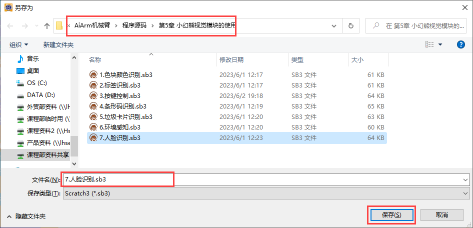

### 5.7.7 Program Outcome

Once the program is downloaded successfully, turn on AiArm. WonderCam vision module will automatically switch to “**Face Recognition**” mode.

Position human face within WonderCam’s recognition range, then it will start detecting the human face. Once WonderCam detects human face, LED and buzzer on the CoreX controller will provide corresponding feedback.

