# 6. Vision Recognition and Applications

## 6.1 Color Recognition and Sorting

1. When WonderCam vision module detects red, green and blue objects, RGB lights on the main controller will illuminate in the corresponding color. Then, the robot arm will sort the colored blocks based on color to corresponding area.

### 6.1.1 Preparation

1)  Let WonderCam vision module learn red, green and blue. For detailed instruction, please refer to the files locating in the folder “**1. WonderCam Vision Module Usage**”.

2)  Connect WonderCam vision module to port 9 of CoreX controller.

3)  Install WonderCode programming software according to the instructions provided in “**3. Scratch Programming**”.

### 6.1.2 **Program Logic**

1. To start, the robot arm will initiate the initialization process, which involves running a specific action group to adjust its position for efficient color recognition. Following this, any modules not relevant to this game will be disabled.

2. Once the initialization process is complete, the WonderCam module will begin detecting colored blocks.

3. When the WonderCam module recognizes a colored block, the LED on the CoreX controller will illuminate in the corresponding color. For example, if the WonderCam recognizes a red block, the LED on the CoreX controller will light up in red. After the recognition step is finished, AiArm will invoke the appropriate action group to sort the block.

4. For a more detailed implementation of this game, please refer to the **5. Program Analysis** section.

### 6.1.3 Download Program

1)  Open WonderCode software.

2)  Directly drag the program file saved in the folder “**Programs**” to WonderCode interface.

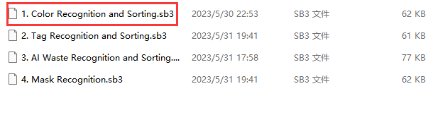

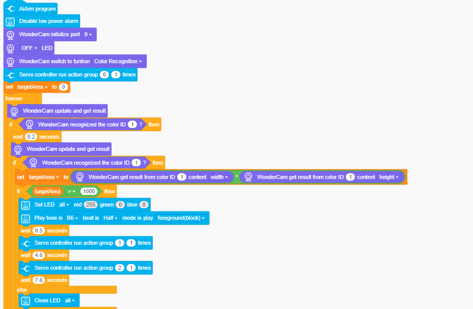

3)  Click-on  and select the corresponding COM port, for example COM4. Please note that COM port options may differ from each computer.

> [!NOTE]
>
> **please do not select COM1, as it used for communication port in general.**

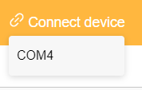 

4)  Click-on  icon to upload the complete program.

5)  The upload may take some times, and please be patient!

### 6.1.4 Program Outcome

1. After successfully downloading the programs, follow the sequence of turning on the switch on the robot arm and the main controller. As a result, the WonderCam vision module will seamlessly transition into **Color Recognition** mode. 
2. Upon identifying the relevant colored block, the buzzer on the CoreX controller will emit a brief beep, accompanied by the RGB light on the main controller illuminating in the corresponding color. 
3. Subsequently, the robot arm will initiate the sorting process within the recognition zone and position the block on the right side of the robot arm.

### 6.1.5 Program Analysis

1. **Initial Settings**

​	(1) To begin, WonderCam vision module will switch to color recognition. Next, an action group labeled as **0** will be invoked to position the robot arm in a downward attitude, facilitating efficient recognition.

​	(2) In addition, to avoid any potential interference with color recognition, the ultrasonic module will be turned off.

​	(3) A variable named **target area** will be established, with an initial value of 0. The detected area value of the color block will be assigned to this variable, allowing for further processing or analysis.

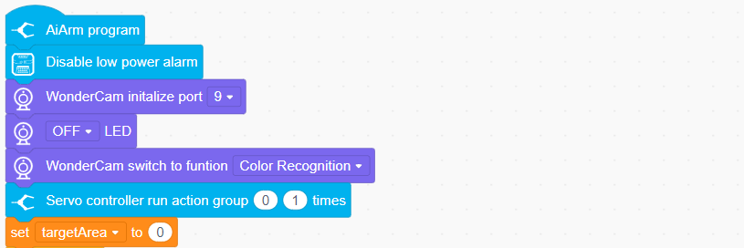

2. **Color Recognition**

​	(1) AiArm utilizes WonderCam vision module to achieve color recognition. A repetitive loop statement will be used to enable the vision module to recognize repeatedly. For example, when recognizing a red block, WonderCam vision module will perform recognition again to ensure the accuracy of the recognition result.

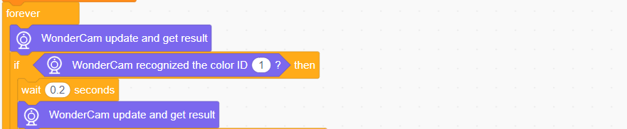

​	(2) If the WonderCam vision module successfully detects a red block, it will set two variables, namely **height** and **width,** to store the dimensions of the block image obtained from the module. Once these values are obtained, the area of the block image can be calculated. Subsequently, the following condition can be used to determine if the block area meets the specified threshold, confirming the identified object as the red block.

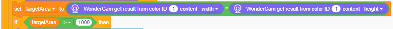

3. **Recognition Feedback**

​	(1) Configure recognition feedback based on color.

​	(2) If WonderCam module detects the color of the block is ID1 (red), set the color of LED light to red. At this time, RGB light on CoreX controller will illuminate in red, and the buzzer will make a short beeping. If no color is recognized, CoreX controller’s light will go off.

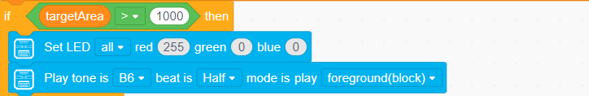

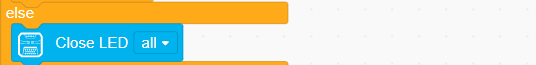

4. **Robot Arm Sorting**

​	(1) When WonderCam vision module recognizes the colored block, it will call specific action group to start sorting the block based on color. To learn more about action group editing, please refer to this chapter ““**2. AiArm Control**”.

​	(2) Action group **“0”** will be called to set the initial position of the robot arm facilitating color recognition.

​	(3) When recognizing the colored block, AiArm will execute action group 1 once to pick up the colored block. After a while, it will perform action group 2 to sort and place the block to corresponding area.

> [!NOTE]
>
> **action groups 0-30 are encrypted and serve as the mandatory action groups for robot games. If you intend to create a new action group, kindly ensure that you begin saving it from No. 31 onwards.**

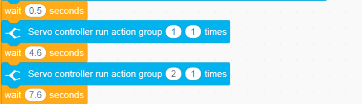

## 6.2 Tag Recognition and Sorting

1. When WonderCam vision module detects tag blocks, buzzer will emit a short beeping. Then, the robot arm will sort the tag blocks to its right side.

### 6.2.1 Preparation

1)  Connect WonderCam vision module to port 9 of CoreX controller.

2)  Install WonderCode programming software according to the instructions provided in “**3. Scratch Programming**”.

### 6.2.2 **Program Logic**

1. To start, the robot arm will initiate the initialization process, which involves running a specific action group to adjust its position for efficient tag recognition. Following this, any modules not relevant to this game will be disabled.

2. Once the initialization process is complete, the WonderCam module will actively detect tags. When the WonderCam vision module recognizes a tag, the buzzer on the main controller will emit a short beep. Subsequently, the robot arm will execute a designated action group to sort the tags.

3. For a more comprehensive understanding of the game's implementation, please refer to the **5. Program Analysis** section.

### 6.2.3 Download Program

1)  Open WonderCode software.

2)  Directly drag the corresponding program file saved in the folder “**Programs**” to WonderCode interface.

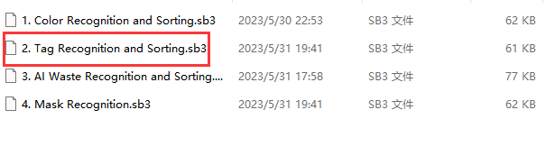

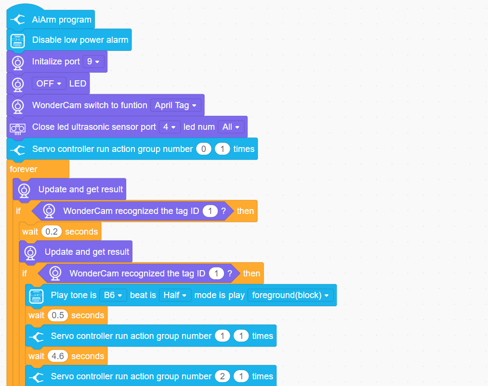

3)  Click-on  and select the corresponding COM port, for example COM4. Please note that COM port options may differ from each computer.

> [!NOTE]
>
> **please do not select COM1, as it used for communication port in general.**

 

4)  Click-on  icon to upload the complete program.

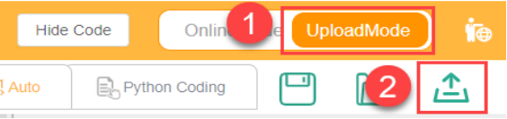

5)  The upload may take some times, and please be patient!

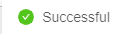

### 6.2.4 Program Outcome

1. After successfully downloading the programs, follow the sequence of turning on the switch on the robot arm and the main controller. As a result, the WonderCam vision module will seamlessly transition into **Tag Recognition** mode. Upon identifying the tag, the buzzer on the CoreX controller will emit a brief beep.
2.  Subsequently, the robot arm will sort and place the tag blocks to corresponding zone according to their ID. Tag 1 will be placed to the area where red block is placed. Tag 2 will be placed to the area where green block is placed. Tag 3 will be placed to the area where blue block is positioned.

### 6.2.5 Program Analysis

1. **Initial Settings**

​	(1) To begin, WonderCam vision module will switch to tag recognition. Next, an action group labeled as **0** will be invoked to position the robot arm in a downward attitude, facilitating efficient recognition.

​	(2) In addition, to avoid any potential interference with tag recognition, the ultrasonic module will be turned off.

2. **Tag Recognition**

​	(1) A repetitive loop statement will be used to enable the vision module to recognize repeatedly. For example, when recognizing a tag 1, WonderCam vision module will perform recognition again to ensure the accuracy of the recognition result.

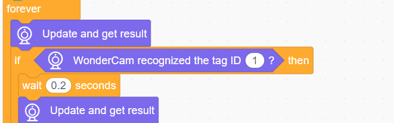

3. **Recognition Feedback and Sorting**

​	(1) Configure the feedback of the robot arm based on the recognized tag ID. For instance, when the WonderCam module identifies tag 1, the buzzer emits a short beep, prompting the robot arm to activate action group 1 for object gripping. Once the object is successfully grasped, action group 2 is executed to position the object in the corresponding area.

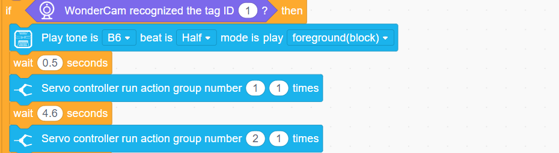

> [!NOTE]
>
> 1.  **To learn more about action group editing, please refer to this chapter “2. AiArm Control”.**
>
> 2.  **Action groups 0-30 are encrypted and serve as the mandatory action groups for robot games. If you intend to create a new action group, kindly ensure that you begin saving it from No. 31 onwards.**

## 6.3 Mask Identification

> [!NOTE]
>
> **Prior to initiating this game, please ensure that the mask recognition model has been successfully uploaded to the WonderCam module. For detailed instructions, kindly refer to the Appendix / WoonderCam Firmware and Firmware installation Tool section.**

1. The WonderCam is designed to identify faces within its field of view. When a face wearing a mask is detected, the dot matrix module will illuminate a smiling face. On the other hand, if a face without a mask is recognized, the dot matrix module will display an **X** symbol.

### 6.3.1 Preparation

1)  Connect WonderCam vision module to port 9 of CoreX controller.

2)  Install WonderCode programming software according to the instructions provided in “**3. Scratch Programming**”.

### 6.3.2 **Program Logic**

1. To begin with, the robot arm undergoes initialization, which includes configuring the module interface and dot matrix module while setting the initial state. Action group No. 9 is called to position the robot arm in a head-up state, facilitating face recognition.

2. Mask recognition is achieved using pre-trained mask models. Users need not train the models themselves; they can simply follow the instructions provided in **5. WonderCam Vision Module Usage/1. WonderCam Vision Module Usage** for model burning and usage tutorials.

3. During mask identification, the WonderCam vision module utilizes image classification to determine if individuals are wearing masks. If no face is detected, the dot matrix module will display a specific pattern . When a face with a mask is detected, the dot matrix module will exhibit a different pattern , while a separate pattern will be displayed if a face without a mask is detected .

4. For detailed information on the specific implementation of this gameplay, please refer to the **5. Program Analysis** section of this document.

### 6.3.3 Download Program

1)  Open WonderCode software.

2)  Directly drag the corresponding program file saved in the folder “**Programs**” to WonderCode interface.

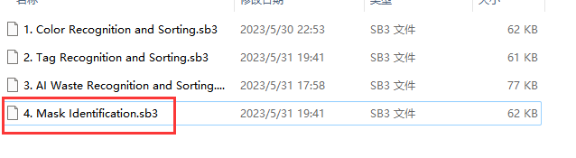

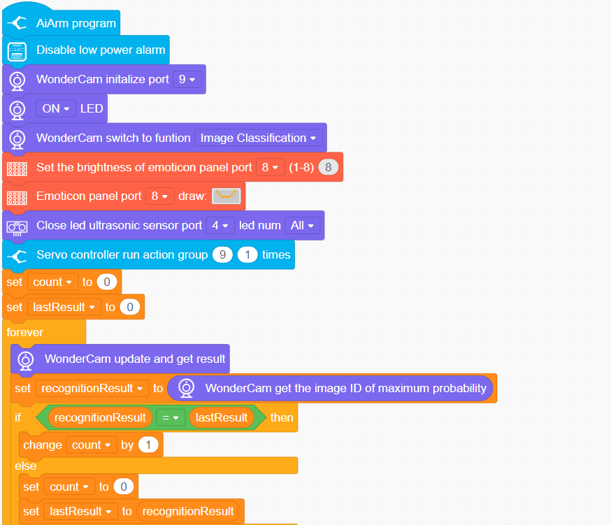

3)  Click-on  and select the corresponding COM port, for example COM4. Please note that COM port options may differ from each computer.

> [!NOTE]
>
> **please do not select COM1, as it used for communication port in general.**

 

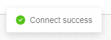

4)  Click-on  icon to upload the complete program.

5)  The upload may take some times, and please be patient!

### 6.3.4 Program Outcome

1. Once the program download is complete, follow these steps:

2. First, turn on the switch of the robotic arm. Then, turn on the switch of the main controller. The WonderCam vision module will automatically switch to the **image classification** function. Following by the robotic arm will be set to a head-up position. 
3. Next, the dot matrix module will illuminate with a specific pattern . During the mask recognition process: If a face wearing a mask is detected, the dot matrix module will display the corresponding pattern. If a face without a mask is detected, the dot matrix module will display a different pattern.

4. Please ensure that the switches are turned on in the specified sequence to ensure proper functionality.

### 6.3.5 Program Analysis

1. **Initial Settings**

​	(1) To begin, designate interface No. 9 as the interface for WonderCam. Switch the function of the WonderCam's vision module to image classification. Set the connecting rod parameters for the robotic arm, and establish an initial posture for the arm using the inverse kinematics function.

​	(2) Next, create two variables named **Count** and **Last Result** to store the number of times and the ID recognized by the vision module. Initialize both variables with a value of 0, as depicted in the figure below:

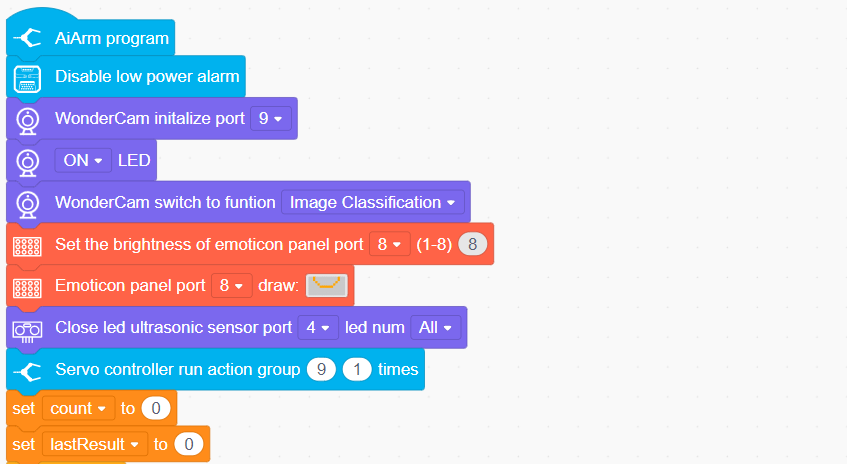

2. **Mask Identification**

​	(1) Mask identification is primarily achieved through the image recognition function of WonderCam module. To facilitate continuous recognition and update of results, a repetitive loop statement is employed.

​	(2) In order to ensure accurate recognition, the program saves the recognized results and performs subsequent recognition. It then compares the current recognition result with the previous one. When there are five consecutive matches between the results, it is determined that the face has been successfully recognized, allowing the program to proceed to the next step of judgment.

​	(3) This iterative process guarantees reliability in identifying faces wearing masks, enabling seamless decision-making for subsequent actions.

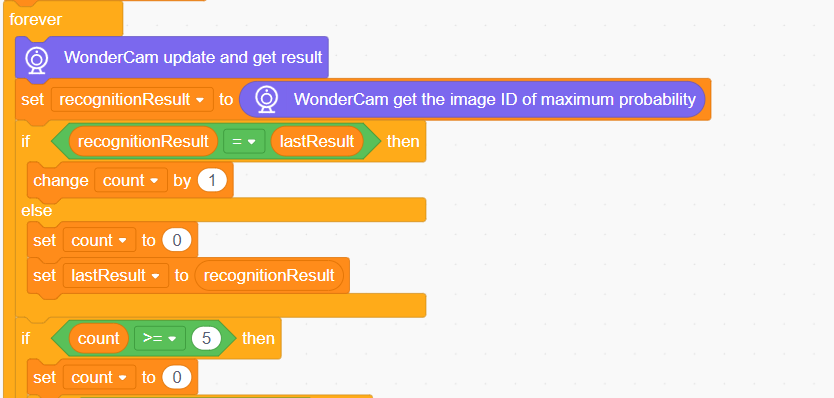

3. **Make Judgement and Provide Feedback**

​	(1) Once the recognition count reaches 5, it will reset back to 0.

​	(2) If the WonderCam vision module fails to recognize a face for 5 consecutive times, the dot matrix display will showcase .

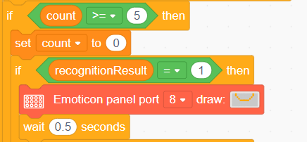

​	(3) When the WonderCam vision module successfully detects a face wearing a mask for 5 consecutive times, the dot matrix module will display .

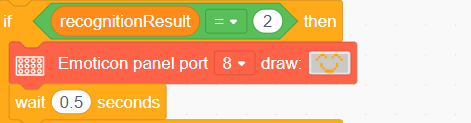

​	(4) In the case where the module recognizes a face without a mask, the dot matrix display will demonstrate  indicating face recognition without a mask. Additionally, the buzzer will emit three beeping sounds to alert the user.

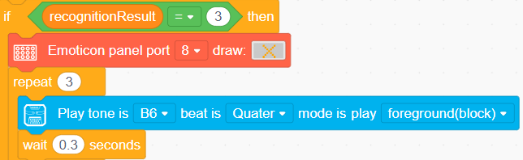

### 6.3.6 FAQ

**Q1**: Why is the dot matrix module not displaying properly after starting the game?

**A1**: Please follow these steps to troubleshoot the issue:

Ensure that the wiring of the dot matrix module is correct, specifically connected to the correct interface (Interface No. 8).

Restart both the robot arm and the main controller. It is crucial to turn on the robot arm first and then power on the main controller.

