# 7. Vision Recognition and Application

## 7.1 Coordinate System Control

1.  **Establish Coordinate System**

​	(1) The origin of the coordinate system of AiArm robotic arm is based on the bottom of the servo inside its pan-title at the base. As shown in the figure below, taking robot’s first-person view, the positive direction of the X-axis is the to the right of the robotic arm, the positive direction of the Y-axis is the forward direction of the robotic arm, and the Z-axis represents the upward direction of the robotic arm.

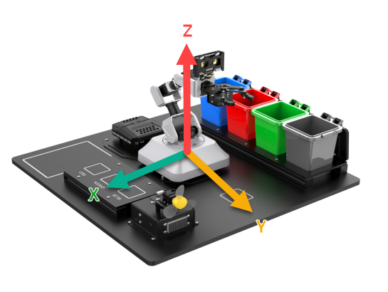

​	(2) In the defined coordinate system, the unit distance for each axis is in centimeters (cm).

2.  **Coordinate System Parameter**

​	(1) The coordinate of X, Y and Z refers to the position information of the end-effector of the robotic arm. The end-effector stands for the length at which robotic arm requires to be fully closed.

​	(2) Here take a coordinate as an example, as shown in the blow figure:

​	(3) This is a coordinate command for setting the initial position of a robotic arm. As you can see in program, the x, y and z coordinate is (0, 9, 6), which specifies that the end-effector is positioned 9 cm directly in front of the origin and 6cm above it. The pitch angle is -65 degrees, which indi

​	(4) This is a coordinate instruction used to set the initial position of a robotic arm. In the program, you can see that the coordinates (x, y, z) are filled with values (0, 9, 6) respectively. This means that the end of the robotic arm is positioned 9 cm directly in front of the origin and 6cm above it. The pitch angle parameter is -65 degrees.

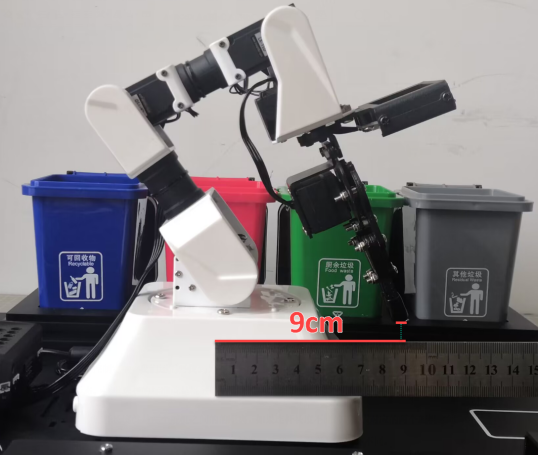

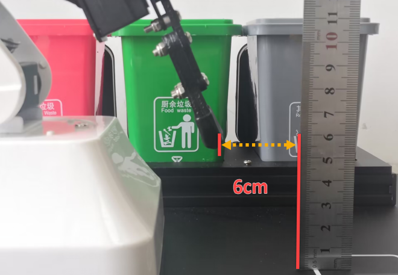

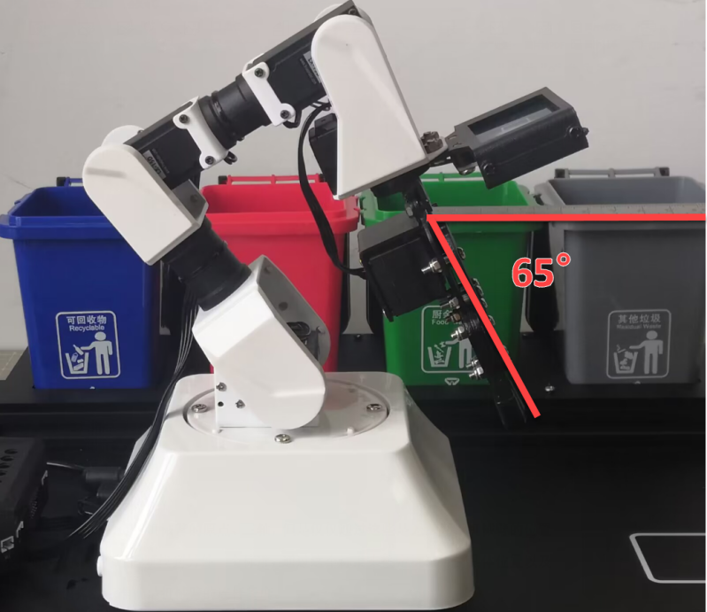

​	(5) There is an another standard required to determine the specific position and pose of the robotic arm. For AiArm, the standard is set as the length of the robotic arm’s linkage.

​	(6) Generally, the length of the robotic arm’s length refers to the distance between two servos. However, due to the special characteristic of the servo on mechanical gripper, the linkage 4 refers to the distance between the servo to to the robotic arm’s end effector.

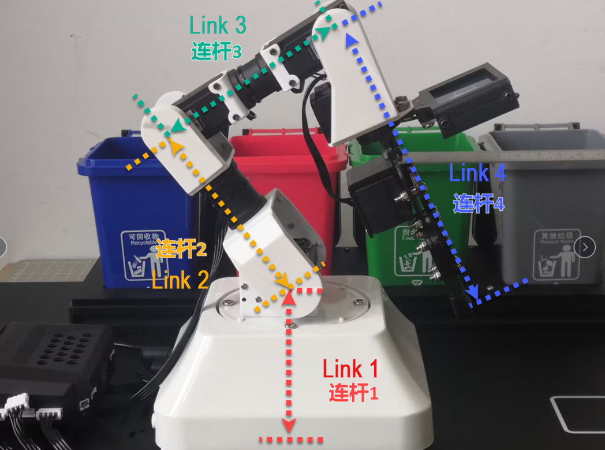

​	(7) If the lengths of the linkages are not defined when the number of linkages is the same, it is not possible to determine the specific position and configuration of the robotic arm solely based on the coordinates of the end effector and the pitch angle. The following two diagrams serve as examples, where the end effector coordinates and pitch angle are the same, but the shape and position of the robotic arm can be different: (each color line corresponds to a linkage)

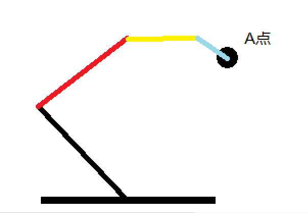

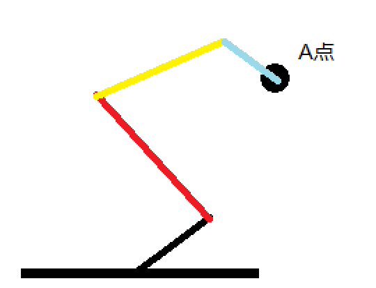

​	(8) From the above figure, to determining the specific position and configuration of the robotic arm requires is necessary to define the length of the linkages, which is also crucial for controlling the movement of the robotic arm. By determining the lengths of the linkages and combining them with the position parameters of the end effector, a unique solution for the position can be obtained.

3.  **Coordinate Control**

​	(1) The following will combine the length of the linkage and the coordinate of the robotic arm to control the movement of the robotic arm, as shown in the below figure:

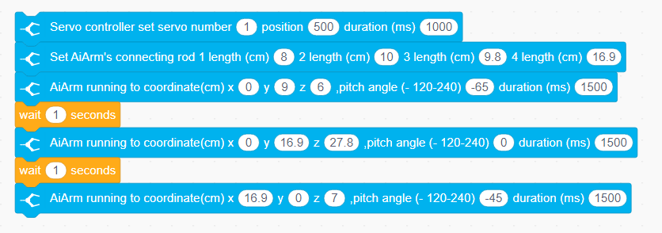

​	(2) First, we need to close the gripper, and then define the length of the robotic arm’s linkages. The initial position of the robotic arm is set as the first position. After 1 second, It will move based on the predefined position of the end effector and the pitch angle of the gripper. Since the pitch angle is 0 in this case, the gripper will be in a flat-view position, looking straight ahead.

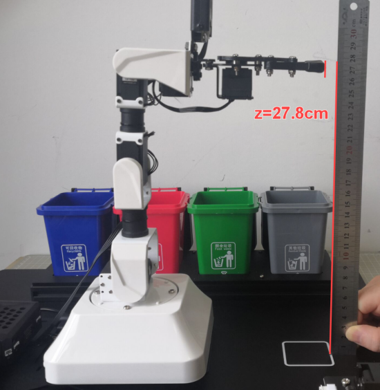

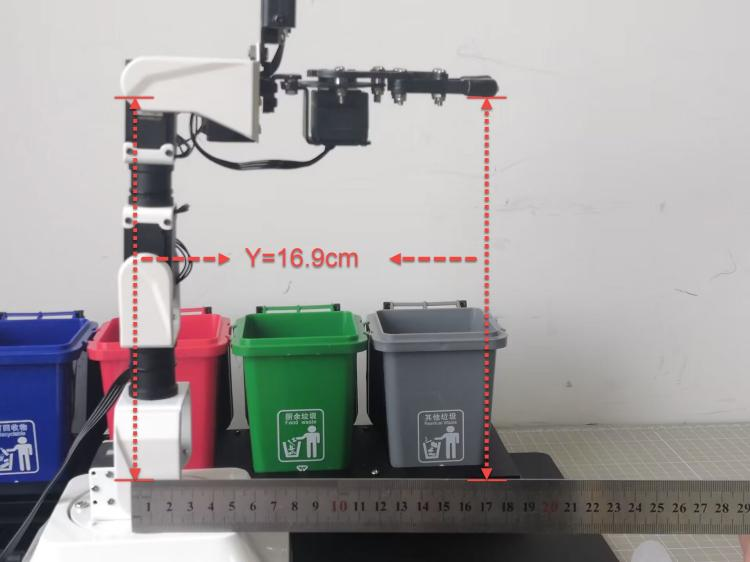

​	(3) After 1 second, it will turn to X=16.9, Y=0, Z=7 and the pitch angle is in the position of 45 degrees.

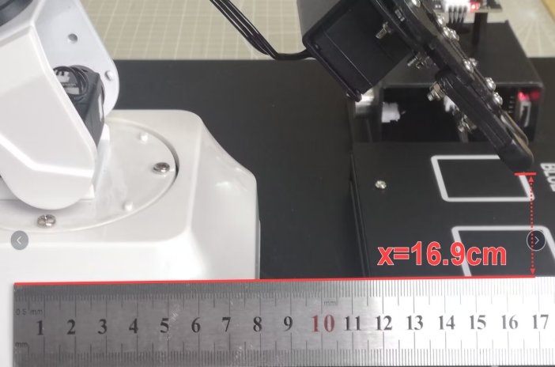

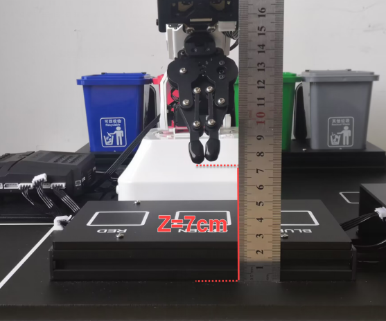

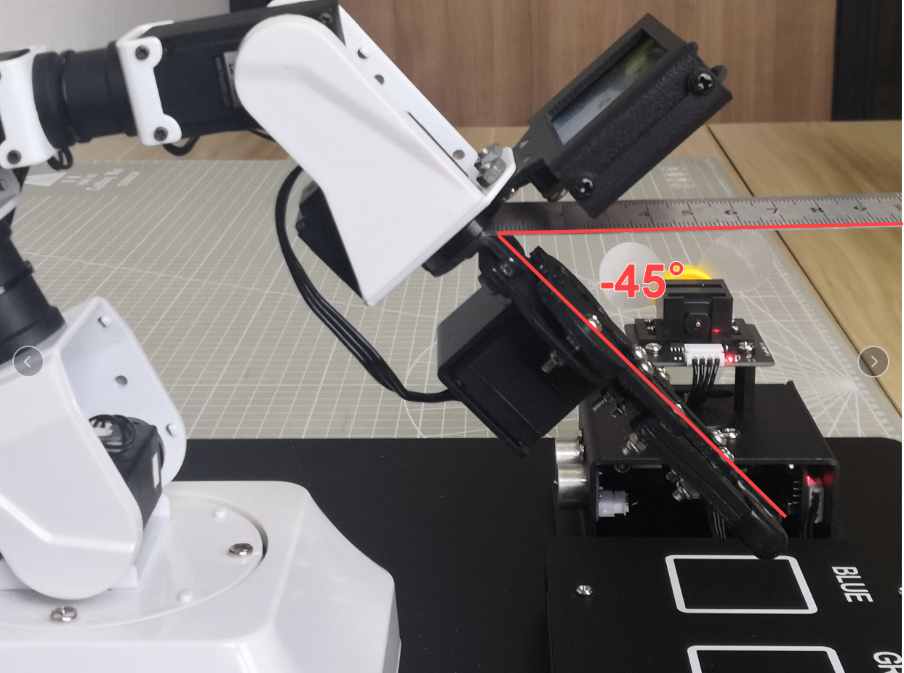

​	(4) If you want to control the robotic arm through coordinates, it is necessary to take the length of the linkages and angle into account due to the limited position.

## 7.2 Face Recognition and Tracking

1. The WonderCam AI vision module will first identify a human face. After the human face that has been learned is recognized, AiArm will move with it and activate the fan module at the same time.

### 7.2.1 Preparation

1)  Before starting this game, you need to perform face learning for WonderCam vision module. For the specific operation, please refer to “5. WonderCam AI Vision module”.

2)  Connect WonderCam vision module to No.9 port on CoreX controller and connect the fan module to No.3 port.

3)  Refer to “3. Scratch Programming” to install WonderCode programming software.

### 7.2.2 Project Logic

1. Face recognition is realized through WonderCam AI vision module.
2.  First, determine the position of the human face, and use PID algorithm to calculate its coordinates in the camera frame, then control the movement of the robotic arm through inverse kinematics function to achieve the face tracking.

### 7.2.3 Download Program

1)  Open WonderCode.

2)  Drag the program in **“7. Advanced Vision Recognition and Application/ Lesson 4 Face Recognition and Tracking”** to WonderCode programming software interface. (the following picture shows a screenshot of part of program)

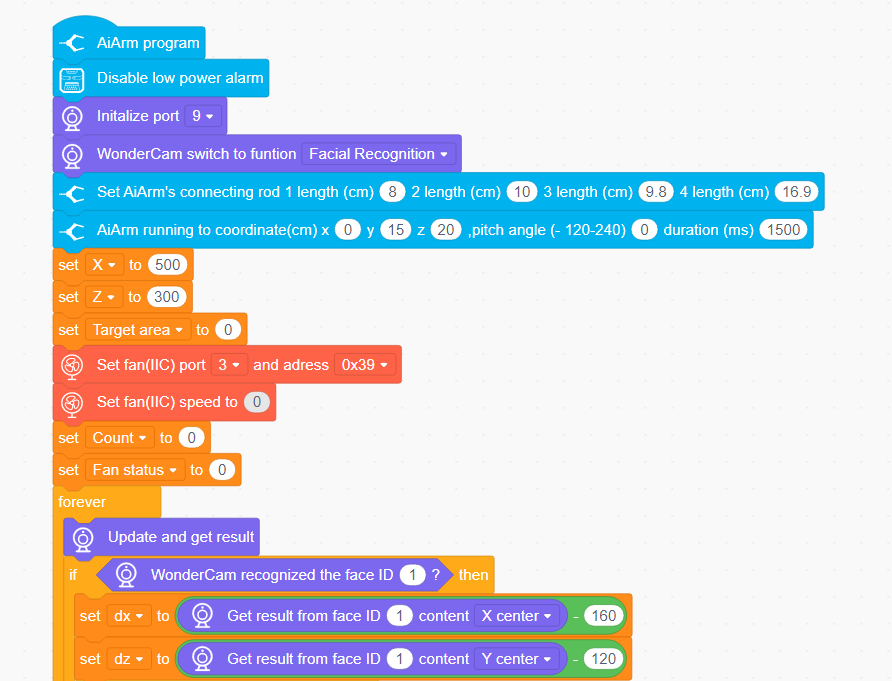

3)  Then click on “Connect” to select the corresponding port. (It is not a fixed port number. Please select the port number according to the actual situation. The following takes COM4 as example.)

> [!NOTE]
>
> **Do not select COM1. It is generally a system communication port.**

4)  After connection, please click on  on the right in the uploading mode.

5)  Wait for the upload to complete.

### 7.2.4 Performance

After the program is downloaded successfully, turn on the switch of the robotic arm, and then turn on CoreX controller. WonderCam vision module will automatically switch to the **“face recognition”** mode.

### 7.2.5 Program Analysis

1. **Initialization Settings**

​	(1) The program will first initialize the ports of WonderCam vision module and fan module, setting the initial setting of the modules. Then set the parameters of the robotic arm’s linkages, defining the lengths of the linkages and the position of the end-effector of the robotic arm to set the initial position of the robotic arm.

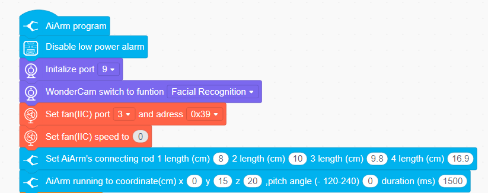

​	(2) Then the program sets several variables, namely X, Z, target area, count, and fan state. The initial value of X is set to 500, which corresponds to the initial position of servo 6. The initial value of Z is set to 300, which corresponds to the initial position of servo 3. The target area, count and fan area set to 0, which will be used for subsequent recognition and detection.

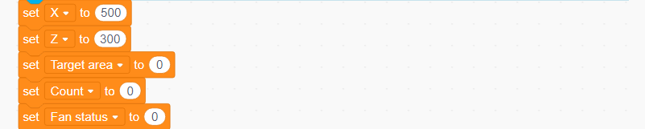

2. **Face Recognition**

​	(1) Face recognition is primarily achieved through WonderCam vision module. Then a loop statement is used to continuously allow the module to recognize and update the recognition result.

3. **Feedback and Tracking**

​	(1) When the WonderCam vision module recognizes the ID of the human face, it will subtract the center point of the face from the center point of the recognition range of the WonderCam module. This allows obtaining the difference between the center of the face and the WonderCam vision module.

> [!NOTE]
>
> **the pixel of the WonderCam vision module is 320*240, thus the subtraction values of 160 and 120 in the following commands correspond to the center point of the WonderCam module.**

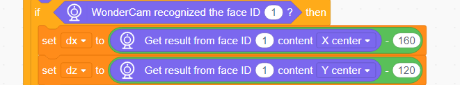

​	(2) In the example of the X-axis direction. After calculating the difference, the servo is controlled step by step to turn towards the center point of the face through using PID algorithm.

​	(3) In this case, **“X center”** represents the X-axis value of the human face detected by WonderCam module, and **“160”** represents the X-axis value of the center point of WonderCam module. The abstraction of two values to obtain the distance between the robotic arm to the face.

​	(4) After calculating the value of dx, evaluate whether the absolute value of this value is greater than 10 to avoid misrecognition due to a too short distance. Then, this difference value is added to the previously set value of X to obtain the coordinate of X-axis of the robotic arm moving to the face.

​	(5) Finally, by controlling servo 6 to rotate to the coordinate. At the same time, the LED light on controller will light up, and the fan will be activated.

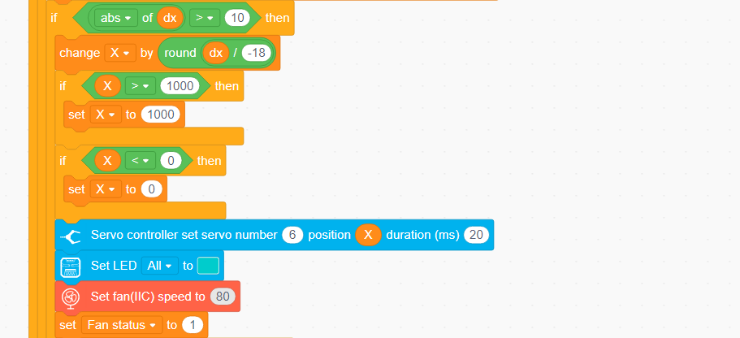

