# 8. Appendix

## 8.1 Deviation Adjustment

1. If the servo main shaft deviates due to servo replacement or other operations during operating the robot arm, you need to debug the deviation. There are two types of deviation: minor deviation and large deviation. Please refer to the following instructions to debug the deviation..

### 8.1.1 Preparation

1. Power on the robot arm, and connect it to a computer, according to the file saved in “**2. AiArm Control\\ Lesson 1 AiArm PC Software**”.

### 8.1.2 Judge Deviation

1)  Click-on reset to make the robot arm extend fully straight.

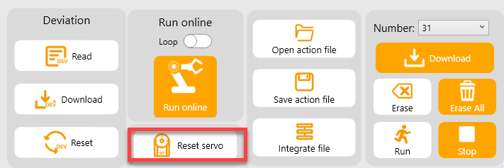

2)  If the robot arm’s pose is as pictured, you don’t need to adjust the deviation.

​	(1) Gripper slightly closes

​	(2) The U-shaped bracket of ID2 servo is parallel to ID1 servo

​	(3) ID 3-5 servos are on the same line

​	(4) The triangular notch of the pan tilt aligns with the notch on the base.

3)  If, upon returning to the center, it appears as depicted in the figure below, it indicates that the robot arm is slightly tilted at a relatively small angle, with a range of ±30°. This can be adjusted using the slider on the PC software. Please refer to section 3, **Adjust Minor Deviations,** for instructions on how to make the necessary adjustments.

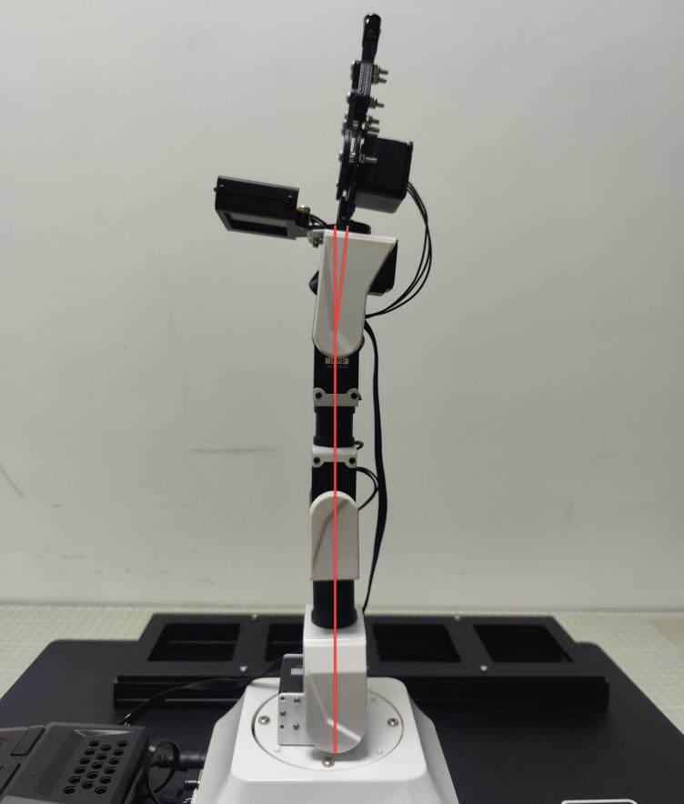

4)  If, upon returning to the center, there is a significant inclination angle as pictured, exceeding 30°. This cannot be adjusted using the servo slider. In this case, the main servo horn of the servo must be removed and recentered before reinstalling it. Please refer to section 4, **Adjust Large Deviations,** for detailed instructions on how to perform the adjustment."

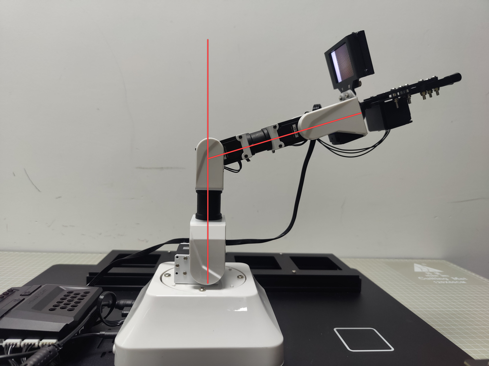

> [!NOTE]
>
> 1. **The angle between servo and the centerline can be calculated as follows:**
>
> 2. **The PC software's slider range for adjusting the servo is 0 to 1000. When the servo is powered on, it can rotate from 0 to 240 degrees. Thus, the rotation angle of the servo per unit of the slider is 240/1000 = 0.24 degrees.**
>
> 3. **For small slider, its adjustment range is ±125. Converting this range to a small deviation, we multiply it by the rotation angle per unit of the slider: 125 * 0.24 = 30 degrees. Therefore, small slider allows for adjustments within a range of ±30 degrees for small deviations.**

### 8.1.3 Adjust Minor Deviation

​	The small deviation adjustment can be made by directly dragging the servo slider on PC software. In this section, we will use the adjustment of No. 3 servo deviation as an example to explain the process. The adjustment methods for other servos are consistent and applicable.

1)  Click-on reset to make the robot arm extend fully straight.

2)  Click-on “**Read deviation**” to read the deviation of the servo. The small sliders will switch to deviation adjustment mode.

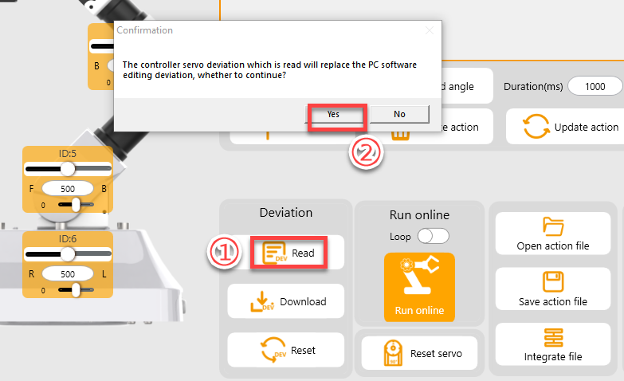

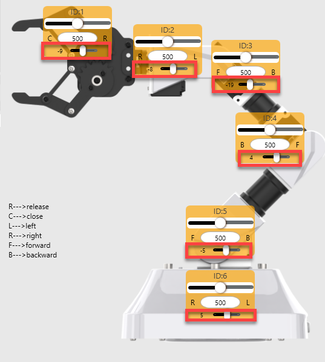

3)  Click and hold the slider of the No. 3 servo for fine-tuning, or click the slider of the No. 3 servo and use the ← and **→** keys on the keyboard to make fine adjustments

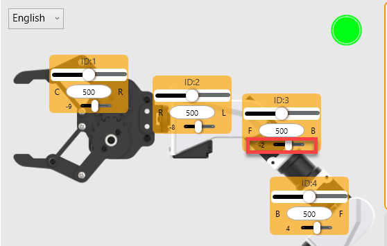

4)  Once you finish adjustment, click-on “download deviation” to save the deviation values. Please do not skip this step.

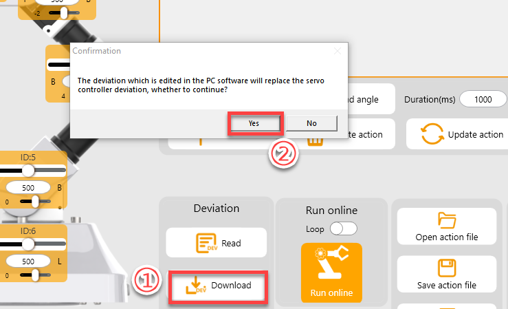

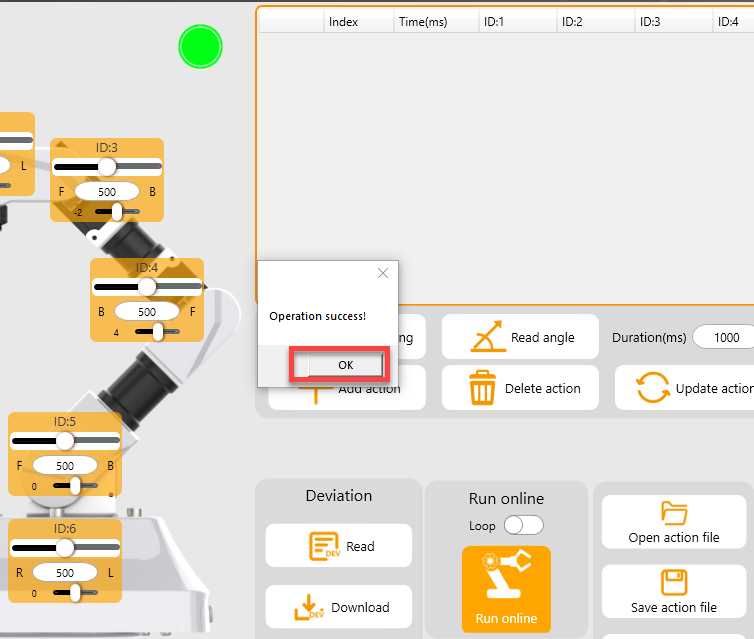

### 8.1.4 Adjust Large Deviation

​	To adjust a large deviation, the servo needs to be removed from the U-shaped bracket, and should be centered, and then follow the steps for small deviation adjustment. In this section, we will use the ID3 servo as an example to explain the process. The adjustment method for other servos remains consistent with this procedure.

1)  Click-on reset to make the robot arm extend fully straight.

2)  You can see that the deviation of servo 4 is significant.

3)  Power off the robot arm. The following operations must be performed when the robot arm is powered off.

4)  Remove the cover of the U-shaped bracket of servo 4.

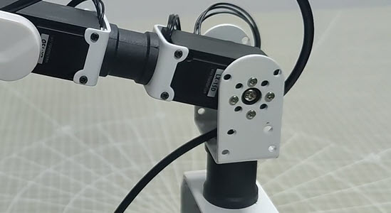

5)  Remove the screws.

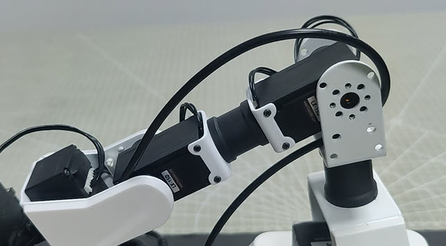

6)  Take down the servo.

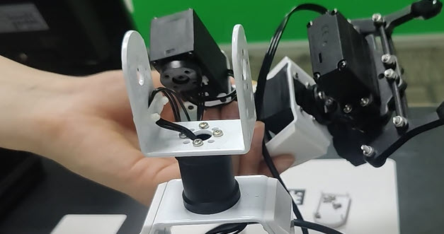

7)  Slightly pull out the min servo shaft. The assistant servo shaft need not to be disassembled.

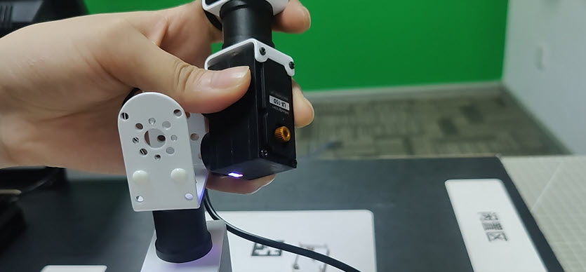

8)  After the servo is removed, turn on the robot, and open the PC software. Click-on Reset to center No.3 servo.

9)  After the servo is centered, please turn off the robot arm, and install the main servo horn and assistant servo horn in a cross pattern.

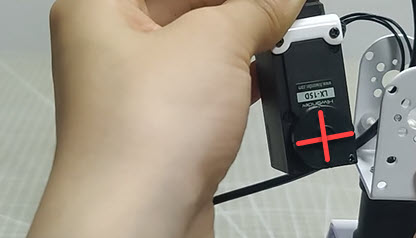

> [!NOTE]
>
> **at this point, the servo is already in the middle position. Avoid applying force to the servo shaft. If the servo is not properly installed in a cross pattern, it is necessary to repeat steps 7 to 9 of section 4, Adjust Large Deviation in this document.**

10) After installation, put the servo back to the U-shaped bracket, and fix them with screws.

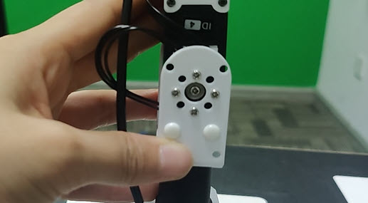

11) Attach the cover to the bracket.

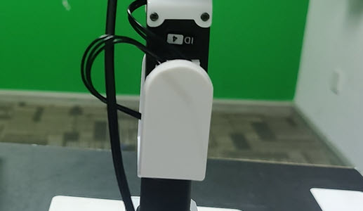

12) Turn on the robot arm, and proceed to adjust the deviation according to the instructions provided in “**3. Adjust Minor Deviation**”.
